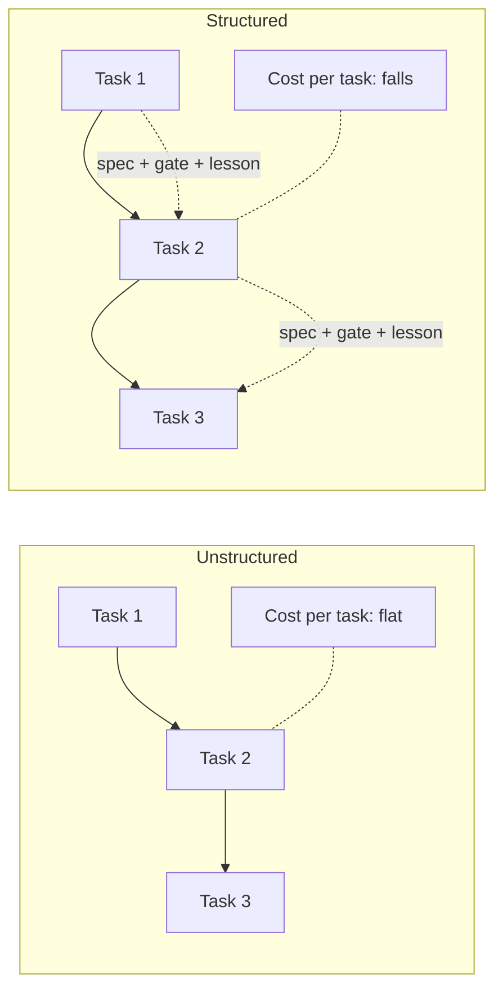
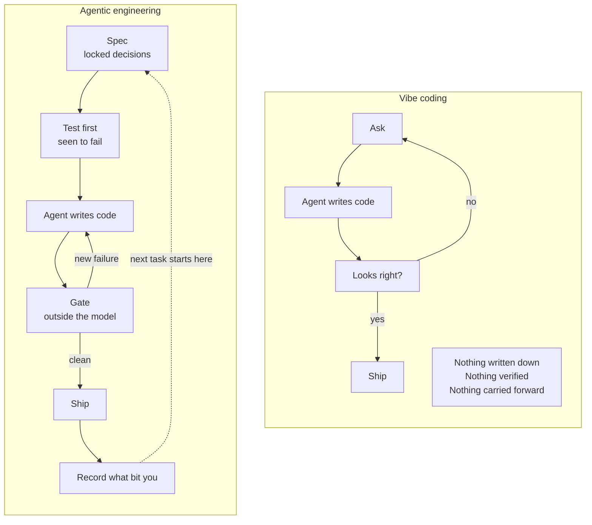

# pagar

**A baseline-aware gate runner and spec-driven method for agentic engineering.
The sensor half of a coding-agent harness, with zero runtime dependencies.**

*Pagar* is Indonesian for **fence**. A fence does not herd the cattle and does
not decide where they go. It stands at the boundary and stops them at it.
pagar holds the line your coding agent works against: it never writes or
fixes code, it observes and reports, with exit codes an agent cannot argue
with.

---

## What that is, concretely

- **A gate runner** (`gates/`): runs the checks CI would run, locally, in
  seconds, before the commit. It snapshots your already-failing tests into a
  **baseline**, then fails **only on failures that are new**. That single
  idea is what lets a gate survive contact with a repo that already has debt.
- **A spec-driven method** (`docs/`, `workflows/`): PRD to epics to stories,
  tests that have been *seen to fail*, lessons that compound. Stack-neutral,
  written down, readable in an evening.
- **The sensor half, on purpose.** A harness needs an actuator (your agent —
  any of them), sensors (pagar), and memory (specs, baselines, lessons as
  plain files). pagar is only the sensors and the memory format. Swap agents
  next year; the fence stays. See
  [`docs/00-the-sensor-half.md`](docs/00-the-sensor-half.md).

**Zero runtime dependencies** is a hard rule, not a phase. The runner is
Node 20+, ESM, standard library only. It starts with a plain `node`, no
`npm install`, in any repo — including one with no `package.json` at all.

---

## Quick start

The fastest useful thing is the gate runner alone. Three ways in, same tool:

**1. Install it into your repo** (recommended — you own the copy, it works
offline forever, and your agent can read its source):

```bash
curl -fsSL https://raw.githubusercontent.com/ridwanspace/pagar/main/install.sh | bash -s -- /path/to/your/project
```

**2. Run it with no install at all** (npm package `pagar-gates`, binary
`pagar`, zero dependencies — you only author a `gates.config.json`):

```bash
cd /path/to/your/project
$EDITOR gates.config.json     # ~20 lines; start from gates/gates.config.example.json

npx pagar-gates --update-baseline   # snapshot today's failures, from a clean tree
npx pagar-gates                     # from now on, only NEW failures fail
```

**3. Just take the directory.** No script, no package, no ceremony:

```bash
git clone --depth 1 --filter=blob:none --sparse \
  https://github.com/ridwanspace/pagar.git /tmp/pagar
git -C /tmp/pagar sparse-checkout set gates
cp -r /tmp/pagar/gates ./gates && rm -rf /tmp/pagar

cp gates/gates.config.example.json gates.config.json
$EDITOR gates.config.json        # name your lint, type-check, and test commands

node gates/run-gates.mjs --update-baseline   # from a clean tree
node gates/run-gates.mjs                     # before every commit
```

Whichever way you chose, that is the whole first step. It works before you
adopt anything else here, and it is useful on its own.

### What it looks like

A run where the code under test has one pre-existing failure and one you just
introduced:

```
  FAIL  backend/pytest unit tests 0.5s
        1 NEW failure(s), not in the baseline:
          + backend/tests/test_math.py::test_new_regression
        1 known failure(s) in the baseline, ignored

  1 new failure(s) across 1 gate(s). Fix them before committing.
  Do not add them to the baseline to get past this.
```

Exit code 1. The new failure is named. The old one is counted and left alone,
so the thing you broke does not hide inside forty lines of old debt. Full
manual: [`gates/README.md`](gates/README.md). The reasoning:
[`docs/05-local-ci-enforcement.md`](docs/05-local-ci-enforcement.md).

---

## Where pagar sits

You may know some of these; here is the honest map:

| Tool | What it is | What pagar is not |
|---|---|---|
| [pre-commit](https://pre-commit.com), [lefthook](https://github.com/evilmartians/lefthook), [lint-staged](https://github.com/lint-staged/lint-staged) | Git-hook frameworks, polyglot, installed via a package manager | pagar is not a hook manager. It is a full-repo, agent-shaped gate runner with baseline semantics, copyable with no install. Hooks are one way to invoke it. |
| [GitHub spec-kit](https://github.com/github/spec-kit) | A spec-**authoring** workflow (`/speckit.specify → plan → tasks → implement`) as an installed CLI | pagar's spec pipeline is plain markdown you copy in, and pagar goes where spec-kit does not: **enforcement**. Gates that block on regressions, outside the model. |
| Lint ratchets (rubocop's `--auto-gen-config`, [FlakeHell baseline](https://flakehell.readthedocs.io/commands/baseline.html), [Betterer](https://github.com/phenomnomnominal/betterer)) | Baseline semantics for **one ecosystem's** linter | pagar gives the same known-failures/pass-on-new semantics to **every** gate at once — tests, type checks, lints, builds — across languages, with stable failure keys. |
| CI | The same checks, later | pagar runs CI's checks **before** the commit, which is the only moment a fix is cheap. It complements CI; it does not replace it. |

---

## Ready to start, agent-assisted

Paste this into your agent and ask it to get you set up:

```
https://raw.githubusercontent.com/ridwanspace/pagar/main/README.md
```

The agent reads this file, works out which parts you need, and fetches only
those. Take the gate runner and nothing else if that is all you want.

---

## For the agent reading this

You are helping an engineer adopt an AI-assisted engineering workflow. Read
this section before anything else.

**Your first move:** ask the engineer what they want, then fetch only what
that answer needs. Do not fetch the whole repository. Most people should start
with the gate runner alone.

**Route by what they say:**

| They want | Fetch this | Then do this |
|---|---|---|
| "just make my repo safer" | `gates/README.md` | Copy `gates/`, write a config for their stack, snapshot a baseline |
| "what even is this" | `docs/00-the-sensor-half.md` | Answer, do not install anything yet |
| "why does this matter" | `docs/01-why.md` | Answer, do not install anything yet |
| "help me write specs" | `docs/02-spec-driven-development.md`, `starter/.claude/scripts/specs/README.md` | Set up the specs tree, then the helper CLI |
| "my tests keep passing when the code is broken" | `docs/03-tdd-with-agents.md` | Teach the mutation-verify loop, apply it to one real test |
| "I keep re-explaining the same things" | `docs/04-compound-engineering.md` | Set up `CLAUDE.md`, then rules, then lesson mining |
| "set up local CI" | `docs/05-local-ci-enforcement.md`, `gates/README.md` | Build the gate ladder for their stack |
| "I use Codex / Kiro / Antigravity / Cursor" | `docs/07-agent-tools.md`, `starter/agent-adapters/README.md` | Use the adapter for their tool, warn them it is mapped and not tested |
| "show me how this works day to day" | `workflows/README.md` | Route them to the scenario matching their situation |
| "a bug just landed on my desk" | `workflows/README.md`, then the scenario it routes to | Run triage first, always, before diagnosing anything |
| "is this actually worth it" | `workflows/06-a-real-week.md` | Let them read one honest week, do not argue |
| "give me everything" | `starter/README.md` | Follow its six-step adoption order, do not skip ahead |

**URL shape.** Every path above is relative to this repo. To fetch one, prefix
it with:

```
https://raw.githubusercontent.com/ridwanspace/pagar/main/
```

So `gates/README.md` becomes
`https://raw.githubusercontent.com/ridwanspace/pagar/main/gates/README.md`.

**The full map, so you know what exists without fetching it:**

```
docs/00-the-sensor-half.md            what pagar is: sensors, actuator, memory
docs/01-why.md                        why a harness beats a better model
docs/02-spec-driven-development.md    PRD to epics to stories to review
docs/03-tdd-with-agents.md            making tests mean something
docs/04-compound-engineering.md       the two loops that make work cheaper
docs/05-local-ci-enforcement.md       gates, the ladder, the baseline pattern
docs/06-further-reading.md            books and papers, outside this repo
docs/07-agent-tools.md                Claude Code, Codex, Kiro, Antigravity, Cursor

workflows/README.md                   which skill for what just landed on you
workflows/01-new-feature.md           the full pipeline, spec to shipped
workflows/02-bug-from-qa.md           triage a batch, then hotfix or root cause
workflows/03-fix-not-on-stag.md       the fix is missing downstream, audit it
workflows/04-monday-morning.md        picking work back up with no context
workflows/05-joining-a-repo.md        first week in an unfamiliar codebase
workflows/06-a-real-week.md           five days, interruptions included

gates/README.md                       the gate runner: install, config, CLI
gates/gates.config.example.json       a config covering all four stacks
gates/gates.schema.json               config schema for editor validation

starter/README.md                     the adoption order, read before installing
starter/.claude/CLAUDE.md             project context template, has the
                                      placeholder fill-in table
starter/.claude/rules/                scoped knowledge, 11 files
starter/.claude/skills/               named procedures, 11 skills, step files
starter/.claude/scripts/specs/        the spec pipeline CLI and its README
starter/.claude/hooks/                session-start and stop hooks
starter/agent-adapters/               Codex, Kiro, Antigravity, Cursor

examples/README.md                    four stacks compared side by side
examples/python-flask/                Flask, pytest, ruff
examples/node-react/                  React, TypeScript, vitest, eslint
examples/go/                          net/http, go test
examples/java-spring/                 Spring Boot, JUnit 5
```

**Rules for you, the agent:**

1. **Do not copy the whole `starter/` tree by default.** It is a menu. Copying
   all of it into a project that needed one gate runner is the bloat this repo
   is written to avoid.
2. **Fill in every `{{PLACEHOLDER}}`** before telling the engineer something is
   ready. Run `grep -rn '{{' .claude/` and resolve what it finds.
3. **Gates first, almost always.** They pay off the same day and depend on
   nothing else here.
4. **Snapshot a baseline before enforcing anything.** A gate that goes red on
   day one for pre-existing debt gets disabled by day three.
5. **Tell the engineer what is untested.** Claude Code is the only agent tool
   exercised end to end. The Codex, Kiro, Antigravity, and Cursor adapters are
   documented mappings, not tested installations. Say so rather than letting
   them find out.
6. **Rewrite `rules/response-style.md` in their voice.** An inherited style
   rule nobody agreed to is worse than none.

---

## The claim, in one paragraph

An AI coding agent starts every session with no memory of the last one. So the
same trap gets re-discovered at full price, every time, forever. A green test
suite is not evidence the feature works, because agents are very good at making
tests pass. Speed without a checkpoint just produces confident wrong code
faster. The value is not in the model. It is in the harness around the model.
A structured workflow makes each task cheaper than the last. An unstructured
one makes every task cost the same, permanently.



---

## Vibe coding is not what we recommend

Two ways of working with an agent look similar from outside. They are not.

**Vibe coding** is: ask, read the reply, run it, ask again. The engineer steers
by feel. Nothing is written down. Nothing is checked except whether the app
seemed to work. It is fast, genuinely fun, and correct for a prototype, a
spike, a throwaway script, or learning an unfamiliar API.

**It is not correct for production.** Not because the code is always bad. It is
because nothing in the loop can tell you when it is bad.

**Agentic engineering** is what this repo proposes: the agent still writes the
code, but it works against a written spec, its tests have been seen to fail,
its output passes a gate the model cannot argue with, and what went wrong is
recorded so the next task starts ahead of this one.



The difference is not how much the agent writes. It is how many places the
work can be caught being wrong.

### Side by side

| | Vibe coding | Agentic engineering |
|---|---|---|
| What decides "done" | It looked right | The spec's acceptance criteria |
| What tests prove | That they pass | That they fail when the code breaks |
| Who catches a mistake | You, later, in production | A gate, in seconds, before the commit |
| Where knowledge lives | In the chat, then gone | In the repo, as specs, guards, lessons |
| Second engineer's cost | Full price, no context | Reads the spec, runs the gates |
| Cost of task 50 | Same as task 1 | Lower than task 1 |
| An agent's confident wrong answer | Ships | Fails a gate |
| Reviewing the change | Read all of it, hope | Read the diff against a stated intent |
| Constraints (authz, money, limits) | Held in your memory | Locked in the PRD, guarded by tests |

### Honest trade-offs

**What vibe coding is genuinely better at.** Starting. Exploring an unfamiliar
library. Throwaway work. A one-file script. Anything where the cost of being
wrong is that you delete it and try again. Do not put a spec pipeline in front
of a 20-line utility.

**What agentic engineering costs you.** Real setup time before the first line
of production code. A spec to write. Gates to configure. The discipline to
record a lesson when you would rather move on. It pays back on work measured in
months and on code more than one person touches. On a weekend project it is
overhead you will resent.

**The honest failure mode of our approach:** process nobody follows. A gate
that takes 90 seconds gets bypassed. A rule file nobody reads decays into
fiction. A baseline that grows every time it goes red is not a gate any more.
Every piece in this repo is built to be cheap enough to actually run, and
where a piece is not carrying its weight, delete it.

### Why the four pieces together, and not just one

Each one covers a specific way an agent fails, and each leaves a gap the next
one fills:

- **SDD** fixes *building the wrong thing correctly*. It cannot tell you the
  code is broken.
- **TDD** fixes *the code is broken*. It cannot stop an agent from writing a
  test that never could fail.
- **Local CI gates** fix *the claim that it works*. They are outside the model,
  so confidence does not get a vote. They cannot stop you re-learning the same
  trap.
- **Compound engineering** fixes *paying full price twice*. It needs the other
  three to have anything worth recording.

Take one and you get part of the benefit. Take gates alone and you still catch
most of the bad days, which is why we recommend starting there.

---

## The four ideas, briefly

**Spec-driven development.** The specification is the durable artifact. Code is
the output. A story is written so the implementing agent needs only that story
plus the specific sources it cites, never the whole PRD. The PRD carries a
locked-decisions table, and a story may not weaken one of those without a human
saying so. That table is what stops an agent from quietly trading away a
constraint to make a test pass.

**Test-driven development, with teeth.** Red-green-refactor still applies, but
the agent has to *show* red. A test that has never been seen to fail is not
evidence of anything. So: break the fix on purpose, watch the test go red,
restore it. Every guard you intend to trust earns that trust once.

**Compound engineering.** Two loops. The first turns exhaust into fuel: every
finished story records what actually bit you, and story creation mines those
records so the next story starts from other stories' scars. The second turns
the workflow on itself: after each story, one thing you did by hand becomes a
script or a guard. Maximum one. "Nothing this time" is a valid answer, because
manufacturing busywork is the anti-goal.

**Local CI enforcement.** Gates run on your machine, in seconds, before the code
lands. The pattern that makes them adoptable in a repo that already has debt is
the baseline: snapshot what is failing today, then fail only on failures that
are new. A gate that goes red on day one for reasons you did not cause is a
gate that gets disabled by day three.

### Credit where due

None of the four ideas started here. pagar's contribution is the assembly and
the fence; the ideas have parents, and they deserve the traffic:

- **Spec-driven development.** The agentic lineage:
  [GitHub's spec-kit](https://github.com/github/spec-kit), for making
  specify-plan-tasks an installable workflow, and the
  [BMAD method](https://github.com/bmad-code-org/bmad-method), for running
  analyst, architect, PM, dev, and QA as agent personas from plan down to
  story-level implementation. pagar's PRD → epics → stories tree is a lighter,
  copy-in take on the same bet. The book lineage — Cockburn, Adzic, Patton —
  is mapped in [`docs/06-further-reading.md`](docs/06-further-reading.md).
- **TDD with teeth.** The loop, and the rule that a test earns trust by being
  watched to fail, are Kent Beck's, from *Test-Driven Development: By Example*
  (2002). Mutation verification is the manual, once-per-guard version of what
  [Stryker](https://stryker-mutator.io), `mutmut`, and `cosmic-ray` automate.
- **Compound engineering.** The term and the loop belong to Kieran Klaassen at
  Every — captured skills and plans so every task starts ahead of the last
  one. Read the [original guide](https://every.to/guides/compound-engineering);
  Every also ships the idea as an open-source
  [plugin](https://github.com/everyinc/compound-engineering-plugin). pagar's
  two loops ([`docs/04`](docs/04-compound-engineering.md)) are the same
  principle written as plain files no agent vendor owns.
- **Local CI enforcement and baselines.** The baseline ratchet is an old,
  honored idea: RuboCop's
  [`--auto-gen-config`](https://docs.rubocop.org/rubocop/configuration.html),
  [FlakeHell's `baseline`](https://flakehell.readthedocs.io/commands/baseline.html),
  [Betterer](https://github.com/phenomnomnominal/betterer), and
  [cargo-insta](https://insta.rs) all park known failures and fail only on new
  ones — each inside its own ecosystem. pagar applies the semantics to every
  gate at once. The hook runners ([pre-commit](https://pre-commit.com),
  [lefthook](https://github.com/evilmartians/lefthook)) and the CI canon
  (Humble & Farley, Fowler) are mapped in
  [`docs/06-further-reading.md`](docs/06-further-reading.md).

---

## Start here

| If you want to | Read |
|---|---|
| See what pagar is, in one page | [`docs/00-the-sensor-half.md`](docs/00-the-sensor-half.md) |
| See what a normal working day looks like | [`workflows/`](workflows/README.md) |
| Understand why any of this is needed | [`docs/01-why.md`](docs/01-why.md) |
| Write specs an agent can actually build from | [`docs/02-spec-driven-development.md`](docs/02-spec-driven-development.md) |
| Make tests mean something when an agent writes them | [`docs/03-tdd-with-agents.md`](docs/03-tdd-with-agents.md) |
| Make the workflow get cheaper over time | [`docs/04-compound-engineering.md`](docs/04-compound-engineering.md) |
| Stop broken code before it lands | [`docs/05-local-ci-enforcement.md`](docs/05-local-ci-enforcement.md) |
| Use this with Codex, Kiro, Antigravity, or Cursor | [`docs/07-agent-tools.md`](docs/07-agent-tools.md) |
| Go deeper, outside this repo | [`docs/06-further-reading.md`](docs/06-further-reading.md) |

New to it? Read `00`, then `01`, then `05`. Those three give the most value
for the least reading. `05` in particular pays off on the same day you set it
up.

Not sure it is worth the process? Read
[`workflows/06-a-real-week.md`](workflows/06-a-real-week.md) instead. It is one
week of ordinary work, including the day the whole workflow gets skipped
because a version bump does not need a pipeline.

---

## Repository layout

```
gates/             The sensor: baseline-aware local CI runner.
                   Zero dependencies, Node 20+.
docs/              The method. Stack-neutral. Start at 00.
workflows/         What the method looks like on an ordinary working day.
starter/           Copy into your project and fill in the placeholders.
  .claude/         Reference implementation, Claude Code shaped.
    skills/        Named procedures, one directory each.
    rules/         Scoped knowledge, loaded only when relevant.
    scripts/       The spec pipeline helper CLI.
    hooks/         Deterministic checkpoints.
  agent-adapters/  Mappings for Codex, Kiro, Antigravity, Cursor.
examples/          Four worked stacks: Python, Node, Go, Java.
install.sh         One-line installer for the gate runner.
AGENTS.md          Guidance for agents working on pagar itself.
```

pagar gates itself (`gates.config.json` at the root), and CI runs the gate
runner's test suite on Node 20, 22, and 24, plus all four examples:
[`.github/workflows/ci.yml`](.github/workflows/ci.yml).

---

## What is actually tested

Honesty matters more than reach here, so:

- The **gate runner** ships with its own test suite. Run it:
  `node gates/test/run-tests.mjs`.
- The **examples** each state exactly which commands were run and which were
  not. All four gate configs are exercised in CI. Where a toolchain was
  unavailable for local verification, the example README says so.
- The **starter kit** is exercised end to end on Claude Code only. The Codex,
  Kiro, Antigravity, and Cursor adapters are documented mappings, built from
  each tool's published configuration format. Check them against your
  installed version before trusting them.

The method itself came out of daily use on production work. The generalization
in this repo is newer than the method.

---

## The durable part

The specs, the baselines, and the recorded lessons are plain files in your
repository. They are not stored in a vendor's account, not tied to one editor,
and not written in a proprietary format. Switch agents next year and they all
still work. That is deliberate. Tool churn in this space is fast, and anything
that only lives inside one tool is on a timer.

---

## License and contributing

MIT — see [`LICENSE`](LICENSE). Contributions follow
[`CONTRIBUTING.md`](CONTRIBUTING.md): small PRs, honest claims, zero runtime
dependencies in `gates/`, forever. Security reports:
[`SECURITY.md`](SECURITY.md).
