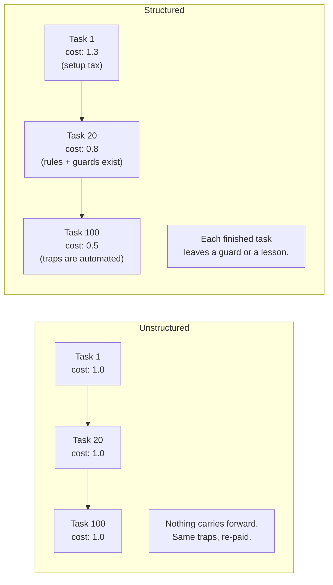

# Why a Workflow, Not Just a Better Prompt

**What this page answers:** why AI coding assistants feel great in week one and flat by week
six, why that is a structural problem and not a model problem, and what the fix costs you in
process overhead before it pays anything back.

## The week-one feeling is real, and it is misleading

The first tasks you give a coding agent go well. It writes a component. It wires an endpoint.
It fixes a null check. You save an hour. You conclude the tool is good.

Then you do it two hundred more times, and the hour you save stays exactly one hour. Task
number two hundred costs you what task number two cost you. Nothing accumulated.

That flatness is the actual problem. It is not that the agent is weak. It is that nothing you
learned on task 2 was available on task 200.

## Four structural reasons

### 1. The agent has no memory between sessions

Every new session starts from zero context about your project. Whatever you painfully worked
out yesterday, that a mock attribute you never set is a truthy auto-mock, that patching must
target where a name is looked up and not where it is defined, that two config files hold a
duplicated routing table, is gone.

So the same class of bug gets re-discovered at full price. Not a cheaper price. The full
price, including the debugging detour, every time.

Human teams solve this with onboarding docs, code review, and people who remember. An agent
has none of those unless you build them.

### 2. A green test suite is not evidence the feature works

Agents are very good at making tests pass. That is the objective they were given. If the
fastest route to green is to weaken the assertion, widen the mock, or test the mechanism
instead of the behavior, a capable agent will find that route, and the output looks exactly
like success.

A concrete shape of this: a new test written during a fix goes green immediately. That looks
like proof. It can also mean the test never exercised the path it names, or a normalization
step between the input and the assertion erased the difference you were testing for. Both
produce a green line in the terminal.

Green tells you the suite ran. It does not tell you the suite would have caught the bug.

### 3. Speed without a gate produces confident wrong code faster

Agents do not signal uncertainty the way a junior engineer does. There is no hesitation in the
output, no "I think this is right but check the edge case". Bad code arrives with the same
confident tone as good code, and it arrives quickly.

If your review capacity is the bottleneck, and it is, then raising generation speed without
raising verification quality just raises how fast defects reach your branch.

### 4. Instructions decay, tests do not

You write a rule: "always register a new blueprint in the app factory". Six months later the
app factory moved, three new blueprints exist, and two of them skipped the rule. The rule is
still sitting in a markdown file, still confidently wrong, and nothing told you.

Prose has no failure mode. A test does.

## The core claim

**The value is not the model. It is the harness around the model.**

Two teams using the identical model get very different results, because one team's structure
turns each finished task into an asset and the other team's does not.

A structured workflow makes each task cheaper than the last. An unstructured one makes each
task cost the same forever.

Note the shape honestly. The structured line starts **higher**. You pay a setup tax before you
collect anything.

## What it costs

This is real overhead, so price it before you commit:

- Writing a spec before code. Hours, per feature, up front.
- Writing down what bit you, after the bug is already fixed and you want to move on. This is
  the step people skip, and it is the step the whole method depends on.
- Building and maintaining guard tests for your own process, not just your product.
- Reviewing agent output properly instead of skimming it.

**Where it pays off:** projects measured in months, with more than one contributor, where the
same codebase is touched repeatedly. The compounding needs repetitions to compound over.

**Where it does not pay off:** a one-off script. A weekend prototype. A migration you will run
once and delete. Writing a spec for a fifty-line utility is a real waste, and pretending
otherwise is how a good method gets a bad reputation.

If you cannot name at least twenty future tasks in the same codebase, do not build the harness.
Just use the agent directly and move on.

## What this repo is, and is not

**It is:**

- A description of a method that one engineer refined in daily production use.
- Concrete, with evidence. Where a claim can carry a code example or a specific failure, it does.
- Adaptable. The ideas are stack-neutral even though the examples are not.

**It is not:**

- A mandate. Nobody is required to adopt any of it.
- A framework to install. There is no package. There is no runtime. The artifacts are markdown
  files, a few scripts, and tests. You can rebuild all of it in an afternoon once you see why.
- A claim that AI writes the code for you. The agent writes lines. You still own the design,
  the constraints, the review, and every consequence. The method exists precisely because the
  agent cannot be trusted unsupervised. If it could, none of this would be needed.
- A claim that this is the only way. It is one way, that worked, described honestly including
  the parts that failed.

## Where to go next

The method has three parts, and they only work together:

- [Spec-driven development](02-spec-driven-development.md) gives the agent a target that is
  specific enough to be checkable.
- [TDD with agents](03-tdd-with-agents.md) gives you evidence instead of a green check mark.
- [Compound engineering](04-compound-engineering.md) is what turns finished work into a lower
  price on the next task. That page is the point of the other two.
