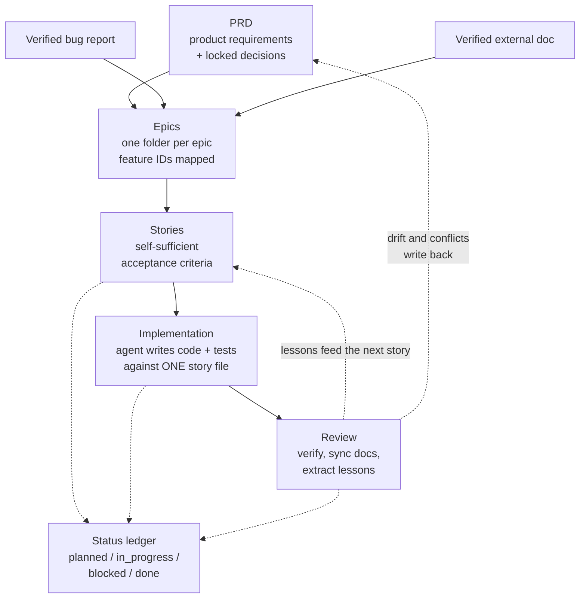
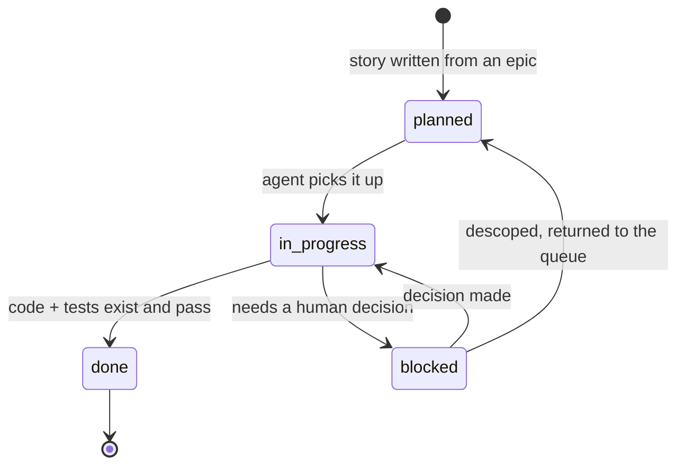
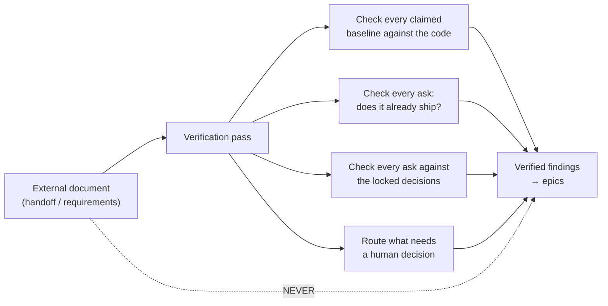

# Spec-Driven Development

**What this page answers:** how to make the specification the durable artifact and the code the
output, what a story file must contain to be handed to an agent unsupervised, and why a
document written by another team is a set of hypotheses rather than a set of requirements.

## Standing on shoulders

The agentic version of this idea has parents. [GitHub's spec-kit](https://github.com/github/spec-kit)
makes specify → plan → tasks an installable workflow. The [BMAD method](https://github.com/bmad-code-org/bmad-method)
runs analyst, architect, PM, dev, and QA as agent personas from plan down to story-level
implementation. This page is a lighter, copy-in take on the same bet: plain markdown, no
install, any agent. The book lineage — Cockburn, Adzic, Patton — is listed in
[06-further-reading.md](06-further-reading.md).

## The inversion

Normal practice treats code as the asset and the spec as paperwork that goes stale the day
after it is written. Spec-driven development flips that.

The spec is the asset. The code is one compilation of it. If the code is lost, a good spec
rebuilds it. If the spec is lost, no amount of code tells you what the constraints were or why
a decision went the way it did.

This matters more with an agent than without one. An agent will produce code from any input.
The quality of what comes out is bounded by how specific and how checkable the input was. Vague
input does not produce vague code. It produces confident code that solves a problem nobody
asked about.

## The chain

Each arrow is a real handoff with a real output file. Nothing is implied or held in someone's
head.

## The status ledger

One file tracks every story through four states. Not three, not six.

Two details that look small and are not:

**`blocked` is a first-class state, distinct from `planned`.** A story blocked on "does an
admin see other tenants' rows?" is not un-started work. It is finished work waiting on a person.
Collapsing the two hides the real bottleneck, which is usually a human decision nobody was
asked for.

**A story reaches `done` only when its tests exist and pass.** Not when the code looks
finished. This is the single cheapest guard against an agent declaring victory, and it is
covered in detail in [TDD with agents](03-tdd-with-agents.md).

Keep the ledger machine-readable, one file, and rebuild its *structure* from the plan folder
while preserving its *values*. A sync that regenerates structure and clobbers status is worse
than no sync.

## Locked decisions: the invariant table

The PRD carries a table of decisions that are **locked**. Not defaults. Not preferences.
Invariants that later work is not allowed to weaken.

Example rows from a real one:

- One user-facing action equals one API call. The server absorbs the orchestration.
- A schema change ships with its migration in the same change.
- Never create a table and add a NOT NULL constraint in the same deploy. Expand, backfill,
  contract.
- Server-side authorization is the only authorization. A hidden UI button is not a permission.

**Why this table exists:** without it, an agent under pressure to make a test pass will trade
away a constraint, and the trade looks reasonable in isolation. Widening a validation rule
makes the failing test green. Splitting one endpoint into three makes the frontend simpler.
Each individual trade is defensible. The cumulative effect is that your architecture quietly
became something nobody chose.

The rule is blunt: a story may not weaken a locked decision. If a story genuinely needs to, the
work stops, a human decides, and the PRD changes first. The decision changes at the top, then
flows down. It never gets negotiated away at the bottom.

This is the highest-value paragraph in a PRD, and it is the one most often missing.

## Story files must be self-sufficient

**The rule:** an implementing agent should need that one story file, plus the specific sources
the file cites by path and line, and nothing else. Never "read the whole PRD first".

Two reasons, and both matter.

**Context economy.** Loading a full PRD, four epics, and a schema dump into every session costs
tokens and time on every single task, forever.

**Correctness, which is the bigger one.** An agent given everything attends to nothing. Signal
gets diluted. The constraint that actually governs this story sits in paragraph forty of a
document where thirty-nine other paragraphs are equally emphasized. A story file that says
"this endpoint is paginated, see `services/report.py:214`" gets that constraint applied. A PRD
that mentions pagination once on page six does not.

A self-sufficient story file contains:

- What to build, stated as behavior.
- Acceptance criteria, each independently testable.
- The exact files and line ranges that are relevant, cited.
- Which locked decisions apply here.
- Known traps, carried forward from earlier stories. See
  [compound engineering](04-compound-engineering.md).
- What is explicitly out of scope.

Writing this file is real work. That is the point. The thinking happens once, in a place where
it persists, rather than being re-derived badly in every session.

## Acceptance criteria and the edge-case budget

"Include edge cases" with no budget gives you two lazy ones or fifteen bloated ones, depending
on the day. So the count gets a cap, and every case gets a source.

**The budget:**

- **3** edge-case acceptance criteria per story. Default.
- **5** when the story touches **money, authorization, or file upload**. Those are the three
  places where a missed branch costs real damage.
- **More than 5 means the story is too big.** The count is a size smell, not a coverage target.
  Split the story, and let each half carry its own three.

Happy-path criteria and criteria forced by a locked decision, like idempotency or an authz
check, are not in the budget. Those are mandatory regardless.

**Every edge case must trace to a source.** Walk this list in order, and write one line for
each source you skip. That skip line is the bloat control. It forces a deliberate "not
applicable" instead of an open-ended hunt for scary scenarios.

1. **Boundaries.** For fields the code actually bounds: min-1, min, max, max+1. Only the bound
   this story moves. A story that does not change a limit does not re-test that limit.
2. **Equivalence classes.** One valid representative, one invalid. "All unsupported file types"
   is one class and one criterion, not eleven.
3. **Error paths the stack forces.** These need no imagination, they are readable off the code
   shape: a 422 where the schema layer rejects a bounded field, a 401 and 403 for each auth
   decorator on the route, a 404 for another tenant's row, a 503 when a real dependency is down.
   Include only the ones this route actually has.
4. **State and concurrency.** Double submit with the same idempotency key produces exactly one
   write. A retried background task produces no duplicate side effect. Empty result set. First
   page against last page. A row deleted between read and write.
5. **Domain-specific.** The ones only your product has. Reach here when sources 1 through 4
   come back thin.

Write the behavior, not the mechanism. "The upload is rejected with a message naming the size
limit" is testable and stable. "The schema layer raises a ValidationError" breaks when you
change libraries and tells a reviewer nothing.

**What this budget does not try to do:** find multi-step state bugs. Those come from
exploratory testing after the story ships, not from a longer criteria list. Writing scripted
edge cases past the cap buys bloat and no coverage.

## An external document is a set of hypotheses

This is the point most teams get wrong, and it is expensive.

A requirements document or handoff doc arrives from another team. It contains a section like
"current state: the export endpoint does not support filtering". It contains asks. It reads
like a specification.

**It is not a specification. It is a set of claims, and each claim needs verifying against the
actual code before it becomes work.**

Specifically:

- Its "this already exists" table was written by someone **without commit access** to your
  repo. They inferred it from the UI, from an old document, or from a conversation. Any row can
  be wrong in either direction.
- Its asks may **already ship**. You can build a feature that has been live for two months.
  This happens, and it happens quietly, because nobody re-checks a requirement that arrived in
  an official-looking document.
- Its baselines may describe an older deployed environment, not your main branch.

So a verification step sits in front of epic generation:

The same holds for a bug report. A report can be right that a field is wrong and wrong about
why, and wrong about the fix. Verify the diagnosis and the remedy separately. Fixing a
correctly-reported symptom with an incorrectly-reported cause is how you ship a second bug.

## Requirements entry points

Exactly three things may become an epic. Nothing else has been verified enough to earn it.

1. **A PRD.** Greenfield, or built from an existing brief that was read and quoted rather than
   guessed at.
2. **A verified bug report.** Checked against the code, the live API schema, and the PRD.
3. **A verified external document.** Same verification pass as above.

An unverified paste is not an entry point. Neither is a chat message, a screenshot, or a
meeting note. Those are inputs to verification, not inputs to planning.

## Traceability, and its honest limit

Give every declared feature an ID. Have the epics reference those IDs. Then a coverage check
answers one question: is every declared feature mapped to at least one epic?

**Be explicit about what that proves.** Coverage is a **tautology check**. It proves nothing
you declared is unmapped. That is all.

It does **not** prove:

- that the PRD asked for the right things,
- that the mapped epic actually delivers the feature,
- that the feature list is complete.

A clean coverage number on an incomplete PRD is a clean number on the wrong document. Feature
catalogs written by asking "what can the user do?" systematically miss the application's own
surface: shared UI vocabulary, accessibility as a verified state, observability, error
messaging. None of those answer "what can the user do", and all of them are real work.

The real value of the mapping is **sequencing**, not the percentage. Foundation epics early,
cross-cutting sweeps late. A coverage tool that shows you the ordering is worth more than one
that shows you a number.

One mechanical warning if you build such a tool: pick an ID pattern up front, allow digits in
it, and make every scanner in your pipeline use the exact same pattern. When a scanner misses
an ID, fix the scanner. Never rename the feature to dodge the tool.

## What to take from this page

If you adopt one thing, adopt **self-sufficient story files**. They are the unit that makes
agent work checkable.

If you adopt two, add the **locked decisions table**. It is the only thing standing between
your architecture and a hundred individually reasonable trades.

Next: [TDD with agents](03-tdd-with-agents.md), which is how a story's acceptance criteria turn
into evidence instead of a green check mark.
