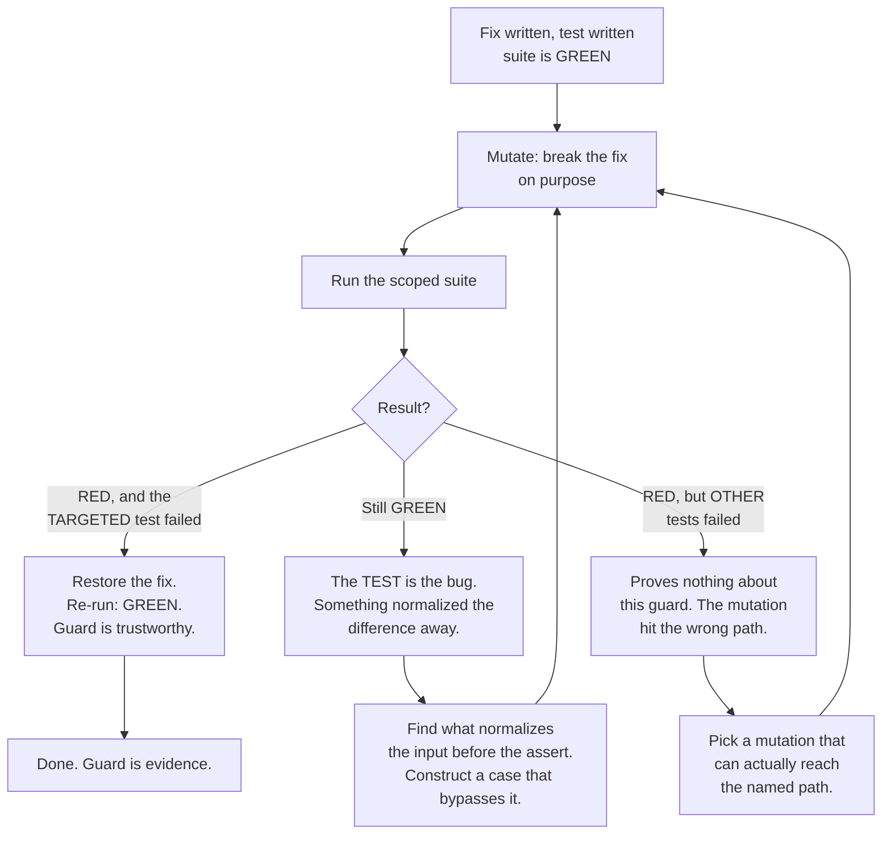

# TDD When an Agent Writes the Code

**What this page answers:** why red-green-refactor needs extra teeth when the agent writes both
the test and the code, what mutation verification is and how to run it, and how to write a
guard that cannot pass by accident.

## The classic loop still applies. It is just not enough.

Red, green, refactor is not obsolete. The mechanics are unchanged. What changed is who writes
the test, and that breaks one assumption the loop quietly depended on.

When a human writes a test first, the human **watched it fail**. That observation is the whole
value. It proves the test can detect the absence of the behavior. Nobody wrote that step down
because nobody could skip it.

An agent can skip it. An agent can write the code and the test in one pass and report both
green. You never saw red. So you have a test that passes, and no evidence it would ever fail.

**A test that has never been seen to fail is not evidence of anything.**

## Mutation verification

The discipline that fixes this: **break the fix on purpose, watch the test go red, restore it.**

Do this for every guard you intend to trust. Not every test. Every test you plan to rely on as
a safety net.



Three failure modes in that diagram are the reason it needs to be a diagram:

**Still green means the test is the bug.** Usually there is a normalization step between your
input and your assertion that erased the difference. A trim, a sort, a default, a type coercion.
Ask what normalizes your input before the assert, then build the case that bypasses it.

**Red on the wrong tests proves nothing.** Check *which* tests broke, never just the count. A
mutation that goes red on four unrelated tests and leaves your new one green has told you your
new one is worthless.

**The mutation itself can be the bug.** Confirm the line you broke is on the path the test
names. Breaking dead code produces a green run and a false conclusion.

### Python, pytest

The fix and its test:

```python
# services/report.py
def build_report_rows(rows, tenant_id):
    # The fix: never leak another tenant's rows.
    return [r for r in rows if r.tenant_id == tenant_id]
```

```python
# tests/test_report_service.py
def test_rows_from_other_tenants_are_excluded():
    rows = [
        SimpleNamespace(id=1, tenant_id="acme"),
        SimpleNamespace(id=2, tenant_id="globex"),
    ]
    out = build_report_rows(rows, tenant_id="acme")
    assert [r.id for r in out] == [1]
```

Now verify it. Break the filter:

```python
def build_report_rows(rows, tenant_id):
    return list(rows)          # MUTATION: filter removed
```

```
$ cd backend && python -m pytest tests/test_report_service.py -v
FAILED tests/test_report_service.py::test_rows_from_other_tenants_are_excluded
  assert [1, 2] == [1]
1 failed
```

One test failed, and it is the one you targeted. Restore the filter, re-run, confirm green.
**Now** the test is evidence.

Restore with a targeted edit, never `git checkout -- <file>`. Checkout wipes every uncommitted
change in that file, including work from earlier in the session that has nothing to do with the
probe.

### TypeScript, vitest

```ts
// src/features/report/filterRows.ts
export function filterRows(rows: Row[], tenantId: string): Row[] {
  return rows.filter((r) => r.tenantId === tenantId);
}
```

```ts
// src/features/report/__tests__/filterRows.test.ts
import { describe, expect, it } from "vitest";
import { filterRows } from "../filterRows";

describe("filterRows", () => {
  it("excludes rows from other tenants", () => {
    const rows = [
      { id: 1, tenantId: "acme" },
      { id: 2, tenantId: "globex" },
    ];
    expect(filterRows(rows, "acme").map((r) => r.id)).toEqual([1]);
  });
});
```

Mutate `filterRows` to `return rows;`, run `npx vitest run src/features/report`, confirm exactly
that test goes red, restore.

## Never mark a task done unless its tests exist and pass

Agents will claim done. They are not lying, they have genuinely finished generating. The claim
just does not correspond to a verified state.

So the workflow makes the claim cheap to check. Before any story moves to `done`:

- Its tests exist as files you can open.
- They pass in a run you watched, not a run that was described to you.
- The new ones have been mutation-verified.

The cost of checking has to be low or it gets skipped. A single scoped command that prints pass
or fail is enough. If verifying takes ten minutes of manual clicking, you will stop doing it by
week two.

## Test the invariant, not the point that bit you

This is the most common way a guard turns out to be worth less than it looked.

**Worked example, from a real reconcile bug.**

A sync routine rebuilt a status ledger's structure from a plan folder while preserving each
entry's status value. Some entries came from an external source and had no matching plan folder
at all. The sync dropped them. They vanished from the ledger.

The obvious guard: create a ledger where an entry is **fully absent** from the plan, run the
sync, assert it survives. That passes. It looks like the bug is covered.

It is not. There is a second state that fails **differently**: an entry that is
**partially present**. The plan folder has the entry, but only some of its children. The
absent-case code path handles a missing key. The partial case exercises a merge path, and a
merge that substitutes instead of merging drops the extra children while the fully-absent guard
stays green the entire time.

**One bug, two states, two different failure mechanisms. A guard written against the state that
bit you tests one point, not the invariant.**

The invariant is: *values that came from outside the plan survive a sync, whether their parent
is fully absent or partially present.* Two test cases, both mutation-verified. The generalized
form of the lesson: when you fix a reconcile or merge bug, cover the partial state too. Absent
and partial are different states.

Ask this of every guard you write: what is the *class* of input that breaks this, and did I
cover more than one member of it?

## Guards must be import-shaped or call-shaped

A structural guard checks a property of the codebase itself. "Every route has an auth
decorator." "These two routing tables are identical." "Every blueprint is registered."

These are the highest-value tests in the method, because they catch a whole class of regression
including in files that do not exist yet. And they have one specific failure mode.

**A naive substring check matches the prose in its own docstring and passes forever.**

```python
# BROKEN. This guard can never fail.
def test_every_route_has_auth():
    for path in Path("backend/api").rglob("*.py"):
        src = path.read_text()
        assert "auth_required" in src        # matches a comment. Or the docstring
                                             # of this very test, if it scans itself.
```

The fixed shape strips comments and docstrings first, then checks a **call or import shape**:

```python
import ast
from pathlib import Path

PUBLIC = {"health", "openapi_spec"}   # explicit allowlist, reviewed

def test_every_route_carries_an_auth_decorator():
    offenders = []
    for path in Path("backend/api").rglob("*.py"):
        tree = ast.parse(path.read_text())          # AST: comments are gone by construction
        for node in ast.walk(tree):
            if not isinstance(node, ast.FunctionDef):
                continue
            names = {
                d.func.id if isinstance(d, ast.Call) else getattr(d, "attr", getattr(d, "id", ""))
                for d in node.decorator_list
            }
            is_route = any("route" in n for n in names)
            if is_route and node.name not in PUBLIC and not (names & AUTH_DECORATORS):
                offenders.append(f"{path}:{node.name}")
    assert offenders == [], f"routes without auth: {offenders}"
```

TypeScript equivalent, same principle:

```ts
// src/__tests__/guards/singleApiClient.test.ts
import { describe, expect, it } from "vitest";
import { globSync } from "glob";
import { readFileSync } from "node:fs";

const ALLOWED = "src/services/api/apiClient.ts";

describe("axios instance guard", () => {
  it("creates an axios instance in exactly one file", () => {
    const offenders = globSync("src/**/*.{ts,tsx}")
      .filter((f) => f !== ALLOWED)
      .filter((f) => {
        const src = readFileSync(f, "utf8")
          .replace(/\/\*[\s\S]*?\*\//g, "")   // strip block comments
          .replace(/\/\/.*$/gm, "");          // strip line comments
        return /\baxios\s*\.\s*create\s*\(/.test(src);  // CALL-shaped, not a substring
      });
    expect(offenders).toEqual([]);
  });
});
```

Four properties make a structural guard trustworthy:

1. **It walks the tree.** `rglob` or `glob`, never a hardcoded file list. A new file must be
   caught automatically, which is the entire reason the guard exists.
2. **It is unconditional.** "If the file imports X, then it must also do Y" is defeated by the
   likeliest regression, which is a new file that simply omits both.
3. **It strips comments before scanning**, or parses an AST so comments are gone by
   construction.
4. **It has been seen red.** Add a throwaway file with none of the required machinery, confirm
   the guard fails, delete the file. A family guard that has never rejected a member has never
   been tested.

## Scoped tests during work, full suite at the gate

Running the full suite after every edit is slow enough that you will start skipping it, which is
worse than not having it.

- **While working:** run only the tests for what you touched. Seconds, not minutes.
- **At the commit gate:** run the full suite.
- **Record a baseline the first time you run it.** Real projects have pre-existing failures.
  Blocking every commit on debt somebody else created means the gate gets bypassed within a
  week, and a bypassed gate is worth zero.

The baseline-aware gate compares against a stored snapshot of known failures and fails only on
**new** breakage. Policy on the baseline file:

- **Shrink it freely.** You fixed pre-existing debt, re-snapshot, good.
- **Never grow it to get past a red gate** without an explicit human decision. Growing the
  baseline to make a gate green is the exact move the gate exists to prevent, and it leaves no
  trace unless you make it a rule.

One more reason baselines matter on a GitLab setup: if CI runs tests only on merge requests,
then a plain push to a feature branch runs nothing at all. Local gates are the only signal
between the edit and the MR. That is a long window to leave unguarded.

## Honest test doubles

Prefer hand-written fakes over deep mock chains where you can. A fake that implements the real
interface fails loudly when the interface changes. A mock chain silently keeps passing.

Traps worth knowing, each of which cost a real debugging session:

**An attribute you never set on a mock is not absent. It is a truthy auto-created mock.** So
`getattr(row, "new_column", None)` returns a mock object, never `None`, and every fail-closed
branch that checks for absence is silently defeated. When a change adds a column, add it
explicitly to every stand-in, including `= None` for the legacy case. Prefer `SimpleNamespace`
over `MagicMock` for entity stand-ins for exactly this reason: it has no auto-attributes.

**A mock accepts any signature.** Widening a parameter's type is invisible to every call site
that mocks it. Grep for assertions on that parameter's **value**, not just for call sites.

**Patch where the name is looked up, not where it is defined.** `from x import f` copies the
reference, so you patch the importing module's attribute. The inverse trap: a lazy import inside
a function body means patching the importing module is inert, and you must patch the definition
site. If a patched mock "never runs" and no error appears, assert it was called before trusting
anything downstream.

**A capture-dict test needs a "did we get here at all" assertion first.** A dict filled by a side
effect proves nothing if the code raised before reaching it. Assert the key is present, then
assert its contents.

**A negative assertion proves nothing until the detector has been seen to return true.** Every
"X did not change" check needs a positive control that fires it. Every before-and-after
comparison needs a loud assertion that the "before" was non-empty.

## The short version

- A test never seen red is not evidence. Mutation-verify anything you plan to trust.
- Check *which* test went red, not how many.
- Green after a mutation means your test is broken, not your code.
- Cover the invariant. Absent and partial are different states.
- Guards parse structure, not substrings, and strip comments first.
- Scoped while working, full suite at the gate, baseline the pre-existing debt.

Next: [compound engineering](04-compound-engineering.md), where these guards stop being
one-offs and start being an asset that grows.
