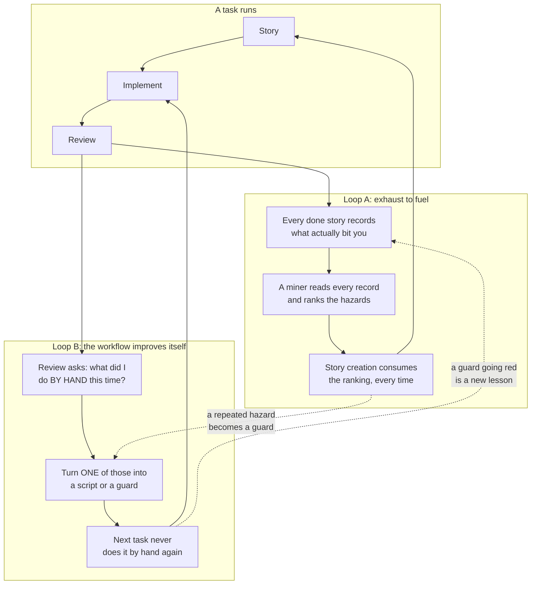
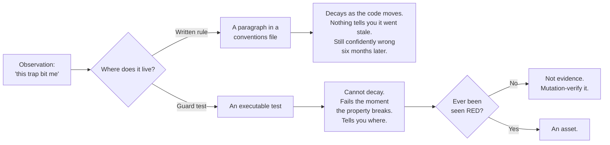
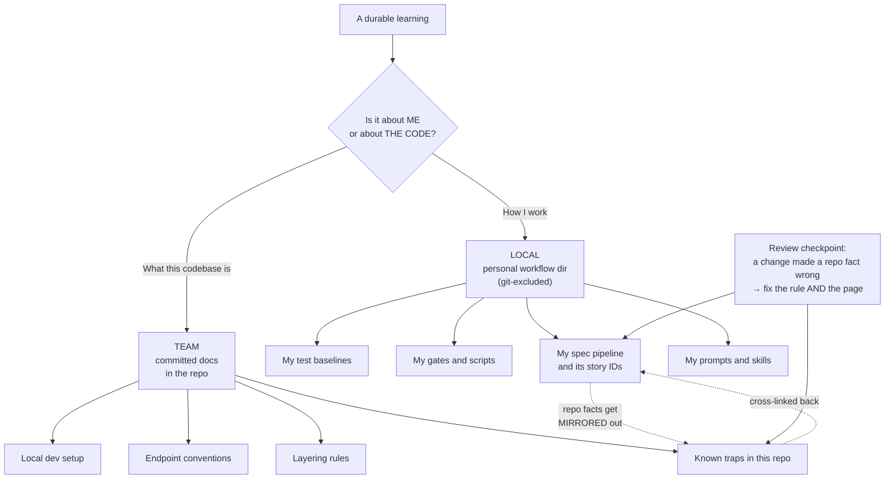

# Compound Engineering

**What this page answers:** how to build an engineering loop where finishing a task makes the
next task permanently cheaper, the two sub-loops that do it, the four ways the first loop fails
quietly, and why some knowledge belongs in your local workflow and some belongs in the repo.

## The definition

**Compound engineering: an engineering loop where finishing a task makes the next task cheaper,
permanently.**

Every word is load-bearing.

- **Finishing** a task, not starting one. The asset is produced at the end, from what you
  learned, not at the beginning from what you planned.
- **Cheaper**, meaning measurably less work. Fewer debugging detours, fewer review rounds,
  fewer re-litigated decisions.
- **Permanently**, meaning it survives your memory, your session, and your absence. If the
  benefit lives only in your head, it is experience, not compounding. Experience does not
  transfer and does not survive a context reset.

Most teams already do the first two accidentally. Almost nobody does the third on purpose.

## Two loops



Loop A carries **knowledge** forward. Loop B carries **automation** forward. They feed each
other: a hazard that keeps recurring in Loop A is the best candidate for a guard in Loop B, and
a guard that fires in Loop B produces a fresh lesson for Loop A.

## Loop A: exhaust to fuel

### The problem

Implementation notes are, by default, written once and never read again. Every project has a
folder full of them. Nobody opens it.

So the same trap gets re-discovered at full price. Not once. Every time a new story touches the
same shape of code. The mock attribute that auto-creates as truthy. The patch target that must
be the import site. The two config files with duplicated routing tables. Each one costs a real
debugging detour, and each one has already been paid for.

The information exists. It is just not reachable at the moment it would help.

### The mechanism

Three parts, and all three are needed.

**1. Every completed story records what actually bit you.**

A `## Dev agent record` section at the bottom of each story file. Not a summary of what was
built, that is what the diff is for. A record of the **traps**: what surprised you, what the
green suite failed to catch, what you got wrong the first time.

**2. A tool mines those records and ranks the hazards.**

A script walks every done story, extracts that section, splits it into items, and flags the
ones matching a hazard pattern.

**3. Story creation consumes the ranking, every single time.**

This is the part that makes it a loop instead of an archive. Creating a new story runs the
miner and pastes the top hazards into the new story file. A new story therefore **starts from
other stories' scars**, automatically, with no discipline required at the moment it matters
most.

The discipline is required only at write time, when the pain is fresh and writing it down is
easy. Read time is free.

### Four ways this fails quietly

These are the interesting part. Each was found in live use, and each produces a tool that looks
like it is working.

#### 1. Silent under-collection reads as "nothing to learn"

The miner prints three hazards. You conclude the corpus is thin. You move on.

Actually it scanned two files out of forty, because a path assumption was wrong or a heading
name changed. The output looked identical in both cases.

**The fix: the miner must fail loud. Always print the denominator.**

```
scanned 14 done stories · 9 had a dev agent record · 23 lessons found
```

Now "3 lessons" is interpretable. Scanned 14, 9 had records, 3 lessons means those stories
logged little. Scanned 2, 1 had a record, 3 lessons means your scan is broken.

Never optimize that line away for being noisy. It is the only thing separating a real result
from a broken one.

#### 2. A denominator cannot see what the matcher never matched

This is the second-order version, and it is subtle enough that the denominator's existence can
create false confidence.

**A denominator guards against scanning too few *files*. It cannot see items the matcher never
matched *inside* a file.**

Concretely: a matcher that extracts backticked function references written as `f()` will
silently skip every reference in the corpus written as `f(x)`. The denominator stays completely
truthful. Fourteen files scanned, nine had records. Every number is correct. The extraction is
still dropping most of its input.

**The fix: mutation-verify the matcher against a planted case written in the syntax the corpus
actually uses.** Not the tidy form in the docstring. The real form. Write a fake record
containing exactly the shape your team writes, run the miner, confirm it comes back. Then
change the matcher so it misses, confirm it disappears. That is the same mutation discipline
from [TDD with agents](03-tdd-with-agents.md), applied to your tooling instead of your product.

#### 3. A hazard filter that matches everything is worth nothing

The first hazard pattern flagged **every** scanned item. A hundred percent hazard rate makes the
flag pure decoration. Ranking by it does nothing, because it is constant.

The cause was matching on **topics**. A regex containing bare words like "bug" or "test" hits
every implementation note ever written, because implementation notes are about bugs and tests.

**The fix: every clause must name a cost or a generalization, never merely a topic.**

Clauses that earn their place:

- **It shipped past the tests.** `green suite`, `still green`, `tests stayed green`
- **It hides.** `silently`, `false positive`, `footgun`, `trap`
- **It recurs.** `generalizes`, `this class of`, `the same shape`, `any X over Y`
- **It already cost someone.** `bit us`, `cost us`, `missed by`, `the bug that`

Each one matches the **shape of a failure**, not a subject area. A note saying "added
pagination to the report endpoint" matches none of them, correctly. A note saying "the green
suite missed this because the mock auto-created the attribute" matches two, correctly.

Test your filter's discriminating power directly: if it flags every item, or zero items, it is
not ranking anything.

#### 4. Ranking without diversity means one story eats the budget

Sort all lessons by hazard, take the top twelve, done. This is the obvious implementation and it
is wrong.

Observed live: **one verbose story filled every slot.** Its author wrote eleven detailed
hazard-flagged notes. Ten other stories, each with one genuinely useful lesson, were buried
entirely. The output was technically the highest-ranked twelve items and practically a single
story's diary.

**The fix: round-robin across sources first, then rank within the diverse set.**

Group lessons by source story. Sort best-first *within* each story. Then take one from each
story, then a second from each story, and so on until the budget fills.

```
Naive top-12:      [S3, S3, S3, S3, S3, S3, S3, S3, S3, S3, S3, S7]
Round-robin top-12: [S1, S3, S4, S7, S9, S1, S3, S4, S7, S9, S3, S4]
```

Ten voices instead of one. **Any ranker over per-source items needs this guard**, not just this
one. It is a general property of "sort then slice" over grouped data.

## Loop B: the workflow improves itself

### The one question

After each story is reviewed, ask exactly one question:

> **What did I do BY HAND this time?**

Then turn **one** of those things into a script or a guard.

That is the whole loop. The constraints around it are what make it survive.

### The constraints

**Maximum one per story.** Not a backlog. Not "let me fix five things while I am here". One.
Small enough to actually finish inside the story's tail, which is the only time it will ever get
done.

**"None this run" is an explicitly valid answer.** This constraint is not softness, it is the
one that keeps the loop honest. Without it, the step becomes a quota, and a quota produces
manufactured busywork: a script nobody needed, wrapping a command nobody ran twice. That script
is now maintenance debt created by a process meant to reduce debt. **Manufacturing busywork is
the anti-goal.** Say "none this run" and mean it.

**Prefer rule to guard.** If you take one sentence from this page, take that one.



A written rule is better than nothing. It is also a static claim about a moving codebase. Six
months later it describes a structure that no longer exists, and it will keep describing it
until a human notices. Nothing about a stale paragraph looks stale.

A guard test cannot decay. When the property it protects breaks, it fails, and it fails at the
exact commit that broke it, and it names the file.

So when a review produces "we should always do X", the first question is: **can that be a test?**
Often yes:

| Rule you were about to write | Guard that replaces it |
| --- | --- |
| "Always register a new blueprint in the app factory" | Every blueprint defined in the API folder appears in the factory |
| "These two routing tables must stay in sync" | Assert the two dicts are equal |
| "Never create a second HTTP client instance" | Exactly one file calls the client constructor |
| "Every route needs an auth decorator" | Walk the routes, allowlist the public ones, assert the rest |
| "Model change ships with its migration" | A changed model file requires a migration file in the same commit |

Each of those started as a paragraph somebody wrote and somebody else did not read.

**A guard that has never been seen red is not evidence.** This is not a separate rule, it is the
same rule from [TDD with agents](03-tdd-with-agents.md), and it applies to your own tooling with
full force. Break the property on purpose, watch the guard fail, restore. A guard you wrote,
never mutated, and now trust is worse than no guard, because you stopped watching for the thing
it claims to catch.

### Why one-per-story beats a cleanup sprint

A dedicated tooling sprint sounds more efficient. It is not, for one reason: **at review time
you still remember what the manual work actually felt like.** Three weeks later, the item on
your backlog says "automate the migration check" and you no longer remember which part was
annoying, so you automate the wrong part.

The tail of a story is the only moment where the cost and the memory are both present.

## Knowledge has two homes

A question comes up as soon as this starts working: where does the knowledge live?

The answer is that there are two kinds, and mixing them causes a specific, avoidable problem.



**Personal process knowledge stays local.** How you run gates. Which failures are in your
baseline. Your story numbering. Your prompt library. None of that is a fact about the codebase,
and none of it is useful to a teammate who works differently.

**Repo facts get mirrored into committed team docs.** "The API layer calls services, services
call models, models never import the API layer." "One user action is one API call." "These two
config files hold a duplicated routing table, keep them in sync." Those are true for everyone
touching the repo, whether or not they use any of your tooling.

**Why keep them separate rather than committing everything?**

Because a personal workflow directory in a shared repo **invites a standardization argument that
a written convention page does not.**

Commit a conventions page and the conversation is about the content: is this layering rule
right? Should this endpoint really be one call? That is a good conversation and it improves the
document.

Commit your personal agent configuration, your prompt files, your story numbering, and your test
baselines, and the conversation becomes: is everyone required to use this? Why is this the
standard? Who approved this tool? Do I have to adopt your process to contribute?

That is an expensive conversation, it is about process rather than code, and it is entirely
avoidable. Nobody argues about whether they are allowed to read a document. Adoption stays
voluntary, which is the only way it works anyway.

**Cross-link both ways, or they silently fork.** The local rule points at the committed page.
The committed page points back. When one changes and the other does not, the divergence is
visible on the next read instead of six months later.

**Put a checkpoint in the review step.** One line: when a change makes a repo fact wrong, fix
the local rule **and** the committed page. Not one of them. Both. This is exactly the kind of
manual step Loop B eventually automates, which is a nice demonstration that the loops apply to
themselves.

## Making it real

The smallest version that actually compounds:

1. Add a `## Dev agent record` section to your story or ticket template. Record traps, not
   summaries.
2. Write a twenty-line script that reads them all and prints them, **with the denominator**.
3. Run that script when writing a new story. Paste the top items into the story file.
4. At review, ask what you did by hand. Turn one thing into a guard. Mutation-verify it.
5. Split what you learn: process knowledge stays local, repo facts get committed.

Steps 1 through 3 are Loop A. Step 4 is Loop B. Step 5 keeps it adoptable.

Everything else on this page is refinement, learned by watching those five steps fail in
specific ways. The refinements matter, and they are worth reading before you build it, but the
five steps are what compounds.

## The honest limit

None of this makes a bad design good. A compounding loop over a confused architecture compounds
the confusion, faster and more permanently.

Compound engineering lowers the cost of executing decisions. It does not make the decisions. That
is still yours, and it is still the hard part.

Next: [further reading](06-further-reading.md).
