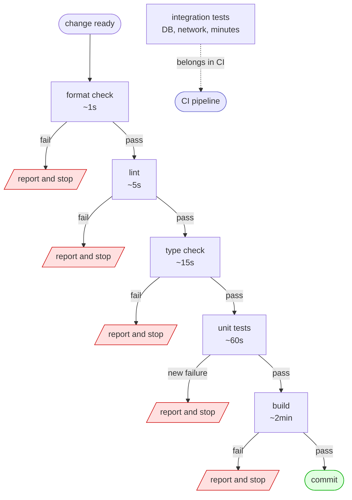
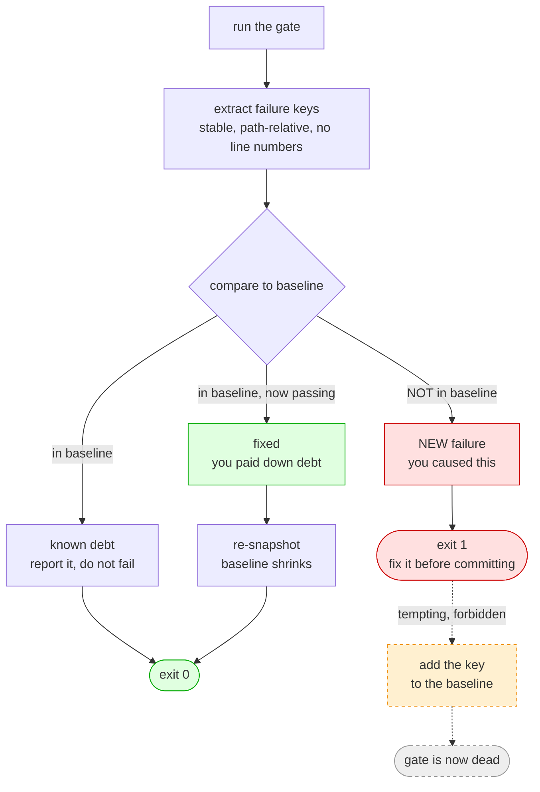
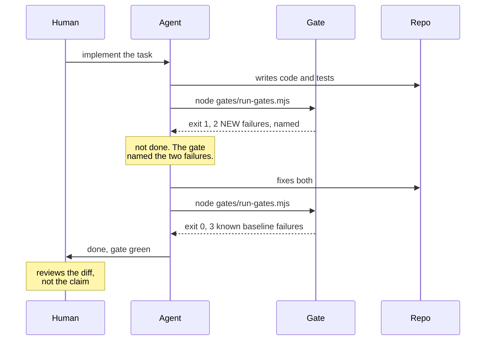

# Local CI enforcement

The runner that implements everything on this page lives in [`../gates/`](../gates/). Read this for the method. Read [`../gates/README.md`](../gates/README.md) for the manual.

## Why local gates, when we already have CI

CI is not the problem. The gap between writing code and hearing from CI is the problem.

**Feedback loop.** A local gate answers in seconds. CI answers in minutes, after a push, a queue and a container pull. Those minutes are not idle. You have context-switched, and the failure comes back to a head that is already somewhere else. Same information, a tenth of the value.

**CI does not run when you think it does.** In the repo this method came from, `.gitlab-ci.yml` runs the test jobs only on merge requests targeting `main`, `stag` or `prod`. A plain push to a feature branch runs nothing. So a red commit lands on a branch, sits for three days, and the first honest signal arrives when somebody opens the MR. By then the branch has twelve commits and the bisect is on you.

**The quality gate may not block.** That same repo sets `ENFORCE_QUALITY_GATE: "false"`. Sonar reports, Sonar does not stop anything. A check that cannot fail the build is a dashboard, not a gate.

Check your own pipeline before you assume you are covered:

```bash
grep -n -A3 'rules:\|only:\|if:' .gitlab-ci.yml   # or .github/workflows/*.yml
```

If the answer is "on merge request", then between the first commit on your branch and the day you open the MR, nothing is checking anything.

### The AI angle

This matters more once an agent is writing code.

An agent produces a large, plausible diff in a minute. Plausible is the hard part. The code reads well, the naming is consistent, the structure matches the file it sits in, and it is wrong in a way that reading does not catch. Confident and wrong looks exactly like confident and right.

Two consequences for the check:

- It must be **fast enough to run every time**, every time the agent claims a piece of work is done. A check you run once a day does not constrain a loop that iterates every two minutes.
- It must be **strict enough to catch confident-but-wrong work**. Prose review does not catch a type error, or a test the agent quietly changed to match the new behaviour instead of fixing the behaviour. The gate does not care how good the explanation was.

The gate is the objective checkpoint between "the agent says it is done" and "it is done".

## The gate ladder

Order the gates by cost, cheapest first. The point is not total runtime. The point is **time to first failure**. The most common mistakes are also the cheapest to detect, so if you order it right, most red runs finish in seconds.



The rungs, and what each one is actually for:

| Rung | Catches | Typical cost |
| --- | --- | --- |
| Format | Whitespace and style churn that pollutes every later diff | ~1s |
| Lint | Unused imports, shadowed names, banned patterns, `console.log` | ~5s |
| Type check | Wrong shapes, renamed fields, null holes. The highest value per second on the ladder. | ~15s |
| Unit tests | Behaviour. The only rung that knows what the code is supposed to do. | ~1min |
| Build | Bundler and packaging failures the type check does not see | ~2min |
| Integration | Real dependencies. Not a local gate. See below. | minutes |

Stop at the first failure. Running the remaining rungs after a type error gives you a wall of downstream noise, and the fix is at the top anyway.

## Baseline-aware gates

Here is the pattern that decides whether any of this survives.

Turn on a gate in a real repo and it goes red immediately, because the repo already has failures. Somebody's flaky test. Forty lint violations from before the rule existed. Type errors in a corner nobody has touched since last year. None of it is yours.

Now the gate fails on every commit for reasons the person committing did not cause. It gets `--no-verify`'d on day two and deleted on day three. Correctly, in fact. A signal that is always red carries no information.

**The fix: snapshot the currently-failing set once. On each run, compare. Fail only on failures that are not in the snapshot.**



Now the gate says something true and useful on day one: **you have not made this worse.** That is a bar a team will hold, and it is enough. Debt that stops growing starts shrinking, because every fix is visible.

### Baseline policy

State this explicitly, and hold it.

- **The baseline may shrink freely.** A smaller baseline means somebody fixed pre-existing debt. Re-snapshot it and commit. This should feel good and it should be easy.
- **The baseline must NEVER grow to get past a red gate without an explicit human decision.** Growing it silently is how the gate dies. Not dramatically. It just quietly stops meaning anything, and nobody notices for two months.

There are legitimate reasons to grow a baseline. A test that is genuinely flaky on shared infrastructure. A dependency upgrade that breaks something you have a ticket to fix. Those are decisions, and a decision has a person attached and a sentence explaining it. Running `--update-baseline` because the gate was red is not a decision, it is an escape hatch.

Two mechanics keep this honest:

**Store baselines as sorted plain text, one key per line, one file per gate.** A JSON blob or a hash would hide exactly the change that most needs a second pair of eyes. Sorted text means a growing baseline shows up as added lines in a diff, in front of a reviewer.

```
backend/tests/test_export.py::test_docx_builder_writes_header
backend/tests/test_meeting.py::TestMeetingList::test_pagination_caps_page_size
```

**Refuse to re-snapshot on a dirty working tree.** A baseline taken over uncommitted work records failures that no commit explains, and the next person cannot tell your work in progress from real debt. Require a clean tree, and make the override explicit.

### Failure keys must be stable

This is where a baseline implementation usually breaks, and the failure mode is quiet.

A key identifies one failure across runs. It must be identical for the same broken code on two machines on two days. A key **never** contains:

- an **absolute path**. Differs per checkout and per CI runner. Strip to repo-relative.
- a **line or column number**. Add a line at the top of a file and every key below it changes, and the gate reports a screen of NEW failures from an edit that changed nothing. That happens once and people stop trusting it.
- a **duration or timestamp**.
- an **assertion message** that carries received values. `assert 200 == 401` today, `assert 500 == 401` tomorrow, same broken test, two different keys.
- **ordering**. Collect into a set, sort on write.

Good keys, by stack:

```
backend/tests/test_auth.py::test_login_rejects_expired_token
frontend/src/pages/Meeting.test.tsx > MeetingPage > paginates at 100 rows
frontend/src/api/client.ts: error TS2345: Argument of type 'string | undefined' ...
frontend/src/pages/Meeting.tsx: no-console
example.com/app/meeting.TestPagination/caps_page_size
com.example.billing.InvoiceServiceTest.rejectsNegativeAmount
```

Note the type-check key keeps the message and drops the position. For a type error the message *is* the identity: two different errors in one file must stay two keys, or one of them can hide behind the other.

One more rule: **a tool that exits non-zero while reporting zero failures did not fail a test.** It crashed, or it was misconfigured. Treat that as a broken gate, not as clean output. Snapshotting an empty set there records a permanently blind gate as healthy, and it will stay blind.

## The type-check hole worth naming

This one is common, silent, and costs nothing to close.

Most TypeScript projects exclude test files from `tsconfig.json`:

```json
{
  "include": ["src"],
  "exclude": ["**/*.test.ts", "**/*.test.tsx", "src/__tests__"]
}
```

There are ordinary reasons for it. Test globals leak into the app's type space, and the build should not compile tests. Fine.

The consequence: **`tsc --noEmit` never type-checks your tests.** Running the tests does not close the gap either, because Vitest and Jest transpile without type checking by default. `esbuild` and `swc` strip types, they do not verify them.

So your test files are the one part of the codebase with no type checking at all. A test can call a function with the wrong arguments, mock a shape that no longer matches the real one, or assert against a field renamed six months ago, and stay green forever. The test passes. It is testing nothing.

This bites hardest where you need it most: an agent refactors a type, updates every call site in `src/`, and leaves a mock in a test file with the old shape. `tsc` is clean. The tests pass. Nothing reports a problem.

Close it with a second tsconfig that adds the tests back:

```json
// tsconfig.gates.json
{
  "extends": "./tsconfig.json",
  "include": ["src", "**/*.test.ts", "**/*.test.tsx", "src/__tests__/**/*"]
}
```

Point the type-check gate at that file, not at the default one:

```json
{
  "id": "typecheck",
  "description": "tsc over src AND tests",
  "run": "tsc -p tsconfig.gates.json --noEmit",
  "parser": "tsc",
  "baseline": true
}
```

Expect it to be red the first time. That is the point, and it is what the baseline is for. Snapshot the errors, then fix them as you go.

Check whether you have this hole right now:

```bash
node -e "const c=require('./frontend/tsconfig.json');console.log(JSON.stringify({include:c.include,exclude:c.exclude},null,2))"
```

If `exclude` mentions tests, or `include` does not, you have it.

## What belongs in a gate, and what belongs in CI

A gate is **fast, deterministic, local and hermetic**. Miss any of those four and it does not belong in the ladder.

| Property | Meaning | What breaks without it |
| --- | --- | --- |
| Fast | Whole ladder well under two minutes | People stop running it |
| Deterministic | Same input, same result, every time | One flake and the whole gate loses authority |
| Local | No shared or remote resource | Fails on a plane, fails on VPN trouble, fails when a colleague's DB is down |
| Hermetic | No live database, no real network, no shared state | Two people running it at once interfere with each other |

Split it this way:

| Gate, locally | CI |
| --- | --- |
| Format, lint | Full integration suite against a real database |
| Type check, including tests | End-to-end and browser tests |
| Unit tests with fakes and in-memory storage | Contract tests against a deployed service |
| Build | Container build and push |
| Fast static checks such as secret scanning | Coverage thresholds, license scanning, security scanning |
| | Anything needing credentials |

The pressure always goes one direction. Somebody wants the integration suite in the gate too, because it catches real bugs. It does. It also needs a live database, takes four minutes, and fails when the container is not up. Add it, and within a week the whole gate is being skipped, including the fifteen-second type check that was catching things daily.

**Protect the fast rungs by keeping the slow ones out.** CI is the right place for the slow ones.

## Hooks, or an explicit command

Be honest about this one.

A `pre-commit` hook that takes 90 seconds gets bypassed. Not by careless people, by good engineers on a deadline. `git commit --no-verify` is eleven characters and it is right there. Once somebody learns it, they use it under pressure, which is exactly when you wanted the gate most.

Two more problems with hooks specifically:

**Git does not share hooks on clone.** `.git/hooks/` is not tracked. A new teammate clones the repo, has no hooks at all, and nothing tells them. You can fix that with a tracked directory plus a one-time setup:

```bash
git config core.hooksPath .githooks
```

That is still a manual step per clone, so somebody will not run it, and you will not find out until a red commit lands from the one machine that never had the gate.

**A hook only fires on the operations it is bound to.** `pre-commit` does not run on `git commit --amend -n`, on a rebase that replays commits, or on a merge. Coverage is patchy by design.

### The recommendation

**Make the gate a command your workflow calls at a known checkpoint. Treat the git hook as optional.**

```bash
node gates/run-gates.mjs          # before every commit
```

Put it where work already stops:

- In your commit flow, as the step before writing the message.
- In your agent loop, as the step before the agent reports back.
- In `package.json` scripts, so it is discoverable: `npm run gates`.
- In CI too, so the same command runs in both places and cannot drift.

If you do want a hook, keep it to the fast rungs only, and keep it under ten seconds:

```bash
# .githooks/pre-commit
node gates/run-gates.mjs --only-changed --gate format --gate lint --gate typecheck
```

`--only-changed` skips whole projects git says you did not touch, which is what keeps a monorepo hook survivable.

The version that lasts is the one people choose to run because it is faster than being wrong. Not the one that fights them.

## Integrating with an agent loop

An agent finishes a task and says it is done. That claim comes from the same model state that produced the code, so it tells you very little about whether the code is right.

The gate is the checkpoint that turns the claim into a fact.



Three rules make this work.

**The agent runs the gate. It does not decide whether it passed.** Exit code 0 or not. No prose reading of the output, no judging that a failure looks unrelated. A gate whose verdict is negotiable is not a gate.

**The gate's output is the fix list.** This is why NEW failures must be listed explicitly and separately from baseline ones. Hand an agent forty failures, three of which it caused, and it will start fixing pre-existing debt it does not understand and did not have context for. Hand it the three, and it fixes the three.

**A green gate is not a review.** It says you did not break what was already covered. It says nothing about whether the design is right, whether the new tests test anything real, or whether the requirement was understood. A human still reads the diff. The gate exists so the human reads a diff worth reading, instead of finding a type error on line 40.

One trap is specific to agents: an agent that cannot make a test pass may change the test. A green suite after that means nothing. Guard it cheaply, by reading test file changes as carefully as source changes, and by never letting a baseline grow without a human sentence next to it.

## Gate commands by stack

Concrete starting points. Adjust to your repo, keep the ladder order.

| Stack | Format | Lint | Type check | Unit tests | Build |
| --- | --- | --- | --- | --- | --- |
| **Python** | `ruff format --check .` | `ruff check .` | `mypy .` | `pytest tests -q -rfE` | `python -m build` |
| **Node / TS** | `prettier --check .` | `eslint . --format json` | `tsc -p tsconfig.gates.json --noEmit` | `vitest run --reporter=json` | `npm run build` |
| **Go** | `gofmt -l .` | `go vet ./...` | built into `go build` | `go test -json ./...` | `go build ./...` |
| **Java** | `mvn spotless:check` | `mvn checkstyle:check` | built into `mvn compile` | `mvn -B test` | `mvn -B package -DskipTests` |

Notes that save an hour each:

- **Python**: `ruff` replaces `black`, `isort` and `flake8`, and it is fast enough for a gate. `-rfE` makes pytest print the `FAILED path::test` summary lines, which is where stable keys come from with no plugin.
- **Node / TS**: point the type check at a tsconfig that **includes the tests**. See the hole above. Write the vitest JSON to a file, since vitest prints progress on the same stream as the report.
- **Go**: `gofmt -l .` prints offending files and still exits 0, so check for empty output, not for the exit code. `-json` on `go test` is required for stable keys.
- **Java**: the fastest local gate is `mvn -o -B test` in offline mode. Parse the JUnit XML in `target/surefire-reports`, not the console output. Gradle writes the same XML to `build/test-results/test`.

## Rolling this out on an existing repo

In order, over about a week.

1. **Read your CI config** and write down what actually triggers it. Most teams are surprised.
2. **Pick one gate**, the highest value per second. Usually the type check or the unit suite.
3. **Run it and record the baseline.** Expect red. That is the debt you already had, now written down.
4. **Commit the baseline** with a message saying what it is: `chore: record gate baselines, known debt as of <date>`.
5. **Wire it into the checkpoint** where work already stops, before the commit.
6. **Add the next rung** once the first has been green for a week.
7. **Watch the baseline size.** Shrinking is the health signal. If it grew twice with no explanation in the commit message, the gate is on its way to dying, and that is worth one conversation now.

The whole thing is one bar, held steadily: **do not make it worse.** Everything else follows.
