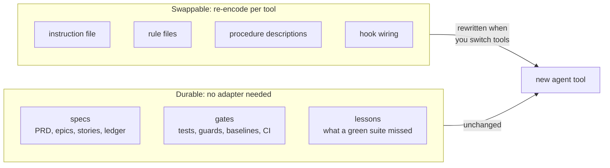

# Portability: the method is not the tool

**What this page answers:** which parts of this method depend on Claude Code, which parts do not,
how to carry it to OpenAI Codex, AWS Kiro, Google Antigravity, or Cursor, and what survives when
you switch tools entirely.

## The principle

Everything in this repo is shaped like Claude Code, because that is what it was built and used on.
Files live in `.claude/`, rules carry a `paths:` glob, procedures are skills, checkpoints are
hooks wired in `settings.json`.

None of that is the method. It is one encoding of the method.

Underneath, four things have to exist no matter which agent you run. Call them the portable
primitives:

1. **Always-loaded project context.** What this project is, what it is built with, what is locked.
   Paid for on every turn, so it has to stay small.
2. **Scoped knowledge, loaded on demand.** Rules that apply to one area. The whole point is that
   the API rules cost nothing while you work on the frontend.
3. **Repeatable named procedures.** Implement a story. Review a story. Triage an issue. A
   procedure you invoke by name instead of re-explaining it every time.
4. **Deterministic checkpoints outside the model.** The part the model cannot talk its way past.

```mermaid
flowchart TD
    subgraph P["The four primitives"]
        A["1 · Always-loaded context<br/>what this project is"]
        B["2 · Scoped knowledge<br/>loaded on demand"]
        C["3 · Named procedures<br/>invoked, not re-explained"]
        D["4 · Deterministic checkpoints<br/>outside the model"]
    end

    A --> CC["Claude Code<br/>.claude/CLAUDE.md"]
    B --> CC2["rules/*.md<br/>with paths: glob"]
    C --> CC3["skills/ and commands/"]
    D --> CC4["hooks/ via settings.json"]

    A --> CX["Codex<br/>root AGENTS.md"]
    B --> CX2["nested AGENTS.md<br/>merge order matters"]
    C --> CX3["no equivalent<br/>markdown + point at it"]
    D --> CX4["Codex hooks framework"]

    A --> KR["Kiro<br/>.kiro/steering/product.md"]
    B --> KR2["steering/tech.md<br/>structure.md, custom files"]
    C --> KR3["Kiro native specs"]
    D --> KR4[".kiro/hooks/"]

    A --> AG["Antigravity<br/>.agents/rules/ + AGENTS.md"]
    B --> AG2["rules are ALWAYS active<br/>12,000 char cap each"]
    C --> AG3[".agents/workflows/"]
    D --> AG4["verify locally"]

    A --> CU["Cursor<br/>rule with alwaysApply: true"]
    B --> CU2[".cursor/rules/*.mdc<br/>with globs"]
    C --> CU3["no equivalent"]
    D --> CU4["CI + pre-commit only"]
```



The interesting part of that diagram is where the arrows get thin. Primitive 3 has no home in two
of the five tools. Primitive 4 has no in-editor home in one of them. Those are the real portability
costs, and they are covered per tool below.

## Which tool is this tested on

**Claude Code, and only Claude Code.**

It is the reference implementation. It is the tool the method was developed on, in daily production
use, and it is the only one exercised end to end. The hooks in `starter/.claude/hooks/` were
written and run against real repositories.

**Everything in `starter/agent-adapters/` is a documented mapping, not a tested integration.** The
adapters were written against each tool's published behavior. Nobody ran a project through them
from spec to merge.

This matters more than it sounds. A confident wrong instruction file produces confidently wrong
code, and it fails quietly, because the model just proceeds without the guidance you thought it
had. Where a detail could not be verified, the adapters omit it or mark it "verify against your
installed version" rather than guessing. Check the specifics against your installed version before
you rely on them.

## Capability matrix

Honest, including the gaps.

| | Claude Code | Codex | Kiro | Antigravity | Cursor |
| --- | --- | --- | --- | --- | --- |
| **1. Always-loaded context** | `.claude/CLAUDE.md` | root `AGENTS.md` | `.kiro/steering/*.md` | `.agents/rules/*.md`, also reads `AGENTS.md` | rule with `alwaysApply: true` |
| **2. Scoped, on-demand knowledge** | `rules/*.md` with a `paths:` glob | nested `AGENTS.md` per directory | steering files, all active | not available, rules are always active | `.cursor/rules/*.mdc` with `globs` |
| **3. Named procedures** | `skills/`, `commands/` | not available | Kiro native specs | `.agents/workflows/` | not available |
| **4. Deterministic checkpoints** | `hooks/` via `settings.json` | hooks framework, verify locally | `.kiro/hooks/`, verify locally | verify locally | not in-editor, use CI |
| **Sub-agents** | yes | verify locally | verify locally | verify locally | verify locally |
| **Hard size limit** | none documented | 32 KiB merged total, default | none documented | **12,000 characters per rules file** | none documented |
| **Inspect what loaded** | `/context` | `--print-instructions`, verify locally | verify locally | verify locally | verify locally |

"Verify locally" means exactly that: the capability may exist, but this page will not tell you it
does when nobody checked. Read your installed version's documentation.

Two rows deserve a second look.

**Scoped on-demand knowledge is where the tools differ most.** Claude Code and Cursor both scope by
glob, so a rule about test files costs nothing until you open a test file. Codex scopes by
directory nesting. Kiro and Antigravity do not scope at all: every steering file and every rule is
always active. That is not a defect, but it changes the budget arithmetic completely. On those two
tools, every word you add to a rule is a word paid for on every task forever.

**Named procedures are missing entirely from two tools.** That is the primitive people notice least
and miss most.

## Where each primitive lives on disk

| Tool | Project config | Global config | Procedures | Checkpoints |
| --- | --- | --- | --- | --- |
| Claude Code | `.claude/CLAUDE.md`, `.claude/rules/` | `~/.claude/` | `.claude/skills/`, `.claude/commands/` | `.claude/hooks/`, wired in `.claude/settings.json` |
| Codex | `AGENTS.md` at the root, nested `AGENTS.md` below it | verify locally | none, keep markdown in the repo | Codex hooks framework, verify locally |
| Kiro | `.kiro/steering/` | `~/.kiro/steering/` | `.kiro/specs/` | `.kiro/hooks/` |
| Antigravity | `.agents/rules/`, `.agents/skills/`, `.agents/workflows/` | `~/.gemini/GEMINI.md`, `~/.gemini/config/global_workflows/`, `~/.gemini/config/skills/` | `.agents/workflows/` | verify locally |
| Cursor | `.cursor/rules/*.mdc` | verify locally | none, keep markdown in the repo | none in-editor, use CI |

## Porting to OpenAI Codex

Adapter: [`starter/agent-adapters/codex/`](../starter/agent-adapters/codex/)

`AGENTS.md` is the instruction file Codex reads before touching code. Put it at the repository root.

**What maps cleanly.** The always-loaded context becomes the root `AGENTS.md`. Scoped rules become
nested `AGENTS.md` files next to the code they govern. The specs, the gates, and the recorded
lessons need no adapter, because they are plain files.

**Gotcha 1: merge order runs the opposite way to most people's intuition.** Codex discovers
`AGENTS.md` files from the repository root downward and joins them with blank lines. Files closer
to the current directory land **later** in the merged prompt, so they **override** what came before.

People expect the root file to be authoritative and the nested one to be a detail. It is the
reverse. The nested file wins. Use it deliberately: broad guidance at the root, specific overrides
next to the code, and write the root file so an override reads as a refinement rather than a
contradiction.

**Gotcha 2: the 32 KiB cliff, and it fails silently.** Codex stops adding files once the combined
size reaches `project_doc_max_bytes`, default 32768 bytes. Files past that point are dropped.

Because root files are added first, the ones you lose when you blow the budget are the ones
**nearest your working directory**, which are also the most specific and the most relevant to what
you are doing. There is no error. It looks like the model ignoring a rule.

Measure:

```bash
wc -c AGENTS.md
find . -name AGENTS.md -not -path './node_modules/*' -exec wc -c {} +
```

The shipped `AGENTS.md` is 9,603 bytes, 29 percent of the default budget, leaving roughly 23 KB for
nested files.

Codex also skips empty files, so an empty `AGENTS.md` is not a way to disable a parent. To override
a parent, write the override.

**Checking what actually loaded.** Recent CLI versions accept `--print-instructions`, which dumps
the merged instructions Codex really read. That is the only reliable way to see discovery, merge
order, and the budget together. Verify the flag exists in your version.

**Hooks.** Codex has a hooks extensibility framework for injecting scripts into the agentic loop.
Published use cases include logging, scanning prompts for secrets, persistent memory, validation
checks, and customizing prompts by directory. The configuration format changes between versions, so
the adapter does not ship one. Check your installed version. The two scripts in
`starter/.claude/hooks/` are plain Node and plain Python with nothing tool-specific in them, so
whatever the wiring turns out to be, the scripts should run unchanged.

**What does not carry.** Named procedures. Keep each one as markdown in the repo, for example
`docs/procedures/implement-story.md`, and start a task by pointing Codex at it. More typing, same
result, and the file stays useful when you switch tools again.

## Porting to AWS Kiro

Adapter: [`starter/agent-adapters/kiro/`](../starter/agent-adapters/kiro/)

Steering files live in `.kiro/steering/` at the project root, and globally in `~/.kiro/steering/`.
The conventional documents are `product.md` for purpose, users, features, and business goals,
`tech.md` for frameworks, libraries, tools, and constraints, and `structure.md` for file
organization, naming, imports, and architecture. Custom steering files are supported, and
`security.md` is a common one.

**Gotcha: steering is several files, not one memory file.** If you are coming from a single
always-loaded memory file, the port is not a copy. It is a split. You have to decide which of your
existing rules is a product fact, which is a tech fact, and which is a structure fact, and some
will be none of the three.

Two ways it goes wrong. Dumping everything into one steering file and stubbing the rest recreates
the single-file problem inside a directory designed to solve it. Splitting so finely that no file
has enough surrounding context makes each one uninterpretable. The useful test: would a new
engineer look for this under "what is this product", "what is it built with", or "where do things
go"? If none of the three, it wants a custom file, which is why the adapter ships `testing.md` and
`security.md` alongside the conventional three.

**Kiro is the closest fit of the four.** It is built around spec-driven development natively, which
changes the advice.

**Use Kiro's own specs.** Do not port this method's spec pipeline on top of them. Kiro's specs are a
first-class feature integrated with how it plans and executes. Running a parallel markdown pipeline
beside them gives you two sources of truth, which is strictly worse than one.

**Take the three parts Kiro's specs do not cover.** These are the parts that make the method
compound rather than merely organize:

- **The gates.** A spec tells the agent what to build. A gate checks what came back, outside the
  model. `.kiro/hooks/` exists, so there is a natural home. Verify the format against your version.
- **Lesson mining.** When a bug gets through a green suite, the fact that it got through is
  information about your tests, and it evaporates within a week unless written down. Steering files
  are always active, so a lesson recorded in `testing.md` is paid forward into every future task
  automatically. This is the highest-value part to port, because it is the loop that makes the next
  task cheaper than this one.
- **The two-homes documentation rule.** Working notes stay with the workflow. Team-facing pages live
  under `docs/`, committed, carrying no private workflow references and no internal spec IDs. When a
  change makes a fact wrong, fix both in the same change.

## Porting to Google Antigravity

Adapter: [`starter/agent-adapters/antigravity/`](../starter/agent-adapters/antigravity/)

Workspace configuration lives in `.agents/` with `rules/`, `skills/`, and `workflows/`
subdirectories. Global configuration lives in `~/.gemini/`: `GEMINI.md` for rules,
`config/global_workflows/`, and `config/skills/`. Antigravity also reads `AGENTS.md`, so the Codex
adapter is not wasted here.

**Gotcha: each rules file is capped at 12,000 characters.** This is a hard limit and it is the one
fact that shapes every porting decision.

Check your existing memory file before planning anything:

```bash
wc -c .claude/CLAUDE.md
```

If it is over 12,000 characters, it cannot become one rules file. It has to become several. That is
the intended shape and it is a better shape than one large file, but you have to do the split
deliberately rather than discovering it when content goes missing.

Split by subject, not by character count. A file cut in half at the 12,000 mark produces two files
that each make no sense. Testing, security, structure, and writing style are four coherent
subjects, which is the split the adapter ships. When one subject is still too big, split by scope
inside it: backend testing and frontend testing, or authentication and input validation. The test
for a good split is whether you can name each half in three words and a reader would know which
half to look in.

The five shipped rules, measured with `wc -c`:

| File | Characters | Percent of the 12,000 cap |
| --- | --- | --- |
| `00-project.md` | 3,864 | 32% |
| `10-structure.md` | 4,621 | 38% |
| `20-testing.md` | 5,290 | 44% |
| `30-security.md` | 4,640 | 38% |
| `40-writing.md` | 2,913 | 24% |

Every one is under half the cap on purpose. You will add project-specific content when you fill in
the placeholders, and a file starting at 90 percent of the cap is a file you cannot edit safely.

**Rules versus workflows is the distinction to get right.** Rules are always active, like system
instructions, so they cost context on every task. Workflows are saved prompts invoked on demand,
guiding a sequence of steps, and they cost nothing until invoked.

The mapping is clean: if a piece of guidance answers "how should this code always look", it is a
rule. If it answers "what steps do I take to do this job", it is a workflow. Guidance in the wrong
home either costs context it did not need to, or is unavailable at the moment you needed it. On a
tool where rules cannot be path-scoped, moving procedures into workflows is the main tool you have
for keeping always-active context small.

The adapter ships three workflows: `implement-story.md`, `review-story.md`, and `triage-issue.md`.

**One caution on `AGENTS.md`.** Since Antigravity reads it too, you can either keep everything in
`AGENTS.md` and skip `.agents/rules/`, or split the Antigravity-specific parts out. Either works.
What does not work is holding the same rule in both places. Two copies become two different rules
within a month, and neither the agent nor a teammate can tell which is current.

## Porting to Cursor

Adapter: [`starter/agent-adapters/cursor/`](../starter/agent-adapters/cursor/)

Shortest of the four, because the mapping is mostly one primitive.

**Cursor does scoped rules well.** A `.cursor/rules/*.mdc` file with a `globs` pattern loads only
when the agent touches a matching file. That is the same idea as this kit's `paths:` frontmatter,
and it is the mechanism that keeps always-loaded context small. Of the four tools here, Cursor is
the closest match to Claude Code on primitive 2.

Use it. The temptation is to set `alwaysApply: true` on everything so nothing gets missed, which
recreates the single-large-memory-file problem inside a directory built to solve it. Reserve
`alwaysApply: true` for the orientation rule and glob everything else.

The adapter ships one worked example, `.cursor/rules/testing.mdc`, with correct frontmatter. Verify
the field names against your installed version, since Cursor's rules format has changed across
releases.

**What you solve elsewhere.** Cursor has no workflow or skill equivalent, so keep procedures as
markdown in the repo and point the agent at one. And it has no in-editor checkpoint that runs
outside the model, so the gates go in CI and a pre-commit hook. That is the honest limitation for
this method: without a checkpoint outside the model, the discipline depends on the model
cooperating every time.

## The durable part

Here is the thing worth taking away, and it is a design decision rather than an accident.

Look at what an adapter actually contains. Instruction files. Rule files. Procedure descriptions.
Every one of them is a re-encoding of the same content into a different tool's format. Tedious,
but mechanical.

Now look at what no adapter contains, because none of it needs one:

- **The specs.** The PRD, the epics, the story files, the status ledger. Markdown and one
  structured file, in the repository.
- **The gates.** The test suite, the guards, the baseline files, the pre-commit script, the CI
  pipeline. Scripts and tests, in the repository.
- **The recorded lessons.** Every trap a green test suite failed to catch, written down when it was
  fresh. Markdown, in the repository.

None of that lives in `.claude/`. None of it lives in `.kiro/` or `.agents/` or `.cursor/`. It is
in the repo, in formats any tool and any person can read, and it does not care which agent is
running.



That split is deliberate. It would have been easier to put the story files inside `.claude/specs/`
and be done with it, and in the reference implementation the working notes do live there. But the
things with lasting value, the tests, the guards, the committed documentation, are kept in the
repository proper, precisely so that switching agents costs a day of rewriting configuration rather
than losing the asset.

Tool churn in this space is fast. The agent you use in a year is probably not the one you use
today. A method whose value lives inside one vendor's configuration directory loses everything on
that change. A method whose value lives in specs, tests, and written-down lessons loses a day.

That is the insurance policy. It is worth designing for on purpose.

## Where to go next

- [Spec-driven development](02-spec-driven-development.md) for the artifacts that survive the
  switch.
- [TDD with agents](03-tdd-with-agents.md) for the gates that survive the switch.
- [Compound engineering](04-compound-engineering.md) for the lessons that survive the switch.
- [`starter/agent-adapters/README.md`](../starter/agent-adapters/README.md) for the directory guide.
- [`starter/.claude/hooks/README.md`](../starter/.claude/hooks/README.md) for the two working hooks
  and why a hook beats a rule.
