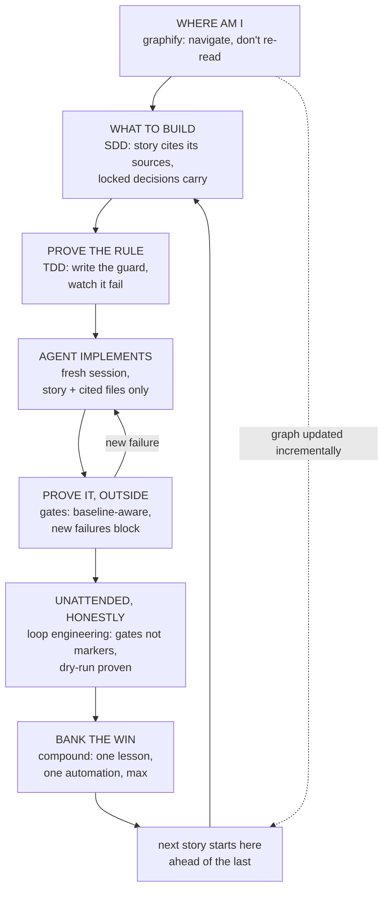

# Six Principles, One Workflow

**What this page answers:** how the six pagar disciplines snap together into one
working loop — and what each one catches that the other five cannot.

## The six, one line each

| # | Principle | The question it answers | Its artifact |
| --- | --- | --- | --- |
| 1 | [Spec-driven development](02-spec-driven-development.md) | Are we building the right thing? | PRD → epics → stories, locked decisions |
| 2 | [TDD with teeth](03-tdd-with-agents.md) | Does the code work? | Tests that have been watched fail |
| 3 | [Local CI enforcement](05-local-ci-enforcement.md) | Can we prove it, outside the model? | Gates + baselines |
| 4 | [Compound engineering](04-compound-engineering.md) | Does the next task start ahead of this one? | Lessons, guards, one automation per story |
| 5 | [Loop engineering](08-loop-engineering.md) | Can it run unattended without lying to us? | The loop harness, its gates, LEARNINGS.md |
| 6 | [Graphify](09-graphify.md) | Can we pay context for what we need, not what exists? | The navigable code graph |

Read as a sentence: **a graph tells you where you are, a spec tells you what to
build, tests tell you it works, gates tell you it is true, the loop does it while
you sleep, and the lessons make the next one cheaper.**

## The composite loop

One story, start to finish, through all six stations:

Nothing in the diagram is a product. Every box is a plain file in your repository
plus a discipline for keeping it truthful. Swap the agent, keep the fence.

## What each one catches that the others cannot

This is why six and not four, and not one:

- **SDD** fixes *building the wrong thing correctly*. It cannot tell you the code is
  broken.
- **TDD** fixes *the code is broken*. It cannot stop an agent writing a test that
  never could fail.
- **Gates** fix *the claim that it works*. They are outside the model, so confidence
  does not get a vote. They cannot stop you re-learning the same trap.
- **Compound engineering** fixes *paying full price twice*. It needs the other three
  to have anything worth recording.
- **Loop engineering** fixes *the unattended run quietly going wrong* — the
  confident `COMPLETE` over a red suite, the phase that resumed from zero and died
  at the same wall, the flag in the code that `--help` never heard of. Attended
  workflows do not have this failure class; unattended ones have nothing else.
- **Graphify** fixes *the context bill* — the biggest recurring cost of agentic
  work. It also catches the architectural lies: the surprising cross-community edge
  nobody greps for, the god node the diagram forgot.

Take the first four and you have a disciplined attended workflow. Add the fifth and
it runs at machine speed. Add the sixth and it scales past the context window.

## The walk-through, narrated

A feature request lands. You do not open files; you ask the graph where the feature
lives, and the answer costs a bounded budget, not a repo tour (**6**). The spec is
written so the implementing agent needs one story plus the files the story cites —
the graph told you which files those are (**1**, **6**). The story's acceptance
criteria become guard tests, and each guard is mutation-verified once, by breaking
the rule and watching the test go red (**2**). The loop picks the story up: a fresh
session implements it, the gates verify artifacts — not markers — and a red gate
sends it back with the named failure (**5**, **3**). Baselines keep the gate
survivable on a repo with old debt, so the alarm only fires for *new* breakage
(**3**). When it lands, one lesson is recorded and at most one manual step becomes
a script — "nothing this time" allowed (**4**). The graph updates incrementally, so
the next question starts from the new map (**6**). Task 50 costs less than task 1.
That is the entire claim.

## The adoption ladder

Adopt in the order that pays back soonest. Each rung works alone.

1. **Gates first** — payoff the same day, depends on nothing.
2. **Graphify** — one build, then every future session gets cheaper; it also makes
   writing the first specs dramatically faster, which is why it sits here and not
   last.
3. **Specs** — PRD → epics → stories for the next feature, not retrofitted.
4. **TDD with teeth** — apply mutation verification to one real guard this sprint.
5. **Compound loops** — end each story with one lesson and at most one automation.
6. **Loop engineering** — only when the stories are self-sufficient and the gates
   are sharp; an unattended loop over vague stories is a printer of confident
   wrong code.

The starter kit's [`README`](../starter/README.md) walks the same ladder with copy-in
instructions. A worked stack lives in [`examples/`](../examples/README.md).

## The honest failure mode of the whole assembly

Process nobody follows. Every principle here is built to be the cheapest version of
itself that still bites: gates in seconds, specs a story at a time, one automation
per story, dry-runs instead of paid rehearsals, a graph instead of a memory. Where
one is not carrying its weight in your project, delete it — the fence that guards
everything guards nothing.
