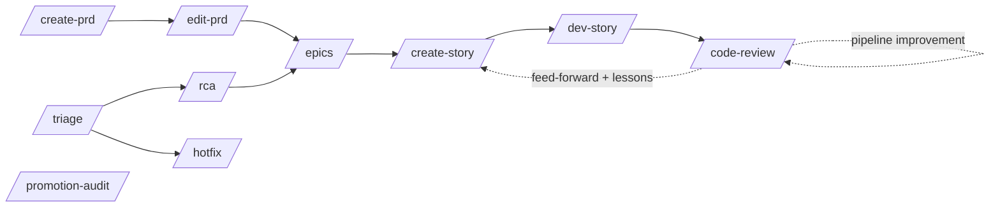

# {{PROJECT_NAME}}: project memory

> **This file is ALWAYS LOADED into the agent's context. Keep it under about 200 lines.** A longer
> file consumes more context and **reduces adherence to everything in it.** Topic detail belongs in
> `.claude/rules/*.md`, which load on demand by path. `/code-review` step 03 enforces this.
>
> 🚨 **This is a TEMPLATE. Every `{{PLACEHOLDER}}` below is a fill-in. The table at the bottom is
> your checklist. A placeholder left unfilled makes the agent guess, and it will guess wrong.**
>
> **The body above the checklist is 158 lines, inside the budget. The two appendices below it,
> the fill-in table and the extensions list, are SETUP SCAFFOLDING: delete them once you have
> filled the placeholders**, and this file drops back to its working size.

## How I answer (applies to every turn)

Long form and edge cases: **`rules/response-style.md`**: 🚨 **rewrite that file in your own voice.
It is the one rule in this kit that is a matter of taste.**

- **Done means done.** Five things asked is five delivered. If one is truly blocked, finish the
  other four and **name the blocker in ONE specific sentence**, never "needs more investigation".
- **Act, do not ask.** Reversible and cheap means do it, then report. **Ask first** only for:
  anything a teammate sees, anything irreversible, anything expensive. **Find something broken in
  scope? Fix it. Handing back a bug I could have fixed makes my work someone's to-do list.**
- **A question is a question.** "Should we use X?" is not "migrate to X". **Answer first, act when
  told to go.** Only an explicit imperative is a go.
- **Speed.** Independent calls go in ONE batch. **Never let two parallel workers touch the same
  files. Speed never buys a worse answer.**
- **Short, plain, one idea per sentence.** Return only what is needed: **what I did, did it work,
  what to do now.** A decision gets at most 2 options plus which I would pick. **Paths and commands
  stay EXACT.**
- **These never yield to brevity or speed:** confirming before irreversible actions,
  `rules/no-local-spec-refs.md`, the commit gates, and **verification, "done" means run and green,
  not "should work".**

## Project

{{ONE_PARAGRAPH_WHAT_THIS_PROJECT_IS}}

- **{{SOURCE_ROOT}}**: {{STACK_SUMMARY_SERVER}}
- **{{CLIENT_SOURCE_DIR}}**: {{STACK_SUMMARY_CLIENT}}

## Commands

```bash
{{ENV_ACTIVATE_COMMAND}}      # if the project needs an environment activated, ALWAYS first

{{TEST_COMMAND}}              # the full suite
{{TEST_COMMAND_SCOPED}}       # ONE file or pattern, the default while working
{{BUILD_OR_IMPORT_CHECK}}     # catches a broken registration or a circular import
{{LINT_COMMAND}}
{{TYPECHECK_COMMAND}}
{{FORMAT_COMMAND}}

{{RUN_COMMAND}}               # start the system locally
{{API_CONTRACT_REGEN_COMMAND}}  # regenerate the committed contract

python .claude/scripts/specs/specs.py help   # the spec pipeline helper
```

⚠ **State honestly which of these DO NOT EXIST in your project.** An agent that invents a gate
reports a green run of a command nobody configured. **A missing linter is a fact to write down, not
a blank to fill.**

## Code style

- **Follow the file you are in.** Match the surrounding idioms. **Keep diffs minimal. Never
  reformat a file you did not otherwise change.**
- **Typed signatures on new code. Structured logging, never a print. No silent catch blocks.**
- Detail: `rules/code-quality.md`.

## Project structure: the 20% that explains 80%

- **`{{COMPOSITION_ROOT}}`**: the single wiring point. ⚠ **A module nothing registers DOES NOT
  EXIST**, and every other gate will still pass.
- **`{{API_LAYER_DIR}}`** → **`{{SERVICE_LAYER_DIR}}`** → **`{{DATA_LAYER_DIR}}`**. Schemas at the
  boundary in `{{SCHEMA_LAYER_DIR}}`. Auth in `{{AUTH_MODULE}}`. Shared helpers in
  `{{SHARED_DIR}}`.
- **`{{BACKGROUND_JOB_DIR}}`**: background work. ⚠ **If queue routing is declared in more than one
  file, name both here. They must stay identical.**
- **`{{MIGRATIONS_DIR}}`**: {{MIGRATION_MECHANISM}}. ⚠ **A model change ships WITH its migration,
  in the same commit.**
- **`{{TEST_DIR}}`** · **`{{BASELINE_DIR}}`** (recorded suite baselines) ·
  **`{{API_CONTRACT_FILE}}`** (generated) · **`{{ENV_EXAMPLE_FILE}}`**.
- **`{{TEAM_DOCS_DIR}}`**: **COMMITTED, team-facing.** Repo facts only: **no personal-tree
  references, no private spec ids, no secret locations.** See `rules/docs-sync.md`.
- **`.claude/`**: personal workflow: `skills/` · `rules/` · `commands/` · `scripts/` ·
  `{{SPEC_DIR}}` (the PRD, epics, stories, reports, ledgers, the status file). **Git-excluded.**

## Testing

- **Run SCOPED, judge by scoped-green plus new tests**, against the recorded baseline. ⚠ **Never
  re-snapshot a baseline to get past a red gate.**
- ⚠ **{{WHEN_CI_RUNS}}**: if CI runs only on requests, **your local gate is the first signal
  anyone gets.**
- Detail, including the mock traps and the guard-test discipline: `rules/testing.md`.

## Git

- Remote `{{REMOTE}}`, default branch `{{DEFAULT_BRANCH}}`, work on `{{BRANCH_PATTERN}}` branches,
  promotion chain `{{PROMOTION_CHAIN}}`. **Merged is NOT deployed.**
- Commits: `{{COMMIT_CONVENTION}}`. **No trailers.**
- ⚠ **The remote is the team's only real task board.** Run `/whos-working-on-this` **before**
  picking up a surface.
- `/sync-main` **merges, never rebases.**

## Key conventions

- **Single-call endpoints (NON-NEGOTIABLE):** one user action equals one API call. The server
  absorbs the orchestration. Multi-call flows ship **only** under the closed exemption list in
  `rules/api-design.md`.
- **Static routes BEFORE parameterized routes.** Register new modules in `{{COMPOSITION_ROOT}}`
  exactly like the existing ones.
- **Keep the health check honest**: real dependency probes, a failure status on failure.
- **Schema change means model change plus its migration, together.** ⚠ **Never create and constrain
  in one deploy: expand, backfill, contract.**
- ⚠ **A behaviour fix SILENTLY INVALIDATES the document that described the old behaviour.** Search
  the docs and the contract for what you changed, and re-verify on the wire.
- **Protect the invariants in the PRD's locked-decisions table.** Never weaken one without the user
  explicitly deciding to.

## Path-scoped rules (`.claude/rules/*.md`, load on demand)

`architecture.md` · `api-design.md` · `backend-practices.md` · `security.md` · `testing.md` ·
`code-quality.md` · `edge-cases.md` (the acceptance-criteria budget) · `spec-pipeline.md` ·
`no-local-spec-refs.md` · `docs-sync.md` · `response-style.md` **(rewrite this one)**.

## Workflow

**Spec pipeline, six skills:** `/create-prd` → `/edit-prd` → `/epics` → `/create-story` →
`/dev-story` → `/code-review`. All share `.claude/scripts/specs/specs.py` and **one status file.**



- **Front door for incoming issues is `/triage`.** Already-solved check FIRST, then a reality check,
  then routing. **Certainty routes, not size.**
- **`/rca`**: deep verification before planning, in QA mode or external-document mode. ⚠ **An
  externally-authored document is a SET OF HYPOTHESES, not requirements.**
- **`/hotfix`**: one small, well-understood fix. **Mutation-verify the test, verify on the wire in
  both directions, one ledger row.** ⚠ **A report can be right about the field and wrong about the
  fix: verify diagnosis and remedy SEPARATELY.**
- **`/promotion-audit`**: read-only. ⚠ **A commit message is not evidence: read the diff. "Behind"
  is not "missing".**
- **`/create-docs`**: team or user documentation, with claims verified against the running system.
- **Commands:** `/commit`, `/sync-main`, `/whos-working-on-this`.
- **The pipeline compounds through TWO loops:** (a) the lessons miner reads every done story's
  agent record for traps a green suite missed, and `/create-story` runs it **every time**; (b)
  `/code-review`'s pipeline-improvement step turns one thing done BY HAND into a script or a guard.
  **"None this run" is valid. Prefer rule → guard**, and **a guard must be mutation-verified RED
  before you trust it.**

---

## 🚨 The placeholder fill-in checklist

**Fill every row before the agent's first real task.** Anything left is a guess waiting to happen.
Delete a row only when it genuinely does not apply to your stack, **and say so where it was used.**

| Placeholder | What it is | Example |
|---|---|---|
| `{{PROJECT_NAME}}` | The project's name | `Acme Orders` |
| `{{ONE_PARAGRAPH_WHAT_THIS_PROJECT_IS}}` | What this system does, for whom |, |
| `{{STACK_SUMMARY_SERVER}}` / `{{STACK_SUMMARY_CLIENT}}` | One dense line each: framework, data store, background jobs |, |
| **Commands** | | |
| `{{ENV_ACTIVATE_COMMAND}}` | Environment activation, if any | `source .venv/bin/activate` |
| `{{TEST_COMMAND}}` | Run the full suite | `npm test` |
| `{{TEST_COMMAND_SCOPED}}` | Run ONE file or pattern | `npm test -- <path>` |
| `{{BUILD_OR_IMPORT_CHECK}}` | Cheapest check that the app assembles | `npm run build` |
| `{{LINT_COMMAND}}` | Lint. **Write "not configured" if it is not** | `npm run lint` |
| `{{TYPECHECK_COMMAND}}` | Type check, or "not configured" | `tsc --noEmit` |
| `{{FORMAT_COMMAND}}` | Formatter, or "not configured" | `prettier --check .` |
| `{{RUN_COMMAND}}` | Start the system locally |, |
| `{{API_CONTRACT_REGEN_COMMAND}}` | Regenerate the committed contract |, |
| `{{SPEC_HELPER_COMMAND}}` | How to invoke the spec helper | `python .claude/scripts/specs/specs.py` |
| **Directories** | | |
| `{{SOURCE_ROOT}}` | Server or main source root | `src/` |
| `{{CLIENT_SOURCE_DIR}}` | Client source root | `web/src/` |
| `{{API_LAYER_DIR}}` | Transport layer | `src/api/` |
| `{{SERVICE_LAYER_DIR}}` | Business logic | `src/services/` |
| `{{DATA_LAYER_DIR}}` | Persistence models | `src/models/` |
| `{{SCHEMA_LAYER_DIR}}` | Boundary request/response types | `src/schemas/` |
| `{{SHARED_DIR}}` | Cross-cutting helpers | `src/shared/` |
| `{{BACKGROUND_JOB_DIR}}` | Background jobs | `src/jobs/` |
| `{{MIGRATIONS_DIR}}` | Migration files | `migrations/` |
| `{{TEST_DIR}}` | Where tests live | `tests/` |
| `{{BASELINE_DIR}}` | Recorded suite baselines | `.claude/baselines/` |
| `{{SPEC_DIR}}` | The spec tree | `.claude/specs/` |
| `{{TEAM_DOCS_DIR}}` | **COMMITTED** team documentation | `docs/engineering/` |
| **Files** | | |
| `{{COMPOSITION_ROOT}}` | The single wiring point | `src/main.py` |
| `{{AUTH_MODULE}}` | Where authorization checks live | `src/auth.py` |
| `{{API_CONTRACT_FILE}}` | The committed generated contract | `openapi.yaml` |
| `{{ENV_EXAMPLE_FILE}}` | The example environment file | `.env.example` |
| **Git and process** | | |
| `{{DEFAULT_BRANCH}}` | Default branch name | `main` |
| `{{BRANCH_PATTERN}}` | Your working-branch convention | `feat/*` |
| `{{PROMOTION_CHAIN}}` | The environment chain | `main → staging → prod` |
| `{{REMOTE}}` | The remote | `origin` |
| `{{COMMIT_CONVENTION}}` | Commit message convention | `type(scope): summary` |
| `{{WHEN_CI_RUNS}}` | **When CI actually runs.** ⚠ Load-bearing | `only on pull requests` |
| `{{MIGRATION_MECHANISM}}` | How migrations are applied, **and by whom** | `hand-applied SQL` |
| `{{SURFACE_A}}` / `{{SURFACE_B}}` | Your ownership zones, for the investigation taxonomy | `server` / `client` |

---

## Extensions worth building for your own stack

The source system this kit generalizes carried several more skills. **They are too stack-specific
to ship, but each solves a real, recurring problem. Build the ones that fit your stack.**

- **`app-screenshot`**: drive the running client with a real browser and capture screenshots,
  console errors, and network calls. **The single highest-value extension**: a green test suite has
  missed real rendering bugs, and `/rca`, `/triage`, and `/hotfix` all get sharper with it.
- **`openapi-drift`**: compare the committed contract against the live one **and against what the
  client actually calls**, and report which client code a drift breaks.
- **`verify-against-be`**: verify a client-side claim ("the server now returns X") against the
  server code **and** a running server, by reproducing the original failing scenario.
- **A codebase knowledge graph**: a queryable index over the repository, so codebase questions are
  answered from a scoped subgraph instead of by reading files one at a time. ⚠ **Whatever you
  build, make it DEGRADE GRACEFULLY: "no result" must be distinguishable from "the index is
  stale".**
- **`weekly-report`**: gather the week's shipped work, reconcile it against what actually merged
  and promoted, and draft the status update.
- **`team-message`**: draft a message to a specific teammate in your established voice, with the
  technical depth tuned to the recipient.
- **`unslop`**: strip the named AI-tell patterns out of prose before a human reads it. Pairs with
  `rules/response-style.md`.
