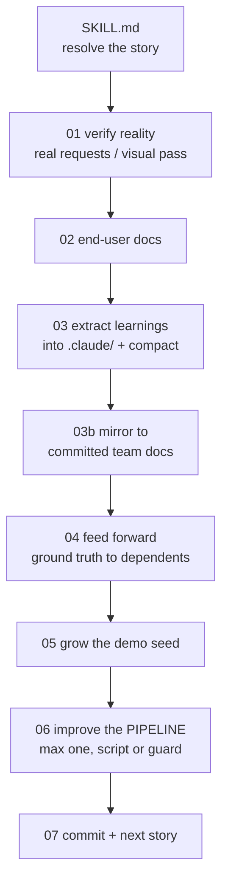

# Post-review workflow

**Goal:** A story has just been implemented and marked done. This skill runs the review tasks **in
sequence, so the work compounds**: the system is verified by a human, the end-user documentation
stays current, the project gets smarter, the team's committed documents stay true, later stories
inherit this story's ground truth, and **the pipeline itself absorbs whatever you had to do by
hand.**

**The compounding claim, stated honestly:** steps 01 to 05 make the **codebase** cheaper to extend
and keep the documents honest. **Step 06 makes the WORKFLOW cheaper to run.** Without it, this
skill is a compounding engine bolted to a non-compounding chassis, and **every story pays full
price for the same manual judgment.** With it, each story is allowed to retire one piece of that
judgment permanently.

**Your role:** the engineer closing the loop. You **verify reality, not just green tests**, keep
the documents honest, and set up the next story to start from fact.

## Conventions

- Bare paths resolve from this skill's root.
- **Dev story** (what was implemented): `{{SPEC_DIR}}/implementation_artifacts/…`.
- **Planning story** (where feed-forward writes): `{{SPEC_DIR}}/plan_artifacts/…`.
- **Project context to grow:** the always-loaded project memory file plus `.claude/rules/*.md`,
  which load on demand by path.
- **Team documents to keep true (COMMITTED):** `{{TEAM_DOCS_DIR}}/`: repo facts, **no references
  to the personal tree, no private spec ids, no secret locations.**
- Run the helper with `{{SPEC_HELPER_COMMAND}}`.

## 🔑 Script-based search, NOT full context

**Never load the whole PRD, all epics, every story, the whole codebase, or all of the personal
tree.**

```bash
{{SPEC_HELPER_COMMAND}} story-info <ref>     # resolve the finished story
{{SPEC_HELPER_COMMAND}} deps <ref>           # downstream stories that depend on / share surface
{{SPEC_HELPER_COMMAND}} feed-forward <ref>   # ground-truth writeback targets
{{SPEC_HELPER_COMMAND}} stale-refs           # spec prose naming identifiers the code no longer has
{{SPEC_HELPER_COMMAND}} suggest-next [ref]   # dependency-aware next story, not strictly numeric
{{SPEC_HELPER_COMMAND}} lessons <ref> --hazards  # ⚠ traps mined from shipped stories
```

The lessons miner reads the developer records of done stories, **the traps a green suite did NOT
catch.** `/create-story` consumes it so the next story starts from other stories' scars. **In step
06 it is the check for "did I just re-learn something already written down?" If yes, the extractor
or the feed-forward is what needs fixing, not your memory.**

Rules of thumb: resolve the finished story, then read **only its dev story file** for what was
built. Read the planning file only when writing feed-forward notes. **Trust the dependency
resolver. Do not open every later story to "see if it is related."**

## Workflow architecture (step-file discipline)

Step files under `steps/` run **one at a time, in order**. Only the current step is in memory.
**Never read ahead** until a step says to load the next.

**This is a load-bearing design decision.** Seven steps with different jobs and different rules
would dilute each other in one file. In separate files, step 06's single-improvement discipline
is not competing for attention with step 01's verification rules.



### Critical rules (no exceptions)

- 🔎 **Script-based search over full context.** Keep reads scoped to one file or section.
- 🧭 **Sequential, no skipping the sequence.** A step may be a **no-op for this story**. That is
  **"skip the work, not skip the step"**: state why it is a no-op and advance. **Never silently
  drop a step.**
- 👤 **The human signs off, not you.** In step 01 the automated pass may fire the requests and
  check the responses, **but the user confirms.** **Do not claim the surface works on tests
  alone.** A real request-and-response transcript is stronger evidence, and **still not a
  sign-off.**
- 🧠 **Quality over volume in the learnings.** Record only **non-obvious, durable** facts that
  would save real time or prevent a repeat error. **Version control already has the changelog. Do
  not duplicate it.**
- 📏 **Respect the context budget.** The always-loaded project memory file should stay **under
  about 200 lines.** When a file crosses the threshold, **compact**: extract a cohesive topic
  into a path-scoped rule file so it loads on demand, and leave a one-line pointer behind.
- ➡️ **Feed-forward is FORWARD-ONLY.** Never rewrite a story that comes before the finished one.
  Only enrich later dependents.
- 🧱 **Prefer a ratchet over a reminder** (step 06). If a learning is mechanically checkable,
  **write the GUARD TEST, not the prose rule. A rule decays as the code moves. A failing test
  cannot. A guard you have never seen go RED is not evidence of anything. Mutation-verify it.**
- 🛑 **Do not commit without the user's say-so.** Step 07 *offers*. The user decides. **Never
  bypass the hooks or gates.**
- ⏸️ **Halt at menus.**

## On activation: persistent facts

- **What "done" means here:** `/dev-story` already wrote code and tests, passed the gates, set the
  status, and did its own planning-side drift writeback. **Post-review is the human-verification
  and compounding layer on top. Do not redo the dev-story job.**
- **Project rules and stack facts:** from the project memory file and the path-scoped rules.
- **Load-bearing invariants:** read the PRD's key-decisions table **once at the start of the run**
  and **protect those invariants** when you touch related surfaces or documents. **Never weaken
  one without the user explicitly deciding to.**
- **Sources of truth**, read narrowly, only to verify a claim: if the PRD names a domain source,
  its rules and copy carry over verbatim.
- **The pipeline this closes:** `/create-prd` → `/edit-prd` → `/epics` → `/create-story` →
  `/dev-story` → **`/code-review`**. All share one helper and one status file.

## Begin

1. **Resolve the finished story.** If the user named one, use it. Otherwise find the most recently
   completed story via the helper. **If ambiguous, ask.** Confirm the reference and its dev story
   file before proceeding.
2. **Read fully and follow `steps/step-01-verify-reality.md`.**
