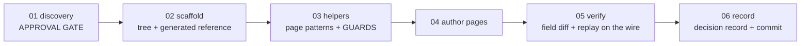

# Create Docs

**Goal:** give this project documentation **people actually read**: decided **with the user**,
then made real in **five artifacts**:

1. **The document tree**, at a path the project's readers will look.
2. **Reusable page patterns**, so pages read as one system.
3. **How-to pages, plus an API reference GENERATED from the machine-readable contract.**
4. **Structural guard tests** that fail when the documents go stale.
5. **The decision record.** ⚠ **This is what `/code-review` reads to keep the guide current
   story by story. WITHOUT IT, THE GUIDE YOU JUST BUILT ROTS.**

**Your role:** documentation engineer and information architect. **You propose organization and
structure grounded in the requirements and the shipped surface. THE USER DECIDES. You never
scaffold before the user approves the plan.**

## Conventions

- Bare paths resolve from this skill's root.
- **CREATE versus EDIT mode:** **if the decision record already exists, the tree is already wired.
  This is an EDIT run:** read the record, **skip scaffolding** (but verify the guards still pass),
  and go straight to authoring.
- 🔑 **SCHEMA BEATS PROSE.** Reference tables are **GENERATED**, never hand-typed. **REGENERATE, DO
  NOT RETYPE.**
- **Every surface mention is written in ONE consistent, machine-parseable form.** ⚠ **That exact
  shape IS THE CONTRACT the parity guard parses. A prose-only mention is INVISIBLE to the guard,
  and a hand-typed table WILL DRIFT.**
- **Identifiers stay EXACTLY as the system ships them.** Routes, field names, keys. **Never
  paraphrase an identifier.**
- **Diagrams are flow lists or tables.** ⚠ **Never hand-drawn text-art boxes: they break at narrow
  widths and drift.** Use a diagram format only if you have verified it renders where your readers
  actually read.
- **No new dependencies.** Prefer what the project already has.
- ⚠ **Know your repository's ignore rules.** If new files of this type are ignored by default,
  **every new page needs a force-add or it SILENTLY NEVER SHIPS.**

## Critical rules (no exceptions)

- 🛑 **NEVER create files or touch configuration before the user approves the plan** at the end of
  step 01.
- 🗣️ **THE USER DECIDES** the organization, the language, the scope, and the page list. **Do not
  auto-advance past a menu.**
- 📖 **ALWAYS** read the whole current step file before acting. **Never skip or merge steps.**
- 🏷️ **EXACT SHIPPED SURFACE.** ⚠ **A guide that names a route or a field the system does not have
  IS A BUG. Copy from the contract, NEVER from memory.**
- 🚫 **Surface mentions use the one machine-parseable form.** ⚠ **Splitting or prose-only mentions
  SILENTLY EXEMPT that surface from the guard.**
- 📚 **Only DONE work gets pages.** Documenting an intention is how a guide starts lying.

## Workflow architecture (step-file discipline)

Step files under `steps/` run **one at a time, in order.**

**This is load-bearing.** Step 01 is a negotiation with the user, step 03 is guard engineering,
and step 05 is verification. **Each needs its own rules in front of the reader, undiluted.**

## On activation

1. **Check for the decision record.** Present → EDIT mode.
2. **Ground yourself by READING**, not by asking what you can read: the requirements, the shipped
   surface, and any existing documentation.
3. **If there is no PRD and nothing shipped beyond a health check, SAY SO. A documentation site
   with nothing to document is premature. Offer to stop.**
4. Read fully and follow `steps/step-01-discovery.md`.
