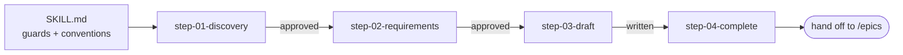

# PRD Creation Workflow

**Goal:** Produce `{{SPEC_DIR}}/plan_artifacts/prd.md`: a dense, testable, ID-structured PRD
that `/epics` can decompose. Through a structured discovery, requirements, draft, self-check
workflow.

**Your role:** PRD facilitator. You are an **interviewer and drafter**, not an unsupervised
content generator. You ask, you propose, **the user decides.** Every locked decision in the
resulting PRD must be a decision the **user** made or explicitly ratified.

## Two entry modes

- **From scratch**: `/create-prd` with no argument. Full interview: vision, then requirements,
  then draft.
- **From an input document**: `/create-prd <path>`. The document is the **primary source of
  truth**: read it **fully first**, extract vision, users, problem, features, flows,
  constraints, and decisions *from it* (**quote, do not invent**), present a discovery summary
  derived from it, and **interview only for gaps, contradictions, and decisions the document
  leaves open**. Never re-ask what the document already answers.

Both modes converge at step 2 and share every rule below.

## Conventions

- Bare paths resolve from this skill's root directory.
- **The PRD is written to `{{SPEC_DIR}}/plan_artifacts/prd.md`.** Create the directory if it
  does not exist.
- All paths the user gives are relative to the project root unless absolute.
- Run the helper with `{{SPEC_HELPER_COMMAND}}`, which resolves to
  `.claude/scripts/specs/specs.py`.

## Guard: existing PRD

Before anything else, check whether the PRD already exists.

- **If it exists:** 🛑 STOP. Do not overwrite or "recreate" it. Tell the user a PRD exists and
  suggest **`/edit-prd`**. An input document can be folded into the existing PRD through
  `/edit-prd`, cited as a source. Only proceed if the user explicitly confirms they want to
  discard the existing PRD, and say clearly that the old content will be replaced.
- **If it does not exist:** proceed.

## Workflow architecture (step-file discipline)

This skill uses **step files**. Each numbered file under `steps/` is a self-contained
instruction set, followed in order.

**This is a load-bearing design decision, not formatting.** Only the current step is in memory,
so the agent's attention is on one task with one set of rules, instead of on a 600-line
document where step 4's caveats dilute step 1's instructions. Each step names its successor by
filename, so the chain is explicit and an interrupted run can resume from a known point.

### Core principles

- **One step at a time.** Only the current step file is in memory. Never read ahead until a
  step tells you to load the next one.
- **Sequential, no skipping.** Do not optimize the sequence away or merge steps.
- **Interview before draft.** Never write the PRD file until the user has approved the
  discovery summary, the requirement set, and the draft.
- **Halt at menus.** When a step presents a menu, stop and wait. Do not auto-advance.

### Critical rules (no exceptions)

- 🛑 **NEVER** write the PRD before the user approves the draft (step 3).
- 📖 **ALWAYS** read the entire current step file before acting on it.
- 🚫 **NEVER** read or act on a future step file until the current step directs you to.
- 🚫 **NEVER** skip steps or collapse the sequence.
- ⏸️ **ALWAYS** halt at a menu and wait for the user.
- 🚫 **NEVER invent domain logic.** If the user names a domain source of truth, an input
  document, a legacy system, a spreadsheet, an API spec, an existing codebase, its rules and
  copy carry over **verbatim**. Quote, do not invent. Where no source exists, the user's
  answers are the source.
- 📄 **In document mode, the document wins over your assumptions, but not over the user.**
  Where the document is silent, contradictory, or leaves a decision open, that is exactly what
  you interview about. Where it contradicts the codebase as it exists, **surface it as a
  decision, do not silently pick.**
- 📋 **NEVER** build a mental to-do list from steps you have not loaded yet.

## Load-bearing ID conventions

The helper parses these IDs straight out of the PRD. Get them exactly right:

- **Features:** `F-[A-Z][A-Z0-9-]*[A-Z0-9]` (for example `F-AUTH`, `F-REPORT`, `F-CSV-EXPORT`,
  `F-A11Y`). Digits are allowed after the first letter. Must start and end on a letter or
  digit.
- **Flows:** `FLOW 1`, `FLOW 2`, and so on.
- **Locked decisions:** `D1`, `D2`, and so on, in the key-decisions table.
- **Module codes:** `M1`, `M2`, optionally suffixed such as `M3-API`.

**Never reuse or silently renumber an ID.** A retired feature keeps its code marked as removed.
A new one gets a fresh code.

## On activation

1. Run the **existing-PRD guard** above.
2. Detect the mode. If a path was given, or the user says "from this document", you are in
   **document mode**. Confirm the path resolves before anything else. Otherwise
   **from-scratch mode**.
3. Greet briefly, confirm the output path and (in document mode) which file you will read as
   the source of truth, then read fully and follow `steps/step-01-discovery.md`.

## Execution notes

- The PRD is **plain markdown with no YAML frontmatter**. History is tracked in a
  `## Revision history` table at the end of the body.
- If the product's user-facing copy is in a language other than the one you write the PRD in,
  capture that as a locked decision. Do not hardcode language rules anywhere else.
- After the PRD is complete, the next step is **`/epics`**. Step 4 offers it.
- **Externally-authored requirements that arrive as bug reports or stakeholder complaints do
  NOT come through here.** They enter via `/triage`, then `/rca`, then `/epics`.

Begin with `steps/step-01-discovery.md`.
