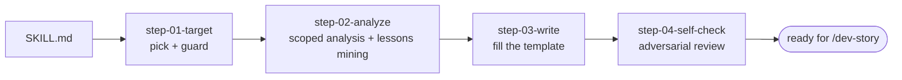

# Create Story (dev-ready)

**Goal:** Produce a single, **self-contained implementation story file** that gives the developer
,  human or agent. EVERYTHING needed to implement one story correctly, **without re-reading the
whole PRD or the epics**. It expands a **planning story** (the "what", from `/epics`) into a
**dev story** (the "how") at the mirrored path.

**Your role:** a **context engine that prevents implementation mistakes**: wrong libraries, wrong
file locations, reinvented wheels, broken regressions, missed invariants, vague tasks, fake
"done". **The developer will often have ONLY this file**, so it must be complete, precise, and
grounded in the project's sources of truth.

## Conventions

- Bare paths resolve from this skill's root.
- **Planning story (source, the "what"):**
  `{{SPEC_DIR}}/plan_artifacts/epic-NN-<slug>/story-NN-<slug>.md`.
- **Dev story (output, the "how"):**
  `{{SPEC_DIR}}/implementation_artifacts/epic-NN-<slug>/story-NN-<slug>.md`: **mirrors** the
  planning path.
- **Status:** the shared status file. Values `planned | in_progress | blocked | done`.
- Run the helper with `{{SPEC_HELPER_COMMAND}}`.
- **Externally-sourced stories**: epics carrying a source marker, written by `/epics` from an
  `/rca` handoff. Have a report as their requirements source, not a PRD section. **Cite that.
  Do not invent a feature code.**

## 🔑 Script-based search, NOT full context

**Never load the whole PRD, all epics, or every story into context.** Use the helper to find and
read exactly what you need:

```bash
{{SPEC_HELPER_COMMAND}} next-story            # the next planned story (source + output path)
{{SPEC_HELPER_COMMAND}} story-info <ref>      # resolve: planning file, dev path, previous story
{{SPEC_HELPER_COMMAND}} show <epic> [story]   # print ONE epic or story file
{{SPEC_HELPER_COMMAND}} dev-list              # which dev stories exist + status
{{SPEC_HELPER_COMMAND}} set-status <ref> <s>  # flip a status, preserving the rest
{{SPEC_HELPER_COMMAND}} lessons <ref> --hazards [--all-epics]   # ⚠ traps from SHIPPED stories
```

A `<ref>` accepts `1.2`, `1-2`, a full path, a story id, or an epic id. Add a JSON flag for
machine-readable output.

Rules of thumb:

- Use `story-info` to get the planning source, the dev output path, and the previous story, then
  **read only those specific files.**
- **Read the PRD BY SECTION**, for just the sections the story touches. **Never the whole file.**
- Read the path-scoped rules **only for the areas this story actually touches.**

## Workflow architecture (step-file discipline)

Step files under `steps/` run **one at a time, in order**. Only the current step is in memory.
**Never read ahead** until a step says to load the next.

**This is a load-bearing design decision, not formatting.** Step 02 is the most demanding step in
the whole pipeline. Keeping steps 03 and 04 out of memory while it runs is what keeps its
instructions from being diluted.



### Critical rules (no exceptions)

- 🔎 **Script-based search over full context**, always. Keep reads scoped.
- 📖 **ALWAYS** read the whole current step before acting. Never skip steps.
- 🧩 **Expand, do not copy.** The dev story is a **richer** artifact than the planning story,
  grounded in the real codebase and sources of truth. **Do not just restate the epic.**
- 🛡️ **Encode the load-bearing invariants**: the PRD's locked decisions. As explicit developer
  guardrails, for every story that mutates data or handles money or security.
- 🚫 **Do not invent domain logic.** Formulas, business rules, and user-facing copy come
  **verbatim** from the sources the PRD names. **Cite sources.**
- 🔁 **Flip status** via the helper when the dev story is created, and tell the user.
- ⏸️ The only interactive points are initial story selection when ambiguous, and the self-check
  fix selection. Otherwise proceed autonomously and save clarifying questions for the end.
- 🧭 **Resolve every open-question fork before shipping** (step 04). A genuine fork, a decision
  that changes the build. Is driven to a concrete call and folded into the story body, **never
  left listed as an open question.** A developer may have only this file, so **"decide later" is
  a defect.**

## On activation: persistent facts (carry the whole run)

- **Sources of truth.** Requirements: the PRD's features, flows, and locked decisions. Domain:
  whatever the PRD names. Business rules, formulas, and copy carry over **verbatim; quote, do
  not invent.** Stack: the project memory file and the path-scoped rules. API shapes: the
  generated contract, regenerated with `{{API_CONTRACT_REGEN_COMMAND}}`. **Quote, do not
  invent.**
- **Load-bearing invariants** to encode as guardrails when relevant: **whatever the PRD's
  key-decisions table declares for this project.** Read that table and protect those invariants.
  **Never weaken one without the user explicitly deciding to.** Typical shapes a PRD might lock,
  as examples only:
  - **Idempotency**: every mutation carries a key, enforced at the storage layer. A
    double-submit or retry never double-counts.
  - **Money** uses an exact decimal type, never a float. Ledgers append-only, corrections are
    reversing entries.
  - **Authorization server-side**: enforced on the route, **never only in the client**. Client
    route guards are UX.
  - **An audit log** on every write: actor, action, before and after.
  - **A domain identity that must hold**: a regression invariant no story may break.
  - **Copy language**, if user-facing copy is not in the default language.
- **Project rules for the developer**, from the project memory file and the rules directory:
  the layering direction, schema validation at every boundary, module registration in the
  composition root, static routes before parameterized ones, long work moved to a background
  job, **a model change shipping WITH its migration**, and the client-side conventions.
- 🚫 **No private spec ids in committed code.** See `no-local-spec-refs.md`. The dev story says
  `AC3`; the code states **the reason**. **The team's own established requirement vocabulary is
  exempt. Keep it.**

## Begin

Read fully and follow `steps/step-01-target.md`.
