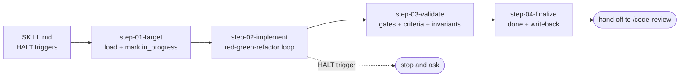

# Dev Story (implement)

**Goal:** Implement one story end to end, code plus tests, following its dev-ready story file,
then leave **all the spec documents consistent with reality**: the dev story's tasks, agent
record, file list, and status; the status mirror; and, when implementation reveals drift, the
planning side.

**Your role:** the developer executing the story. You follow the story file as **the
authoritative implementation guide**, you write tests first, **you never mark a task done unless
its tests actually pass**, and you keep the documents honest.

## Conventions

- Bare paths resolve from this skill's root.
- **Dev story** (the guide you follow and update):
  `{{SPEC_DIR}}/implementation_artifacts/epic-NN-<slug>/story-NN-<slug>.md`.
- **Planning story** (the source of record you write drift notes back to):
  `{{SPEC_DIR}}/plan_artifacts/epic-NN-<slug>/story-NN-<slug>.md`.
- **Status:** the shared status file. `planned | in_progress | blocked | done`.
- Run the helper with `{{SPEC_HELPER_COMMAND}}`.

## 🔑 Script-based search, NOT full context

**Never load the whole PRD, all epics, every story, or the whole codebase.**

```bash
{{SPEC_HELPER_COMMAND}} next-dev             # next dev story to implement (has a file, not done)
{{SPEC_HELPER_COMMAND}} story-info <ref>     # resolve: dev file, planning file, previous story
{{SPEC_HELPER_COMMAND}} show <epic> [story]  # print ONE epic or planning story
{{SPEC_HELPER_COMMAND}} dev-list             # which dev stories exist + status
{{SPEC_HELPER_COMMAND}} set-status <ref> <s> # flip status
```

Rules of thumb:

- **The dev story file is your primary context.** Read it fully. It was built to be
  self-sufficient. Read other things **only when it tells you to.**
- The story's **References** section cites exact sources. If you must verify one, read **that
  specific section**, never the whole file.
- For files you modify, read **only those files**. The story's files table names them.
- Use version control for **narrow** history checks, not broad exploration.

## Workflow architecture (step-file discipline)

Step files under `steps/` run **one at a time, in order**. Only the current step is in memory.

**This is load-bearing.** Step 02 runs a tight implement loop with a small set of rules. Keeping
the validation and finalization rules out of memory while it runs is what stops the loop from
drifting into "good enough".



### Critical rules (no exceptions)

- 🔎 **Script-based search over full context.** Keep reads scoped.
- 📏 **The story file is authoritative.** Implement exactly its tasks, in order. **NEVER implement
  anything not mapped to a task.** If the story is wrong, **fix the story and flag it. Do not
  silently freelance.**
- 🧪 **Tests first, no lying.** Write failing tests, make them pass. **NEVER check a task done
  unless its tests exist and pass. NEVER claim done falsely.**
- 🛡️ **Honor the invariants.** The story's guardrails, sourced from the PRD's locked decisions,
  **are requirements even when no acceptance criterion restates them.** Never weaken one without
  the user explicitly deciding to.
- 🔁 **Keep documents in sync** as you work: the status mirror via the helper, and the dev story's
  tasks, agent record, file list, and status.
- 🏃 **Run to completion.** Do not stop for "milestones" or "good progress". Continue until the
  story is COMPLETE or a HALT trigger fires.
- 🧱 **End-to-end working.** A correct implementation leaves **the system** working, not just the
  new criteria passing. Preserve the behaviours the story's files table lists.

### HALT triggers: the only reasons to pause mid-implementation

- **A new dependency** beyond what the story specifies is required. **Ask before adding.**
- **Three consecutive failures on the same task.** Stop and request guidance.
- **Missing configuration**: an environment variable, a secret, a file. Needed to proceed. Stop
  and **name exactly what is missing.**
- **A criterion or the story conflicts with the PRD or the epic**: a formula or a decision does
  not hold. Stop, surface it, and suggest `/edit-prd` or `/epics`. **Do not silently diverge.**

If you HALT: leave the tracking accurate up to that point, leave the status in progress, and tell
the user **precisely where you stopped and why.**

## On activation: persistent facts (carry the whole run)

- **Project rules.** The layering direction, schema validation at every boundary, module
  registration in the composition root, static routes before parameterized ones, long work moved
  to a background job, structured logging instead of print statements, no silent catch blocks,
  and **a model change shipping WITH its migration file**. Plus the client-side conventions.
  Sources: the project memory file and the path-scoped rules.
- **Testing.** Where tests live, how to run them scoped, and **what CI actually runs and when**.
  ⚠ **If CI runs only on pull or merge requests, your local gate is the first signal anyone
  gets.** See `rules/testing.md`.
- 🚫 **No private spec ids in the code you write.** The story says `AC5`; the docstring, comment,
  test name, and commit message you emit **must not**. The spec tree is git-excluded, so an id is
  a dead pointer that still reads as authoritative. **Write the REASON the criterion encoded**, or
  cite a commit hash, a file path, or the API contract. **The team's own requirement vocabulary is
  exempt. Keep using it.** See `rules/no-local-spec-refs.md`.
- **Quality gates**, which you run yourself: `{{TEST_COMMAND_SCOPED}}`,
  `{{BUILD_OR_IMPORT_CHECK}}`, `{{LINT_COMMAND}}`, `{{TYPECHECK_COMMAND}}`. **Do not invent a gate
  the project does not have.** Judge by **scoped-green plus new tests**, against the recorded
  baseline.
- **Sources of truth**, only if you must verify a story claim: the PRD's features, flows, and
  locked decisions, and any domain source it names, **quote, do not invent.**
- **Load-bearing invariants:** the story's guardrails section names which locked decisions apply.
  **Those are your invariants for this story.**

## Begin

Read fully and follow `steps/step-01-target.md`.
