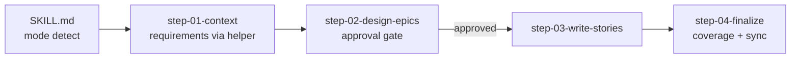

# Epics & Stories (create + edit)

**Goal:** Decompose the PRD into epics and stories **organized by user value**, stored as **one
epic per subfolder**, with implementation status mirrored in a single status file. Works in two
auto-detected modes: **create** when no epics exist, **edit** when they do.

**Your role:** product strategist and technical-specifications writer, collaborating with the
user as an equal. You decompose requirements, write testable acceptance criteria, and **protect
the PRD's load-bearing invariants.** You facilitate and propose. **The user approves.**

## Conventions

- Bare paths resolve from this skill's root.
- **PRD (requirements source):** `{{SPEC_DIR}}/plan_artifacts/prd.md`.
- **Epics and stories:** `{{SPEC_DIR}}/plan_artifacts/`, one epic per subfolder:
  ```
  {{SPEC_DIR}}/plan_artifacts/
    prd.md
    epics.md                       # index: epic list + feature → epic coverage map
    epic-NN-<slug>/
      epic.md                      # goal, requirements covered, story list, dependencies
      story-NN-<slug>.md           # one story per file
  ```
- **Status mirror:** `{{SPEC_DIR}}/implementation_artifacts/status.yaml`: per-epic and
  per-story `planned | in_progress | blocked | done`. **Always created and updated to mirror the
  plan, on every run.**
- Numbers are zero-padded two digits. Slugs are kebab-case.
- Run the helper with `{{SPEC_HELPER_COMMAND}}`.
- **External intake does not start here.** Bug reports, QA rounds, and stakeholder or
  requirements documents enter through **`/triage`** (the front door that kills already-solved
  and not-a-bug items), then **`/rca`** (which verifies and root-causes what is left), then
  here. `/rca` ends in an epics-ready handoff block. Epics created from it carry a source marker
  in the status file and **have no PRD feature to cover. Do not invent one.**

## 🔑 The helper script: use it instead of loading everything

**To avoid context bloat, do NOT read every epic and story file into context.** Query the
on-disk state through the helper:

```bash
{{SPEC_HELPER_COMMAND}} list                 # epics + stories + status (compact tree)
{{SPEC_HELPER_COMMAND}} show <epic> [story]  # print ONE epic.md or story file
{{SPEC_HELPER_COMMAND}} reqs                 # requirement IDs in the PRD
{{SPEC_HELPER_COMMAND}} coverage             # feature → epic map; lists uncovered features
{{SPEC_HELPER_COMMAND}} next-id [epic]       # next epic number, or next story number in <epic>
{{SPEC_HELPER_COMMAND}} slug "<title>"       # kebab-case slug
{{SPEC_HELPER_COMMAND}} sync-status          # regenerate the status mirror
```

Rules of thumb:

- Use `list` and `coverage` for the big picture. Only `show` the one or two files you are
  actively editing.
- Use `reqs` and `coverage` to extract requirements **without reading the whole PRD**. Read only
  the specific sections a given epic needs.
- Use `next-id` before creating any epic or story so **numbering never collides**.
- Run `sync-status` after any create or edit. It **preserves status values** a developer set
  manually, and carries **externally-sourced epics** through verbatim instead of deleting them.
  It still reconciles away genuinely-deleted epics, so **its structure edits are not lossless in
  general: it rebuilds from the tree.**

## Workflow architecture (step-file discipline)

Step files under `steps/` are followed **one at a time, in order**. Only the current step is in
memory. **Never read ahead** until a step tells you to load the next.

**This is a load-bearing design decision.** It keeps the agent's attention on one task with one
set of rules, and it makes an interrupted run resumable from a named point.



### Critical rules (no exceptions)

- 🛑 **NEVER** generate epics or stories before requirements are extracted and the user has
  approved the epic structure (step 02).
- 🔎 **PREFER the helper over loading files.** Keep PRD reads scoped to the needed sections.
- 📖 **ALWAYS** read the whole current step file before acting.
- 🚫 **NEVER** skip steps or read a future step early.
- ⏸️ **ALWAYS** halt at a menu and wait.
- 🔁 **ALWAYS** run `sync-status` when the tree changes, so the mirror stays faithful.
- 🎯 **ALWAYS** protect the persistent facts below.

## On activation

### 1. Load persistent facts (carry these the whole run)

- **Requirements come from the PRD.** The primary requirement units are the **`F-*` feature
  codes**. Flows, locked decisions, and module codes are cross-reference dimensions.
- **Domain source of truth:** whatever the PRD's sources-of-truth section names. Business rules,
  formulas, and user-facing copy carry over **verbatim. Quote, do not invent.** If it names
  none, the PRD text itself is the source.
- **Stack source of truth:** the project memory file and the committed team documentation.
- **Load-bearing invariants stories must respect: the ones declared in the PRD's key-decisions
  table.** Pull the relevant ones into each story. **Never weaken a locked decision without the
  user explicitly deciding to.**
- **Team vocabulary.** Requirement ids the team already uses in the codebase are **their** spec
  vocabulary. Cite them, **never renumber or strip them.** Your own story and criterion numbers
  stay inside the personal tree. See `no-local-spec-refs.md`.
- **Epic design principle: organize by USER VALUE, not technical layers.** Each epic is
  standalone: it delivers complete value for its domain and **does not require a later epic to
  function**. Stories never depend on *future* stories in the same epic. **Create only the
  tables a story actually needs.**

### 2. Detect mode and begin

Run `{{SPEC_HELPER_COMMAND}} list`.

- **No epics found → CREATE mode.** Greet briefly, state you will build the breakdown from the
  PRD.
- **Epics found → EDIT mode.** Greet briefly, show the `list` output, and ask what the user
  wants to change.

Then read fully and follow `steps/step-01-context.md`.

## Notes

- These outputs are **planning documents, not code.** They live in the personal, git-excluded
  tree. **Nothing here is committed to the team repository.**
- The helper script **is** code. If you change it, run its own tests.
- This skill pairs with `/create-prd` and `/edit-prd` upstream, and `/create-story` downstream.

Begin with `steps/step-01-context.md`.
