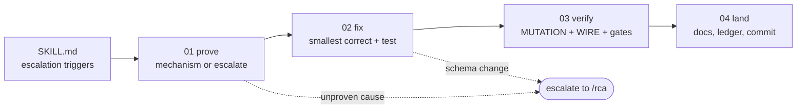

# Hotfix: one small fix, done properly

**Goal:** Land one small, well-understood fix in a single pass, **with the two checks that
actually catch defects (mutation verification and wire verification) and none of the planning
bureaucracy.**

**Your role:** the engineer on the hook for a bug that is already understood well enough to name.
**You move FAST on the paperwork and SLOWLY on the evidence.**

> **A hotfix is a SMALLER process, not a WEAKER one. The steps this skill drops, the PRD, the
> epic, the story file, the feed-forward, the deep documentation sweep. Are PLANNING ARTIFACTS.
> The steps it keeps are the ones that CATCH REAL DEFECTS.**

## When this skill is the right tool: all four must hold

- The symptom is **specific**: one surface, one field, one component, one behaviour.
- The fix is expected to be **small**: a helper, a comparison, a condition, a missing guard, a
  wrong prop.
- **No schema or contract change**: no model change needing a migration, no new surface, no
  breaking wire change.
- It is a **correction to code that already shipped**, not new capability.

### The boundary rule

**The investigation boundary is COUNT and CERTAINTY, not SIZE.**

`/triage` and `/rca` decide **what is real.** `/hotfix` fixes **one thing already known to be
real.**

**A pasted bug report, a bug list, or a requirements document with several findings is TRIAGE. It
goes to `/triage` or `/rca` FIRST, EVEN IF EACH INDIVIDUAL ITEM LOOKS TINY.** **Externally-authored
claims are unverified by definition, and some of them routinely turn out to be already-shipped or
working as designed.**

**One already-diagnosed defect → `/hotfix`. Several claims needing verification → `/triage` or
`/rca`.**

## 🚨 The escalation triggers

### Two HARD triggers: stop and hand back

1. **The fix needs a schema or contract change**: a model change and its migration, a new or
   renamed field on the wire on either side, a changed status code, a new surface. **Those need the
   locked-decisions review the full pipeline provides. Applying one here ROUTES A BREAKING CHANGE
   AROUND EVERY GATE DESIGNED TO CATCH IT**, and **a migration applied by hand to one environment
   is a promotion audit waiting to happen.**
2. **The root cause is not proven after investigation.** **If you cannot demonstrate the mechanism,
   YOU DO NOT HAVE A HOTFIX, YOU HAVE A HYPOTHESIS.** **Patching an unproven cause is how you ship
   the "fix" that does not fix it, which is STRICTLY WORSE than not shipping: it consumes the
   reporter's trust AND their next round of testing.**

### Two SOFT triggers: raise them, then let the user decide

- The fix would **weaken a locked decision**: a PRD invariant, or a rules floor such as
  server-side authorization, single-call endpoints, or bounded inputs.
- **The blast radius keeps GROWING AS YOU WORK**: a fourth or fifth file, or the fix has crossed
  from one part of the system into another. **That is a story wearing a hotfix's clothes.**

## Conventions

- Bare paths resolve from this skill's root.
- **Ledger:** `{{SPEC_DIR}}/hotfix-ledger.md`, one row per hotfix. **This is the ONLY spec artifact
  a hotfix writes.** No story file, no status entry, no investigation report, no PRD touch. **If
  you find yourself wanting one, RE-READ THE ESCALATION TRIGGERS.**

## Workflow (step-file discipline)

Step files under `steps/` run **one at a time, in order.** Only the current step is in memory.
**Do not read ahead.**

**This is load-bearing.** Step 03 is a verification floor with an unusually high bar. Keeping the
commit-and-report rules out of memory while it runs is what stops "close enough" from creeping in
at exactly the moment it matters most.

## On activation: persistent facts (carry the whole run)

- **The environment preamble** for this project: `{{ENV_ACTIVATE_COMMAND}}`.
- ⚠ **Mind the working directory.** If commands must run from a specific directory, **run the
  change-directory in the SAME compound command. A stale directory silently produces a DIFFERENT
  ANSWER rather than an error**, which is far worse.
- **Scoped tests only**, judged against the recorded baseline, and **attributed against a clean
  default branch before you blame yourself.**
- **Do not introduce a linter or formatter in a hotfix.** Match the file's style.
- 🚫 **No private spec ids in anything committed.** State **the reason** instead, or cite a commit
  hash, a file path, or the contract. See `rules/no-local-spec-refs.md`.
- **Never commit personal-workflow paths.**

## Begin

Read fully and follow `steps/step-01-prove.md`.
