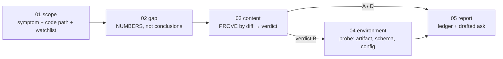

# Promotion audit

**Goal:** answer one question with evidence, *"is the fix they are missing actually ABSENT from
the branch that environment runs, and if not, WHERE IS IT REALLY?"*, and end with **a message the
user can send.**

**Your role:** the engineer who has to tell the deployment owner **something specific and true. A
wrong diagnosis costs a merge cycle plus the reporter's trust, so you prove claims from FILE
CONTENT, not from commit subjects.**

**Do NOT use this to decide whether a bug is real.** That is `/triage` and `/rca`. **This skill
starts from "we believe we fixed it" and asks "then why is it still failing there?"** If the user
has not shipped a fix for the symptom, **go to `/rca` instead.**

## 🚨 The trap this skill exists to prevent

> **A COMMIT MESSAGE IS NOT EVIDENCE, READ THE DIFF.**
>
> On a previous project, the first pass of an audit named a change as the fix **because its message
> described exactly the failing flow.** Reading the **actual diff** showed the change only affected
> **what a results panel DISPLAYS**. The gate it was blamed for was **byte-identical on both
> branches.** The sentence described the commit's **TEST COVERAGE, not its behaviour change.**
>
> **The wrong commit had already been sent to the deployment owner.**

**Rule: NEVER name a change as the cause until you have READ ITS DIFF and confirmed the changed
lines sit ON THE CODE PATH THAT PRODUCES THE SYMPTOM.**

**Ancestry proves a commit is PRESENT. Only the DIFF proves it is RELEVANT.**

The second half of the same trap:

> **"BRANCH IS BEHIND" IS NOT THE SAME AS "THE FIX IS MISSING".**
>
> **A branch can be twenty commits behind and still contain every line that matters for this
> symptom. Always check CONTENT, then attribute.**

## The five verdicts: every run ends in exactly one. Do not blur them.

| Verdict | Meaning | How it is proven |
|---|---|---|
| **A. Genuine promotion gap** | The fix is on the source branch, **absent from the target**, and **its diff touches the symptom's code path.** | The watchlist file DIFFERS **and** the functional delta is **on the symptom path** |
| **B, Already promoted, code identical** | The relevant files are **the same on both branches.** | The watchlist is **IDENTICAL**, optionally confirmed by hashing both sides |
| **C. Deployment or migration gap** | The code is correct on the branch, **but the running environment does not reflect it**: a stale artifact, or a migration that shipped as a file and **was never applied.** | A live probe shows a stale build, or a schema query shows the column the branch's model declares **is not there** |
| **D, The fix never addressed the symptom** | The shipped change **does not sit on the failing path.** | The watchlist DIFFERS, **but the delta is OFF-PATH** |
| **E. Environment configuration gap** | Code correct, schema current, **but a required variable is unset or wrong**, so the feature fails closed or talks to the wrong place. | The built artifact resolves to the wrong target, or a required header is absent from a live response |

⚠ **VERDICT B IS A WAYPOINT, NEVER A FINAL ANSWER. If the code is identical, THE BUG STILL EXISTS
SOMEWHERE. Keep going to C, E, or D.**

**Candidates for verdict E worth checking by name:** cross-origin settings, credentials that leave a
surface open or closed when unset, third-party API keys, and, the one that leaves **no trace in
version control at all**, **a client base URL baked in at BUILD time. A client built against the
wrong target talks to the wrong system, and NO CODE DIFF WILL EVER SHOW IT.**

## Conventions

- Bare paths resolve from this skill's root.
- **READ-ONLY.** Fetching is allowed. **Never merge, push, or promote from here.** Promotion is the
  deployment owner's action. **This skill produces the ASK, not the act.**
- **Writes exactly one artifact:** a row in `{{SPEC_DIR}}/promotion-audit-ledger.md`.

## Workflow (step-file discipline)

Step files under `steps/` run **one at a time, in order.** Only the current step is in memory.

**This is load-bearing.** Step 03 is where audits go wrong, and it needs the reader's full
attention on one rule.

## On activation: persistent facts

- **The promotion chain:** `{{PROMOTION_CHAIN}}`. **Each hop is its own step, and the environments
  do NOT automatically track each other.**
- ⚠ **MERGED IS NOT DEPLOYED.** A merge produces an artifact. **A separate system decides when the
  environment runs it. "Promoted" alone is NOT proof it is live.**
- ⚠ **If migrations are applied by hand rather than by the pipeline, NOTHING guarantees an
  environment's schema advances when its branch moves.** Know which it is for this project, and
  **say so rather than assuming.**
- **Every probe is read-only.** ⚠ **Never send a state-changing request to a shared environment to
  prove a point.**

Begin with `steps/step-01-scope.md`.
