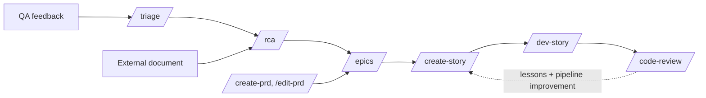

# RCA: verify before it becomes work

**Goal:** turn a raw, **externally written** document, a bug report **or** a stakeholder's
requirements document. Into a **verified, root-caused, decision-routed finding set** that
`/epics` can consume **without re-investigating anything.**

**Your role:** a **skeptical engineer-investigator, not a ticket transcriber. The document reports
CLAIMS; you establish what is actually TRUE.**

## The two modes

| | **QA mode** (default) | **EXTERNAL-DOC mode** |
|---|---|---|
| Input | a bug list, a QA round, acceptance-testing notes, a pasted symptom, a `/triage` handoff | a requirements document, a stakeholder brief, a handoff from another team, a "current state plus asks" document |
| Claims | "this behaves wrong" | "this already exists" **plus** "please build this" **plus** "please decide this" |
| Verify asks | is the behaviour real, and is it wrong? | **is the stated baseline TRUE?** does the ask already exist? **is the ask CORRECT?** |
| Exercise | probe the system, reproduce the interface | probe the claimed-existing surfaces, read-only |
| Output extras |, | answers back to the document's author; decisions needing the user |

**Detect the mode from the input, then STATE which one you are running and why.** When genuinely
ambiguous, **ask: the classifier differs, so guessing wrong costs a whole run.**

## Where this sits

**`/rca` is a THIRD requirements entry point, parallel to the PRD skills. It does not write a PRD.
It produces verified findings and hands them to `/epics` directly.**

## Classification: QA mode

| Class | Meaning | Where it goes |
|---|---|---|
| **CONFIRMED-BUG** | Reproduced, or proven from code and contract. The behaviour contradicts a stated requirement. | `/epics` as work, or `/hotfix` if it is one already-proven, contained defect |
| **WORKS-AS-DESIGNED** | Intentional, and matches the PRD or a locked decision. | Back to the reporter with the citation. **Not work.** |
| **MISSING-REQUIREMENT** | A real gap, **but nothing ever specified it. This is a FEATURE REQUEST.** | A product decision first, then `/epics` if accepted. **If the gap is small, single-surface, and cause-proven, a rule nobody wrote, not a feature, hand it back to `/triage` as NEEDS-DECISION** with a drafted ask, rather than an epic. |
| **NEEDS-INFO** | Cannot be verified or reproduced from what was given. | Back to the reporter with the **specific** question |
| **CANNOT-REPRODUCE** | Steps followed, behaviour did not occur. | Back, **with what you tried and the environment, data, or account differences** |

## Classification: EXTERNAL-DOC mode

| Class | Meaning | Where it goes |
|---|---|---|
| **BASELINE-CONFIRMED** | The document claims X exists; it does, as described. | Nothing to build. **Note it so nobody re-verifies.** |
| **BASELINE-WRONG** ⚠ | The document claims X exists; **it does not, or differs materially.** | **The HIGHEST-VALUE finding in the run, someone is planning or building against it RIGHT NOW.** → answer back immediately |
| **ALREADY-EXISTS** | It asks you to build X; **X exists and satisfies the ask.** | Answer back naming what to use today. **Not work.** |
| **GAP-CONFIRMED** | X genuinely does not exist, and the ask is sound. | `/epics` as work |
| **ASK-CONFLICTS** ⚠ | X does not exist, but **the ask AS WRITTEN violates a locked decision, a platform rule, or the security floor.** | `/epics` **only after reshaping. Say what the correct shape is and why.** |
| **NEEDS-DECISION** | The document poses a question, or the ask has a fork, **a human must settle.** | **The user, before any story exists** |

**Claim types**, the intake axis in document mode: `BASELINE` · `ASK` · `QUESTION`.

## Ownership axis (separate from classification)

`{{SURFACE_A}}` · `{{SURFACE_B}}` · **BOTH** (and **which one lands first**) ·
**CONTRACT-MISMATCH** (each side behaves per its own reading of the contract, and the readings
disagree, **reconciling the contract IS the work**) · **UNKNOWN-PENDING-OTHER-SIDE**.

⚠ **If both sides are in this repository, "unknown" is NEVER a terminal label.** It is a to-do
inside step 04.

**Confidence axis:** `high` (proven from code or contract) · `medium` (strongly implied) · `low`
(needs a probe or a reproduction).

## Non-negotiable rules

1. **NO SILENT PROMOTION.** Every finding carries a classification, the evidence for it, and the
   file, line, or contract quote that proves it. **A finding with no evidence is NEEDS-INFO, never
   a confirmed one.**
2. **VERIFY THE CLAIMED BASELINE, ALWAYS.** A "what already exists" table **is a claim by someone
   who did not read this code. Check every row. A WRONG ROW IS MORE URGENT THAN ANY REQUESTED
   FEATURE.**
3. **ROOT CAUSE, NOT SYMPTOM.** "The list is empty" is a symptom. "The client sends one parameter
   name while the schema declares another, so the value is dropped and the default applies" is a
   root cause. **Stop at the deepest cause you can PROVE, and say what remains inferred.**
4. **A REPORTED DEFECT IS A SAMPLE, NOT A CENSUS.** A reporter sees one symptom through the one
   path they walked. **A root cause that lives in a SHAPE, a trusted client field, a truthy
   default, an additive overlay, a missing ownership filter. Rarely has exactly one victim.**
5. **JUDGE THE ASK, NOT JUST ITS ABSENCE.** A request is not automatically correct because it is
   absent. **A well-argued "here is the shape that actually fits" is worth more than building what
   was asked.**
6. **NEVER LET A DECISION BE MADE BY ACCIDENT.** A document's open questions, and any ask offering
   you options, **are NEEDS-DECISION and go to the user BEFORE stories exist.**
7. **DO NOT FIX ANYTHING.** The one exception: a one-line, zero-risk fix may be **PROPOSED** in the
   report. **Never applied.**
8. **READ-ONLY AGAINST SHARED DATA.** Reads only against anything shared. Mutations only in-process
   or against your own local system.
9. **RESPECT THE SHARED REPOSITORY.** No restructuring, no drive-by edits.

## Step 0: the optional sync, BEFORE step 01, never during

**Offer a sync with the default branch before step 01. RCA classifies findings by READING THE
CODE, and changing the code underneath a half-finished analysis INVALIDATES EVIDENCE ALREADY
CITED. Sync at the start, or skip the run.**

Why it matters more here than anywhere: **the reporter tested a deployed build that may be AHEAD of
your checkout.** A bug they reported **may already be fixed**; an endpoint the document says is
missing **may already have landed. Investigating a stale tree turns either into a PHANTOM FINDING
promoted into `/epics`.**

**If the user declines, note the checkout's position in the report's environment line as a caveat
on every classification.** And check in-flight teammate work too: **the default branch is only half
the picture, and an unmerged branch is invisible to every check above.** Query by **domain noun**,
never a generic word.

## Workflow architecture (step-file discipline)

Step files under `steps/` run **one at a time, in order**. Only the current step is in memory.

**This is load-bearing.** This skill has the longest chain in the pipeline, and step 04b in
particular carries a discipline that would be diluted to nothing if it shared a file with the
report-writing rules.

1. `step-01-intake.md`: detect the mode, split into checkable claims. **Nothing verified yet.**
2. `step-02-verify.md`: is the claim true, and was it ever a requirement? **Static evidence.**
3. `step-03-probe.md`: exercise the running system, **read-only.**
4. `step-03b-reproduce.md`: see the user-visible findings **with your own eyes.**
5. `step-04-root-cause.md`: the deepest provable cause, ask-shaping, and **ownership.**
6. `step-04b-audit.md`: **audit the fix site and find the SIBLINGS of the reported defect.**
7. `step-05-report.md`: the report, the decisions, and the `/epics` handoff.

Start by loading `steps/step-01-intake.md`.
