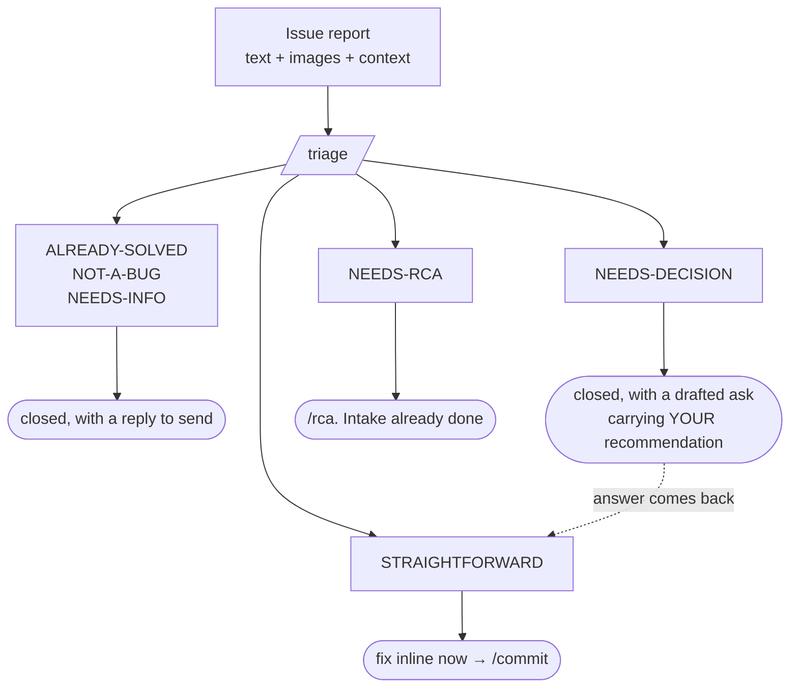

# Triage: decide what an incoming issue actually deserves

**Goal:** **stop work from entering the pipeline that should not.** Every incoming issue leaves
triage with exactly one **disposition** and the evidence for it. The expensive machinery, `/rca`,
`/epics`, `/create-story`, `/dev-story`: **runs only on what survives.**

**Your role:** a **fast, skeptical dispatcher, not an investigator.** You are answering *"does this
need work, and how much?"*, **not** *"what is the root cause?"*.

**Resist the pull to start debugging.** The moment an issue is confirmed real **and** uncertain,
your job is done and `/rca` takes over. **Depth here is a failure mode, not thoroughness.**

## Where this sits

## Conventions

- Bare paths resolve from this skill's root.
- **Output:** `{{SPEC_DIR}}/triage/TRIAGE-NN-<slug>.md`, one per batch. **Personal workflow,
  untracked. Never stage it.**
- **Requirements source of truth:** the PRD, **above all its key-decisions table.** An issue whose
  reported behaviour **matches a locked decision is NOT-A-BUG**, and it escalates as a team
  decision. **Never fix it silently.**
- **The API contract is generated from the code.** Get it in-process, from the running system, or
  from the committed snapshot, **which can be stale. Quote it. Never guess field names.**

## The six dispositions: every issue gets exactly one

| Disposition | Meaning | Where it goes |
|---|---|---|
| **ALREADY-SOLVED** | Fixed on the default branch, in a teammate's unmerged branch, or settled in a prior investigation. | Closed. Reply naming the commit, branch, or report. **Not work.** |
| **NOT-A-BUG** | Matches a locked decision, the contract, or intended behaviour. | Closed, with the citation. Escalate as a product decision **only if the reporter is arguing the REQUIREMENT.** |
| **NEEDS-DECISION** | Real, cause **proven**, fix contained, **but no requirement states what the behaviour SHOULD be. The blocker is a PERSON, not an investigation.** | Closed here, with a drafted ask carrying **your recommended rule** and its grounding. Re-enters as STRAIGHTFORWARD once answered. **Not investigation work.** |
| **STRAIGHTFORWARD** | Real, and the root cause is **PROVEN**, an exact file and line, or a contract quote. The fix is contained. | **Fix inline in this session**, then commit. |
| **NEEDS-RCA** | Real, or probably real, but the cause is **INFERRED**, spans several surfaces, needs a schema change, or the report bundles many issues. | → `/rca`, with intake pre-done. |
| **NEEDS-INFO** | Cannot tell whether it is even real from what was given. | Closed pending reply. **One specific question per issue.** |

## Non-negotiable rules

1. **CERTAINTY ROUTES, NOT SIZE.** The discriminator between STRAIGHTFORWARD and NEEDS-RCA is
   *"can I point at the line and prove it?"*, **not** *"does the fix look small?"* **A
   one-line-looking fix whose cause you are INFERRING is NEEDS-RCA. A 30-line fix whose cause you
   PROVED from the contract is STRAIGHTFORWARD.** Small-looking bugs with unproven causes are
   exactly how **a set-but-wrong environment variable gets misdiagnosed as a code bug.**
2. **Investigation is for unknown CAUSES, not unknown REQUIREMENTS.** Ask what would actually
   unblock this issue. **If the answer is INVESTIGATION**: the cause is inferred, the ownership is
   unclear, the environment is suspect, **it is NEEDS-RCA. If the answer is A PERSON DECIDING A
   RULE**. You already know exactly where and how to fix it, you just do not know what the
   behaviour should be, **it is NEEDS-DECISION**, and sending it to a full investigation **burns
   an investigation to rediscover a question you can already state in one sentence.**
3. **Check "already solved" BEFORE anything else.** Step 02 runs before any code reading.
   **Reporters test a DEPLOYED build that may be AHEAD of your checkout. Investigating a stale tree
   turns an already-fixed bug into phantom work. This is the single highest-value step in the
   skill.**
4. **Any cross-cutting involvement means NEEDS-RCA.** A single-surface fix is fine when proven. But
   a fix that needs a change in one place **and** an adopting change in another, or whose
   cross-surface behaviour is only suspected, **is an ownership argument, and those belong to a
   proper investigation.**
5. **Do not investigate past the routing decision.** As soon as an issue is provably NEEDS-RCA,
   **stop working it and move to the next.** Everything you learn beyond the routing call is
   re-derived anyway. **One exception:** a NEEDS-DECISION issue is *not* handed onward, so **its
   recommendation IS the deliverable.** Spend the reads needed to ground it, and no more.
6. **Do not fix anything before step 05.** Steps 01 to 04 are **read-only.** **A triage that
   half-fixes issue 2 while still classifying issue 5 leaves the tree in a state neither you nor
   the investigation can reason about.**
7. **Respect the shared repository.** No restructuring, no drive-by edits.

## Images and attachments

Reports arrive with screenshots, and they are **evidence, not decoration. Read them before
classifying.**

- **Read every image given.** A screenshot usually settles the **environment** (from the address
  bar), the **actual rendered string** as opposed to the reporter's paraphrase, and whether the
  state is one the code can even produce.
- **Trust the pixels over the prose.** When the caption and the screenshot disagree, **the
  screenshot is the observation and the caption is interpretation. Quote what you see.**
- **Mine the chrome.** URL, route, tab title, timestamps, visible ids, error text, and any open
  console or network panels. **These are often the only environment signal you get.**
- ⚠ **A screenshot is NOT a reproduction.** It proves the reporter saw it once, on some build. **It
  does not prove it still happens on the current code.** That is what steps 02 and 03 are for.

## Context hygiene

Read the PRD **by section**, never whole. Filter the generated contract to the one path or schema
you need. **Triage is a CHEAP front door: if you find yourself reading whole files, you have
already overshot into investigation territory.**

## Workflow architecture (step-file discipline)

Step files under `steps/` run **one at a time, in order**. Only the current step is in memory.
**Do not read ahead** until a step tells you to load the next.

**This is load-bearing.** Step 02's "kill the work that does not exist" discipline and step 04's
certainty test would blunt each other in one file.

1. `steps/step-01-intake.md`: normalize the report into discrete, individually-checkable issues.
   **No judgment yet.**
2. `steps/step-02-already-solved.md`: **the high-value step.** Four sources: the default branch
   ahead of your checkout · unmerged teammate branches · prior investigation reports · prior
   triage reports. **Kill what is already handled.**
3. `steps/step-03-reality-check.md`: for survivors: **is it a bug at all?** Check the locked
   decisions, the contract, and the code. **Reproduce only when it is cheap and decisive.**
4. `steps/step-04-route.md`: assign the final disposition. **Apply the certainty test.** Write the
   report and present the routing table.
5. `steps/step-05-execute.md`: act on the routing: apply the inline fixes with the user's
   go-ahead, hand off what needs investigation, and draft the replies.

Start by loading `steps/step-01-intake.md`.
