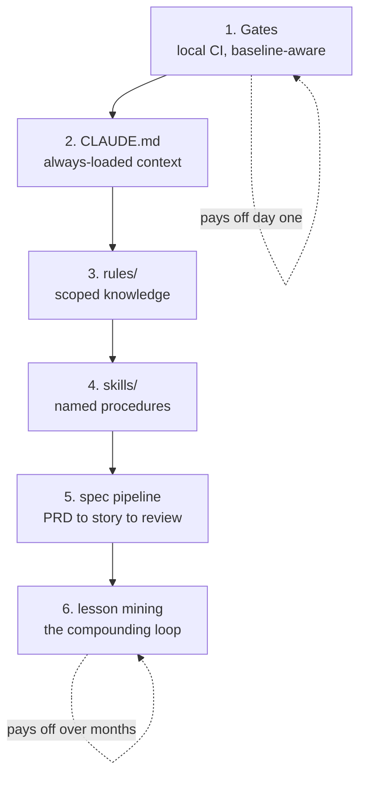

# Starter kit

Copy this into your project, fill in the placeholders, and you have the method
running. Nothing here needs a network call or a package install.

## What is in here

```
.claude/            Reference implementation, Claude Code shaped
  CLAUDE.md         Always-loaded project context. Start your edits here.
  rules/            Scoped knowledge. Loaded only when the agent touches a
                    matching path, so context stays small.
  skills/           Named procedures. One directory each, with step files.
  scripts/specs/    The spec pipeline helper CLI.
  hooks/            Deterministic checkpoints, outside the model.
agent-adapters/     The same method mapped onto Codex, Kiro, Antigravity,
                    and Cursor.
```

## Install

```bash
cp -r starter/.claude /path/to/your/project/.claude
cd /path/to/your/project
```

Then work through the placeholder table in `.claude/CLAUDE.md`. Every
`{{PLACEHOLDER}}` in the kit is listed there with what it means and an example
value.

```bash
# find anything still unfilled
grep -rn '{{' .claude/
```

## Adopt in this order

You do not have to take all of it. Each step is useful alone, and each one is
cheaper than the one after it.



1. **Gates first.** See [`../gates/`](../gates/). Independent of everything
   else, and it is the piece that pays off immediately.
2. **`CLAUDE.md`.** One file. Cuts the amount of re-explaining you do every
   session.
3. **`rules/`.** Move the area-specific knowledge out of `CLAUDE.md` so it
   loads only when relevant.
4. **`skills/`.** Start with `code-review`. It is the one that makes the rest
   compound.
5. **The spec pipeline.** The largest commitment. Worth it on work measured in
   months, overkill on a one-off script.
6. **Lesson mining.** Needs a few finished stories before it has anything to
   mine, so it comes last by necessity.

## A warning about `response-style.md`

That rule file encodes how the agent talks to you. The version shipped here is
a defensible default, not a recommendation. Rewrite it in your own voice. An
inherited style rule that does not match how you actually want to be spoken to
is worse than none, because you will fight it every session.

## What is tested

Claude Code is the reference and the only tool this kit has been exercised on
end to end. The adapters in `agent-adapters/` are built from each tool's
published configuration format and are documented mappings, not tested ports.
Check them against your installed version. See
[`../docs/07-agent-tools.md`](../docs/07-agent-tools.md).
