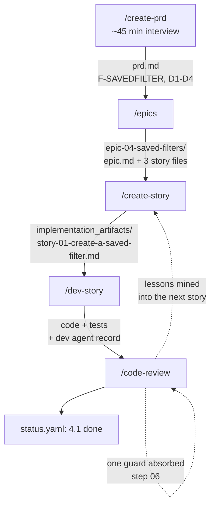

# Scenario 01: A new feature, start to finish

**What this page answers:** what the full pipeline actually feels like on one ordinary feature.
What you type, what the agent asks back, what lands on disk, how long each stage takes, and
where it grinds.

The feature: **saved filters** on the reports page of an internal tool called Ledgerly. Users
filter a transaction report by date range, account, and status, then lose the whole thing on
navigation. They want to save a filter set, name it, and pick it from a dropdown later.

Ordinary. Believable. And it carries one real constraint: a saved filter belongs to the user who
made it, and an administrator must not see other users' saved filters in their own dropdown.
That single rule is what makes this story an authorization story, and that changes the edge-case
budget later. Watch for it.

---

## The chain, with the artifacts named



---

## Stage 1: `/create-prd`

**Roughly 45 minutes.** Most of it is you talking. Budget a real block of time, not a coffee
break. If someone tells you the PRD interview takes five minutes, they wrote a PRD that will not
survive its first story.

Ledgerly has no PRD yet, so this is from-scratch mode.

```
/create-prd
```

The skill checks for an existing PRD first and stops if it finds one. There is none, so it reads
`data/prd-purpose.md` and asks the discovery questions in one message rather than dripping them
at you.

### What it asks, and what a good answer looks like

> **1. What are we building?**

Weak: "saved filters for reports." Good, because it names the job: "Users filter the transaction
report by date range, account, and status. The filter resets on navigation and they rebuild it
every time. We want them to save a named filter set and reapply it in one click."

> **4. Domain sources of truth? Is there an existing system this replaces or must match?**

This is the question people skip, and it is the one that saves you a week. A good answer: "The
filter shape must match what `GET /reports/transactions` already accepts. Do not invent a new
filter vocabulary. The query parameters in the API contract are the source of truth." That one
sentence stops the agent from designing a parallel filter model that then has to be translated
at the boundary forever.

> **5. Hard constraints?**

"A user sees only their own saved filters. Administrators included. We had an incident where an
admin tool leaked one team's data into another team's view and we are not doing that again."

That is your locked decision arriving early, in the user's own words, with the reason attached.

Step 2 then proposes the feature catalog, the flows, and the decision table, in the ID shape the
helper parses. It also proposes two features every catalog forgets, `F-UI` and `F-A11Y`, and
makes you accept or decline them explicitly. Declining is fine. Declining silently is not,
because the coverage map then reports a clean number on a product with an unusable keyboard path.

### What lands on disk

`.claude/specs/plan_artifacts/prd.md`. A real excerpt from the locked-decisions table:

```markdown
## Key decisions (locked)

Locked means a change needs a new decision recorded here, not a code review comment.

| ID | Decision | Why | Consequence if broken |
| --- | --- | --- | --- |
| D1 | A saved filter is visible only to the user who created it. Role does not widen visibility. | An admin tool leaked one team's rows into another team's view once already. Ownership is per-user, never per-role. | Any user with an elevated role sees filters they never made, and the leak is invisible because the UI looks correct. |
| D2 | Ownership is enforced server-side on the route. A client-side filter of the list is not authorization. | A hidden dropdown entry is still returned over the wire and readable in the network tab. | The data leaks to anyone who opens developer tools, while the screen looks compliant. |
| D3 | A user may hold at most 20 saved filters. Creating the 21st is rejected with a message naming the limit. | Unbounded per-user rows on a shared table is how one account degrades the dropdown for everyone. | The dropdown becomes unusable and the list query slows for every user on the shard. |
| D4 | The saved filter stores the same parameter names `GET /reports/transactions` accepts. No translation layer. | A parallel filter vocabulary has to be mapped in both directions forever, and the two drift. | A filter saved today stops reproducing its report after any query-parameter change. |
```

Four decisions. D1 and D2 are the authorization pair. D3 is the size limit. D4 is the constraint
that came out of the sources-of-truth question.

**Where it costs you:** step 3 will not write the file until you approve the draft, and step 1
will not move on until you approve the discovery summary. Two approval gates in one skill feels
slow at 4pm on a Thursday. The reason it earned its place: a PRD written past an unapproved
summary is a document that reads as authoritative and encodes your agent's guesses. Every story
downstream then inherits those guesses with a citation attached.

---

## Stage 2: `/epics`

**Roughly 20 minutes.** Faster, because the PRD did the thinking.

```
/epics
```

The skill runs `python .claude/scripts/specs/specs.py list`, finds no epics, and enters create
mode. It pulls requirement IDs with `specs.py reqs` rather than reading the whole PRD back in.

It proposes one epic and asks you to approve the structure before it writes any story.

### The friction: the agent proposes the wrong split

The first proposal came back as two epics: "Saved filters backend" and "Saved filters UI". That
is a split by technical layer, and the skill's own persistent facts forbid it: **organize by
user value, not technical layers.** A backend epic that ships alone delivers nothing a user can
see. The correction:

> That is a layer split. Neither half is usable alone. Make it one epic, `saved-filters`,
> with the stories sliced by capability instead.

The agent re-proposed one epic with three stories, and the ordering rule held: no story depends
on a later story in the same epic.

```
epic-04-saved-filters/
  epic.md
  story-01-create-a-saved-filter.md
  story-02-apply-a-saved-filter.md
  story-03-rename-and-delete-a-saved-filter.md
```

### The second friction: nine acceptance criteria

Story 01 came back with nine edge-case criteria: empty name, whitespace-only name, duplicate
name, name at 100 characters, name at 101, the 20-filter limit, the 21st filter, a filter
referencing a deleted account, and a concurrent double-submit. Every one is a reasonable thing
to test. The budget still says no.

From [`starter/.claude/rules/edge-cases.md`](../starter/.claude/rules/edge-cases.md):

> - **3** edge-case acceptance criteria per story. Default.
> - **5** when the story touches **money, authorization, or file upload**.
> - **Over 5 means the story is too big.** The count is a **size smell, not a coverage target.**

This story touches authorization, so the cap is 5, not 3. Nine is over the cap, and the cap is a
split signal, not a trim signal.

The correction, typed in full:

> Nine edge cases. This is an authorization story so the cap is 5, and over 5 means split.
> Pull the name-validation rules out into their own story and leave story 01 with creation,
> the ownership rule, and the 20-filter limit. Then walk the five sources and write the skip
> line for each one you do not use.

The agent split it. Story 01 kept five, each traced to a source. The skipped sources got their
one-line reason, which is the part that stops the next run from hunting for cleverness:

```markdown
### Edge-case derivation (budget: 5, this story touches authorization)

| # | Source | Criterion |
| --- | --- | --- |
| AC4 | 1. Boundaries | Given a user holding 20 saved filters, when they save a 21st, then it is rejected with a message naming the 20-filter limit. |
| AC5 | 1. Boundaries | Given a user holding 19 saved filters, when they save a 20th, then it is saved and appears in their dropdown. |
| AC6 | 3. Error paths | Given an unauthenticated caller, when they POST a saved filter, then the request is rejected before any row is written. |
| AC7 | 3. Error paths | Given user B's saved filter id, when user A requests it, then the response is a not-found, not a forbidden. |
| AC8 | 4. State | Given two identical create requests with the same idempotency key, when both are processed, then exactly one filter row exists. |

Skipped sources:
- 2. Equivalence classes: skipped. Name validation moved to story 04 and it owns that class.
- 5. Domain-specific: skipped. Sources 1, 3 and 4 came back full; nothing product-specific is left uncovered.
```

AC7 is worth pausing on. It says not-found rather than forbidden, because a forbidden response
confirms the row exists, which leaks the fact that user B has a filter with that id. The agent
proposed forbidden. That correction came from you, not from the skill.

### What lands on disk

The epic tree above, plus `.claude/specs/implementation_artifacts/status.yaml` with all four
stories at `planned`. The skill runs `specs.py sync-status`, which rebuilds structure from the
plan tree while preserving any status values a human already set.

---

## Stage 3: `/create-story`

**Roughly 25 minutes**, and almost all of it is step 02, which the skill itself calls the most
important step in the pipeline.

```
/create-story 4.1
```

Step 01 resolves the reference with `specs.py story-info 4.1`, which returns the planning
source, the mirrored dev output path, and the previous story. Step 02 then does the expensive
part: it reads only the files this story touches, reads the PRD by section rather than whole,
and mines the shipped-story corpus.

### The hazard scan

This is Loop A doing its job, and it runs every time, not when you remember to ask:

```bash
python .claude/scripts/specs/specs.py lessons 4.1 --hazards
python .claude/scripts/specs/specs.py lessons 4.1 --hazards --all-epics --limit=20
```

Both passes. The same-epic pass gives direct carry-over. The all-epics pass catches the
cross-cutting traps, and this run it earned its keep. From epic 2, eleven weeks earlier:

```
Lessons from all epics, before 4.1
  scanned 9 done stories, 7 had a record, 19 lessons, 6 flagged as hazards

[!] [2.4] The green suite stayed green while the ownership filter was missing, because
    every test fixture created rows for the same user. A cross-user test is the only
    one that can fail.
```

That is exactly the shape of story 4.1. It went into the dev story's testing section with the
source cited, and it is the reason this story's test suite creates two users instead of one.

Note the denominator line. Scanned 9, 7 had a record, 19 lessons. Without it, "6 hazards" is
uninterpretable: it could mean a thin corpus or a broken scan. The miner always prints it, and
[`docs/04-compound-engineering.md`](../docs/04-compound-engineering.md) explains why removing it
is the classic failure in this family of scripts.

### What lands on disk

`.claude/specs/implementation_artifacts/epic-04-saved-filters/story-01-create-a-saved-filter.md`,
mirroring the planning path exactly so both share one entry in `status.yaml`.

A real excerpt, the guardrails section, which is where the locked decisions become developer
instructions:

```markdown
## Dev guardrails (from the PRD locked decisions)

- **D1 + D2, ownership.** The list and read routes filter by the authenticated user's id
  in the query itself, not after the fetch. Do not add a role branch. An administrator is
  an ordinary user for this resource.
- **D2, server-side.** The client dropdown filtering is UX. It is not authorization and it
  must not be the only place the rule exists. Tests cover an out-of-scope caller.
- **D3, the limit.** Count the caller's existing rows inside the same transaction as the
  insert. A count-then-insert without a transaction lets two concurrent requests both see 19.
- **D4, parameter names.** Reuse the exact query-parameter names from `GET /reports/transactions`
  in `openapi.yaml`. Do not rename `account_id` to `accountId` on the way in.

## Tasks

- [ ] Add the `saved_filter` table and its migration file, in the same change.
- [ ] Add the create route with schema validation at the boundary.
- [ ] Enforce the ownership rule in the query, with a cross-user test.
- [ ] Enforce the 20-filter limit inside the insert transaction.
- [ ] Register the route module in the composition root.
- [ ] Regenerate the API contract and confirm the diff is exactly this story.
```

Step 04 then runs an adversarial self-check and forces every open question to a concrete call.
The skill treats "decide later" as a defect, because a developer may have only this file.

---

## Stage 4: `/dev-story`

**Roughly 90 minutes.** Four steps. Most of the time is the red-green loop in step 02.

```
/dev-story 4.1
```

Step 01 loads the story and flips the status to `in_progress` via
`specs.py set-status 4.1 in_progress`. Step 02 walks the task list in order, tests first.

### The test that fails for the wrong reason

This is what actually happens, and it is worth writing down because a green-then-red loop that
went smoothly is usually a loop somebody edited afterwards.

The cross-user ownership test, written first, as the story requires:

```python
def test_user_a_cannot_read_user_b_saved_filter(client, user_a, user_b):
    created = create_saved_filter(client, as_user=user_b, name="Q3 reconciliation")
    response = client.get(f"/saved-filters/{created['id']}", headers=auth(user_a))
    assert response.status_code == 404
```

Run it. It fails. But read the failure before you celebrate:

```
E   KeyError: 'id'
E   at create_saved_filter(client, as_user=user_b, name="Q3 reconciliation")
```

That is not the red you wanted. The test failed because the create route does not exist yet, so
the helper got an empty body and never reached the assertion. The ownership rule was never
exercised. A test that fails at setup proves nothing about the behaviour under test, and if you
implement until it goes green you will never know whether the ownership branch was ever hit.

The fix is ordering, not cleverness. Implement the create route first, watch this test fail at
the assertion line with `assert 200 == 404`, and only then write the ownership filter. Now the
red is on the line you care about, and the green that follows means something.

That is the whole of mutation discipline in miniature, and it is covered properly in
[`docs/03-tdd-with-agents.md`](../docs/03-tdd-with-agents.md).

### The step that feels like overhead

Step 02 says a schema change ships with its migration file **first**, then the model change. On
a project where automatic table creation covers your local database, that feels like paperwork
for a table that already exists on your machine.

It earned its place the hard way. Automatic table creation only creates tables that are absent.
It never alters an existing one. So the model change works on your laptop, works on a fresh
database in CI, and does nothing at all on the staging database that already has the table. The
column is simply missing there, and the failure arrives a week later as somebody else's bug
report, with none of the context still in your head. Write the migration. It takes four minutes.

### Step 03: validate

```bash
node gates/run-gates.mjs --only-changed
```

The gate runner compares against the recorded baseline and fails only on failures that are new.
On this run it reported one new failure that had nothing to do with saved filters: a shared test
fixture that story 4.1 had extended now broke a report test from epic 2. That is a regression,
it is yours, and step 03 says fix it here rather than deferring it.

Step 03 also sweeps the story's file list for leaked private spec IDs:

```bash
grep -nE '[Ss]tory [0-9]+\.[0-9]|\bAC[0-9]{1,2}\b|[Ee]pic [0-9]|RCA-[0-9]|TRIAGE-[0-9]|\.claude/' <file-list>
```

It found one: `test_ac7_cross_user_returns_404`. The spec tree is git-excluded, so `AC7` in a
committed test name is a dead pointer that still reads as authoritative to the next reader.
Renamed to `test_other_users_filter_reads_as_not_found`, which states the reason instead of
citing a document nobody else can open.

### What lands on disk

Code, tests, the migration, and the dev agent record at the bottom of the story file. The record
is the part that compounds, so it does not get sanitized:

```markdown
## Dev agent record

### Trap: the ownership test failed at setup, not at the assertion

Written test-first per the story, it went red immediately, which looked correct. It was
failing on `KeyError: 'id'` because the create route did not exist yet, so the ownership
branch was never reached. Implementing until green would have produced a passing test that
had never once exercised the rule it was named for.

Generalizes: **a red that fires before the line under test is not evidence.** Read the
failure message, not the exit code. When a test depends on a route from an earlier task,
order the tasks so the dependency is green first.

### Trap: count-then-insert without a transaction

The 20-filter limit passed every sequential test and lost to two concurrent requests, both
of which read 19. Moved the count inside the insert transaction. The green suite could not
have caught this: no test in the suite issues two simultaneous requests.
```

Step 04 flips the status to `done` and writes any drift back to the planning story.

---

## Stage 5: `/code-review`

**Roughly 40 minutes.** Eight steps. A step can be a no-op for a given story, and the rule is
"skip the work, not the step": state why it is a no-op and advance.

```
/code-review 4.1
```

**Step 01, verify reality.** Fires real requests against the running service and hands you the
transcripts. Two things it caught that the green suite did not: the new route was reachable but
missing from the generated contract because of a leftover hide flag, and the not-found response
for another user's filter carried a body naming the resource type, a smaller leak of the same
kind D1 exists to prevent. Both fixed. The human still signs off. An agent firing its own
requests is stronger evidence than a green suite and it is still the agent grading its own
homework.

**Step 02, end-user docs.** No-op, stated. Ledgerly has no user guide yet.

**Step 03, extract learnings.** The concurrency trap went into the local rules. The 20-filter
limit is a repo fact, so step 03b mirrored it into the committed team docs, per the two-homes
rule in [`starter/.claude/rules/docs-sync.md`](../starter/.claude/rules/docs-sync.md). "How I
run my gates" stays local, "this table caps rows per user at 20" goes in the committed page, and
neither is a copy-paste of the other's wording.

**Step 04, feed forward.** `specs.py feed-forward 4.1` named story 4.2 as a writeback target.
The ground truth written into 4.2's planning file: the real table name, the real column names,
and the fact that the ownership filter lives in the query rather than in a service-layer check.
Story 4.2 now builds against what shipped instead of against what 4.1 guessed.

**Step 06, improve the pipeline.** One question: what did I do by hand this run?

The honest answer was specific. In step 01 you hand-checked that the new route module was
registered in the composition root, and you had done the same check by hand on the last two
stories. Mechanical, checkable, and exactly the rule-to-guard candidate the step names. So the
improvement was a guard, not a paragraph:

```python
def test_every_route_module_is_registered():
    """Every module under api/ appears in the composition root's registration list."""
    defined = {m.stem for m in Path("src/api").glob("*.py") if m.stem != "__init__"}
    registered = set(introspect_registered_modules(create_app()))
    assert defined - registered == set()
```

Then the part that makes it evidence rather than decoration. Mutation-verify it: comment out the
saved-filters registration line, run the guard, watch it go red naming the module, restore.
State the mutation in the record, because a guard nobody has seen fail is a guard you have no
evidence works.

**"Nothing this run" is also a valid answer**, and it is common. The failure mode of step 06 is
manufacturing busywork, and a script nobody needed is maintenance debt created by a process
meant to reduce debt. When nothing clears the bar, say so in one line with what you considered.

**Step 07** offers a commit and suggests the next story with `specs.py suggest-next 4.1`. It
offers. You decide.

---

## What you have now that you would not have had

- **A spec** that states why a user sees only their own filters, so the next person to touch
  this code does not quietly widen it for an admin dashboard.
- **A locked decision** that the next story inherits as a guardrail rather than as folklore.
- **A guard test** that fails the moment somebody adds a route module and forgets to register
  it. It has been seen red once, on purpose.
- **A recorded lesson** about a test that failed at setup, which `/create-story` will surface
  automatically the next time a story writes a cross-user test.
- **A committed team doc** that names the 20-filter limit, readable by someone who has never
  heard of any of this tooling.
- **A test suite that would actually fail** if the ownership rule were removed, because it
  creates two users instead of one. That came from a lesson recorded eleven weeks earlier by a
  story in a different epic.

The last one is the whole argument. Nobody remembered that trap. The pipeline did.

---

## Honest accounting

About three and a half hours across five stages for one story, plus the PRD, which is a one-time
cost amortized across the whole epic. Stories 4.2 and 4.3 will each run in about half that,
because the PRD exists, the patterns are established, and the feed-forward from 4.1 removed
their guesswork.

If saved filters had been a one-screen prototype you planned to throw away, this would have been
absurd. It was neither. Pick the tool for which of those it is, and be honest about the answer.

Next: [`02-bug-from-qa.md`](02-bug-from-qa.md), where the work arrives already broken.
