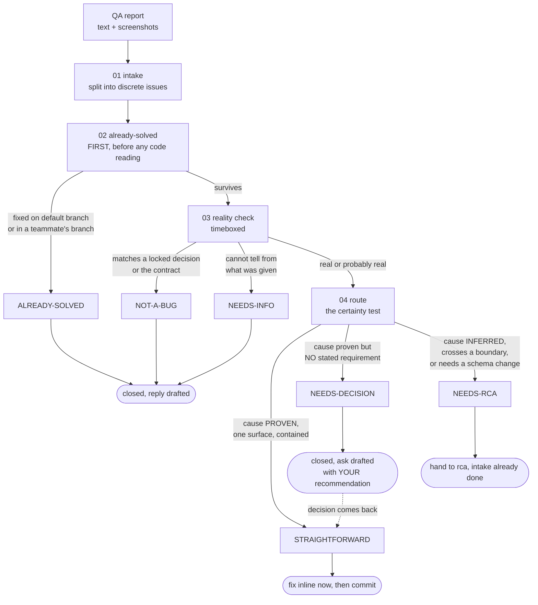

# A bug report lands from QA

**What this page shows:** what happens between a QA engineer pasting four bug reports into
your chat and you having fixed the ones that were real. Which skill you reach for, in what
order, and where the process costs you time you would rather not spend.

The product in this walkthrough is a fictional invoicing app called **Ledgerly**. The names
are made up. The shapes are not.

---

## The input

Friday afternoon. The QA engineer posts a round of findings from the staging environment:

```
QA round 14 - staging

1. Invoice list still shows deleted invoices after refresh.
2. Currency dropdown lets me pick JPY but the total renders 2 decimals.
   Should be 0 for JPY.
3. Export button on the invoice detail page does nothing. No download,
   no error. Console screenshot attached.
4. Client name field accepts 300 characters. Field should be max 120,
   the DB column is varchar(120) so this will blow up on save.
```

The instinct is to open item 1 and start reading code. Do not. You do not yet know which of
these four exist.

---

## Step zero: `triage`, always

[`../starter/.claude/skills/triage/`](../starter/.claude/skills/triage/) is the front door.
Its job is not to find root causes. Its job is to decide, per item, how much this deserves.
Five steps, one file at a time:

| Step | What it does |
| --- | --- |
| `step-01-intake` | Split the paste into discrete, checkable issues. No judgment. |
| `step-02-already-solved` | Kill what already exists as work. **Runs before any code reading.** |
| `step-03-reality-check` | For survivors: is it a bug at all? Cheap and timeboxed. |
| `step-04-route` | Assign one of six dispositions. Write the report. |
| `step-05-execute` | Apply approved fixes, hand off the rest, draft the replies. |

Steps 01 through 04 are read only. Nothing gets edited until you approve the routing table.

### The six dispositions



**Certainty routes, not size.** A one-line fix whose cause you are guessing is NEEDS-RCA. A
thirty-line fix whose cause you can quote from the contract is STRAIGHTFORWARD. That rule is
in the skill because your instinct will fight it every time.

---

## Step 02 catches one, and it costs nothing

This is the highest-value step in the skill, and it is also the cheapest. It runs four checks
in order, and it reads no application code at all.

**Check one: is the default branch ahead of your checkout?**

```bash
git fetch origin main --quiet && \
  git rev-list --left-right --count origin/main...HEAD
```

```
7	2
```

Seven commits on `origin/main` that you do not have. Now scope that to the surfaces the four
items name:

```bash
git log --oneline HEAD..origin/main
```

```
a91f0c2 fix(invoices): drop soft-deleted rows from the list query
4e77b1d chore: bump the date library
2c0a8e9 feat(export): wire the PDF worker queue
...
```

The first commit names item 1's surface. **A commit message is not evidence.** Read the diff:

```bash
git diff HEAD...origin/main -- src/services/invoices.py
```

```diff
-    rows = session.query(Invoice).filter(Invoice.org_id == org_id).all()
+    rows = (session.query(Invoice)
+            .filter(Invoice.org_id == org_id, Invoice.deleted_at.is_(None))
+            .all())
```

The changed line sits on the path that produces the symptom. Item 1 is **ALREADY-SOLVED**, at
`a91f0c2`, merged to the default branch, and the reply has to say the part QA actually needs:
whether it is live on the environment they tested. It is not. It merged after the last
promotion. So the reply says "fixed, and it reaches staging on the next promotion", not
"fixed".

**Check two: unmerged teammate branches.**
[`../starter/.claude/commands/whos-working-on-this.md`](../starter/.claude/commands/whos-working-on-this.md)
runs the same scan. Query by domain noun, never by a word like `api` or `service` that names
the repository's shape:

```
/whos-working-on-this currency rounding decimals
```

```
Overlap: origin/feat/multi-currency-format  (a teammate, 2 days old)
  touches: src/format/money.ts, src/format/__tests__/money.test.ts
  exit code 2
```

Item 2 may live there. **A branch named for the area is not proof it fixes this issue**, so
read the actual file content on their branch before calling it:

```bash
git show origin/feat/multi-currency-format:src/format/money.ts | grep -n "JPY\|minorUnits"
```

```
14:const ZERO_DECIMAL = new Set(['JPY', 'KRW', 'VND', 'CLP']);
```

That is item 2. Their branch is pushed but not merged, so it is **ALREADY-SOLVED, pending
merge**, and the reply says so plainly. QA should not expect it on staging yet.

Two of four items died in a step that read no application code and took about four minutes.

Checks three and four scan prior investigation reports and prior triage reports for the same
symptom and surface. Neither matched this round. After a quarter of running this workflow, those
two catch re-reports more often than you would expect.

---

## Step 03 kills a third one

Two items survive to the reality check. This step asks "is it broken at all?", timeboxed, and
it checks three sources in order. The first one that settles it wins.

**Item 4 is settled by the requirement, not the code.** The claim is that the client name
field should cap at 120 because the column is `varchar(120)`. The PRD's locked decisions table
has this:

```
D6 | Client display names are stored as TEXT and are never truncated.
   | Legacy imports carry names up to 400 characters and truncation
   | corrupts the legal entity name on the invoice PDF.
```

And the column, checked rather than assumed:

```bash
grep -n "name" src/models/client.py
```

```
23:    name = db.Column(db.Text, nullable=False)
```

The reporter was confident and wrong about the mechanism. The column is `Text`. There is no
`varchar(120)`. Item 4 is **NOT-A-BUG**, cited against D6 and the model line.

Note what the reply must not do. QA is not arguing the implementation, they are arguing the
requirement, and they may have a reason. The reply cites D6 and calls it a product conversation.
It does not re-argue the code.

**Item 3 does not settle.** The export button does nothing. There is no rendered string to
search for, which is itself the problem. The console screenshot shows a `404` on
`POST /api/invoices/8812/export`. The route exists in the server code. You cannot read the
account's role from the pixels.

That is the timebox firing. One orientation search and two reads, and the mechanism is not
proven. Per the skill, that is **NEEDS-RCA by definition, and a correct outcome, not a
failure**.

**Item 2 is already dead**, from step 02. Which leaves nothing STRAIGHTFORWARD. So here is the
fifth item QA filed in the same paste, which intake split out:

```
5. Invoice totals on the list page show "1,234.5" but the detail page
   shows "1,234.50". Same invoice.
```

Reality check on item 5: search for the formatter, find two call sites, read both.

```bash
grep -rn "toLocaleString\|formatAmount" src/features/invoices/
```

```
src/features/invoices/InvoiceRow.tsx:41:  {amount.toLocaleString()}
src/features/invoices/InvoiceDetail.tsx:88:  {formatAmount(amount, currency)}
```

The list row calls the browser's default formatter directly. The detail page calls the shared
helper. Proven cause, exact file and line, one surface, and the expected behaviour is stated:
two call sites must agree. All four certainty gates pass. **STRAIGHTFORWARD.**

---

## The routing table

Step 04 writes the report and presents this before touching anything:

| # | Issue | Disposition | Surface | Next |
| --- | --- | --- | --- | --- |
| 1 | Deleted invoices in list | ALREADY-SOLVED | server | reply: merged at `a91f0c2`, reaches staging next promotion |
| 2 | JPY decimal places | ALREADY-SOLVED | client | reply: on a teammate's branch, pending merge |
| 3 | Export button silently fails | NEEDS-RCA | unclear | hand off, intake already done |
| 4 | Client name length | NOT-A-BUG | server | reply: cites decision D6 and the model line |
| 5 | Total formatting differs | STRAIGHTFORWARD | client | fix here |

**5 issues, 3 closed, 1 fixed here, 1 to investigation.**

Written to disk:

```
.claude/specs/triage/TRIAGE-07-qa-round-14.md
```

Personal workflow, never staged. That file is what step 02 of the *next* triage searches when
QA re-files item 4 in round 16.

Then the skill stops and asks. Nothing has been edited yet.

> Shall I apply the fix for #5? #3 stays untouched for the investigation, and I will
> draft the replies for #1, #2, and #4.

---

## Following #5 into `hotfix`

[`../starter/.claude/skills/hotfix/`](../starter/.claude/skills/hotfix/) has four steps. It
skips the PRD, the epic, the story file, and the review pass. It keeps the two checks that
actually catch defects.

> A hotfix is a smaller process, not a weaker one.

### Step 01: prove the mechanism

Reproducing is not proving. The reproduction says the symptom is real. Proving means
demonstrating the specific line that produces it. Run the two real functions on the two real
shapes rather than reading them:

```
$ node -e "
const { formatAmount } = require('./src/format/money.ts');
console.log('helper :', formatAmount(1234.5, 'USD'));
console.log('default:', (1234.5).toLocaleString());
"
helper : 1,234.50
default: 1,234.5
```

Root cause, three clauses:

> **Symptom:** the same invoice total renders with a different number of decimal places on
> the list page and the detail page.
> **Mechanism:** `InvoiceRow.tsx:41` calls `Number.toLocaleString()` directly, which uses the
> locale default of up to 3 fraction digits and no minimum. `InvoiceDetail.tsx:88` calls the
> shared `formatAmount` helper, which pins minimum and maximum fraction digits from the
> currency.
> **Why it was invisible:** no test asserts that two call sites format the same input
> identically. Each was tested alone.

That third clause names the test step 02 has to write.

Then the escalation check. No schema change. Cause proven. No locked decision weakened. Blast
radius is one component. Continue.

### Step 02: the failing test first

Write it before the fix, so red is free instead of something you manufacture later.

The skill wants three things covered, and the third is the one people skip:

```ts
// src/features/invoices/__tests__/amount-format.test.tsx

it('renders the list total identically to the detail total', () => {
  expect(renderRowAmount(1234.5, 'USD')).toBe(renderDetailAmount(1234.5, 'USD'));
});

// the instance the report did NOT name: a zero-decimal currency
it('agrees on a zero-decimal currency too', () => {
  expect(renderRowAmount(1234, 'JPY')).toBe(renderDetailAmount(1234, 'JPY'));
});

// the gate still closes: the helper must still reject a non-numeric amount
it('still throws on a non-numeric amount', () => {
  expect(() => formatAmount('n/a' as never, 'USD')).toThrow();
});
```

The fix routes the row through the same helper. **Fix at the shared choke point, not per call
site.** Two call sites each formatting independently is the bug, not the shape of the
solution.

### Step 03: mutation verification, concretely

This is the part that makes the whole fast path defensible. A test you have never seen fail is
not evidence.

Break the fix on purpose. Pick the mutation that recreates the bug, which here means putting
the call site back to the old wiring, not breaking the helper:

```diff
 // src/features/invoices/InvoiceRow.tsx
-  {formatAmount(amount, currency)}
+  {amount.toLocaleString()}
```

Run the scoped suite:

```
$ npx vitest run src/features/invoices/__tests__/amount-format.test.tsx

 FAIL  src/features/invoices/__tests__/amount-format.test.tsx
  x renders the list total identically to the detail total
    expected '1,234.5' to be '1,234.50'
  x agrees on a zero-decimal currency too
    expected '1,234' to be '1,234'
  v still throws on a non-numeric amount

 Tests  2 failed | 1 passed (3)
```

Read which tests went red, not how many. The two that name the bug failed. The gate test
stayed green, which is correct: the mutation did not touch the guard.

Restore the fix with an edit, never by discarding the file from version control, because that
wipes uncommitted work in the same file:

```
$ npx vitest run src/features/invoices/__tests__/amount-format.test.tsx

 Tests  3 passed (3)
```

Now the guard is evidence. If it had stayed green under the mutation, the test would be the
bug, and the usual cause is a normalization step between the input and the assertion that
erased the difference you meant to detect.

### Step 03, part two: verify on the wire

Green tests are what the bug report already got past. Drive the real screen, with the real
data, and look at it. Both directions:

| Direction | Result |
| --- | --- |
| The reported case now behaves | list and detail both show `1,234.50` |
| What the guard protects still rejects | a non-numeric amount still throws, not silently renders |

A fix that only proves the first half cannot tell "fixed it" apart from "disabled the check".

### Step 04: land it

One row appended to `.claude/specs/hotfix-ledger.md`:

| date | surface | symptom | mechanism | fix | commit |
| --- | --- | --- | --- | --- | --- |
| 2026-08-21 | invoices list | total decimals differ between list and detail | row called `toLocaleString()` directly, detail called the shared helper | route the row through `formatAmount` | `d31b7c4` |

The mechanism column is the one worth writing carefully. Three rows on one file is a design
problem, not three bugs, and this table is what makes that visible.

Then [`../starter/.claude/commands/commit.md`](../starter/.claude/commands/commit.md) runs the
gates for the areas actually touched, sweeps the staged diff for private spec ids, and
commits. The commit body replaces the story file, so it is written for a teammate who never
saw the bug report.

---

## Following #3 into `rca`

Item 3 could not be a hotfix. Not because it looked big. Because the cause was not proven.
[`../starter/.claude/skills/rca/`](../starter/.claude/skills/rca/) runs seven steps in QA mode:

```
01 intake  ->  02 verify (static)  ->  03 probe (running system, read-only)
  ->  03b reproduce (with your own eyes)  ->  04 root cause + ownership
  ->  04b audit the fix site for SIBLINGS  ->  05 report + epics handoff
```

Triage already did the intake, so RCA takes its normalized issue, its already-ruled-out list,
and its findings, and does not redo them. It treats them as leads rather than conclusions,
because a NEEDS-RCA route means the cause was explicitly not settled.

**The report claimed a missing route. The investigation found something else.**

The obvious reading of that `404` is that the route is missing or misnamed. Step 02 checks both
sides, because a client symptom with a server cause is the common case:

```bash
grep -rn "export" src/api/invoices.py
```

```
src/api/invoices.py:14:@blp.route("/<int:invoice_id>/export")
src/api/invoices.py:71:@blp.route("/export-templates")
```

(When the symptom string does not hand you the path this cheaply, the same discovery is
a graph traversal: `graphify path "InvoiceList" "export worker"` names the hops between
a client symptom and its server cause with source locations, inside a token budget —
see [`docs/09-graphify.md`](../docs/09-graphify.md). A hint to verify, like every
heuristic on this page, but a cheap one.)

Both routes exist. Step 03 probes the running system in process, and the probe is where it
turns:

```
$ POST /api/invoices/8812/export      -> 404  {"code":"not_found"}
$ POST /api/invoices/export-templates -> 404  {"code":"not_found"}
```

The second one should never 404. It is a static path. That is the mechanism: the parameterized
route is registered before the static one, so `export-templates` is matched as an `invoice_id`,
fails to coerce, and the framework answers 404 for both. The reporter saw one victim. The defect
has two.

Root cause, as one sentence naming the mechanism rather than the symptom:

> A parameterized route is registered before a static route on the same prefix, so the static
> path is captured by the parameter converter and never reaches its handler.

**Step 04b is the step that pays for the whole investigation.** It audits the fix site, not the
codebase, and asks what other paths share the shape. Three more static routes in this module sit
below parameterized ones. Two are unreachable today. Nobody has reported them.

> The report named 1 defect in `src/api/invoices.py`; the fix-site audit found 3, sharing one
> root cause. 0 are fixed in flight; 2 have never been reported by anyone.

Whoever fixes the reported case is inside that file with full context exactly once. Every
sibling they do not see now becomes its own bug report, weeks later, at full price.

Written to `.claude/specs/rca/RCA-04-invoice-export-routing.md`, ending in an epics-ready
handoff block that [`../starter/.claude/skills/epics/`](../starter/.claude/skills/epics/)
consumes without re-investigating anything.

---

## The trap: right about the field, wrong about the fix

Item 4 was the reporter confidently wrong about the mechanism, and triage caught it. The sharper
version is a reporter **right about the symptom and wrong about the remedy**, because that one
ships a second defect if you adopt it.

Suppose item 2 had not been on a teammate's branch, and QA had filed it with a recommendation:

> Should be 0 decimals for JPY. Please add a check for JPY in the formatter.

The diagnosis is correct. The remedy is a hardcoded list of one name. `hotfix` step 01 is
explicit about this: verify the claim, then verify the remedy separately, because they fail
independently.

Ask the question the skill puts in your mouth: **what is the most general statement of this
mechanism?** If the report names N specific instances, check whether instance N+1 exists. It
does. `KRW`, `VND`, and `CLP` are zero-decimal too, and a currency added next quarter is
broken on arrival.

**Prefer fixing by value over fixing by name.** A fix keyed on the property that makes those
currencies special cannot decay. A fix keyed on a list of names decays the moment somebody
adds a row.

And then convert the judgment into evidence. Apply the rejected narrower fix as a mutation and
show it fails:

```
$ npx vitest run src/format/__tests__/money.test.ts

 x formats KRW with 0 decimals
 x formats VND with 0 decimals
 v formats JPY with 0 decimals

 Tests  2 failed | 1 passed (3)
```

One line in the report reading "the recommended fix leaves two tests red" is routinely the
strongest artifact of the whole run. It turns "I judged it insufficient" into something a
reviewer can check.

---

## What ended up on disk

| Path | What it is | Committed? |
| --- | --- | --- |
| `.claude/specs/triage/TRIAGE-07-qa-round-14.md` | the routing decisions and their evidence | no, personal |
| `.claude/specs/hotfix-ledger.md` | one appended row for the formatting fix | no, personal |
| `.claude/specs/rca/RCA-04-invoice-export-routing.md` | the investigation and the epics handoff | no, personal |
| `src/features/invoices/InvoiceRow.tsx` | the fix | yes |
| `src/features/invoices/__tests__/amount-format.test.tsx` | the mutation-verified guard | yes |

Three drafted replies, none sent. Outward messages stay the user's to send.

---

## The honest friction

**Triage on a batch of four takes real time.** Twenty to thirty minutes before a single line of
code changes, producing no visible progress while a stakeholder waits. That feels bad, and it is
why the step gets skipped.

Here is why it still wins on this round. Two of five items were already handled. Investigating
either would have produced a confident, fully evidenced analysis of a bug that no longer exists,
and in the teammate's case a merge conflict with work already done. A third was not a bug.
Skipping triage means paying full investigation price on three of five items, and the two you
would have paid for are the two that look most urgent, because the reporter saw them most
recently.

**The certainty test will annoy you.** It routes a fix that looks like one line to a full
investigation, and you will be right about the line count often enough to resent it. Item 3 is
the answer. It looked like a missing route. It was a route ordering bug with two unreported
siblings. A hotfix on the inferred cause would have added a route that already existed and
shipped nothing.

**One part is nearly free.** The already-solved check is four minutes, and it is the step to
keep even when you skip everything else.

---

## See also

- [`../docs/03-tdd-with-agents.md`](../docs/03-tdd-with-agents.md) for the mutation
  verification loop in full, including the three ways it goes wrong.
- [`../docs/02-spec-driven-development.md`](../docs/02-spec-driven-development.md) for where
  the epics handoff goes after an investigation.
- [`../gates/README.md`](../gates/README.md) for the gate runner the commit command calls.
- [`03-fix-not-on-stag.md`](03-fix-not-on-stag.md) for what happens when QA reports that this
  fix is still broken on staging next week.
