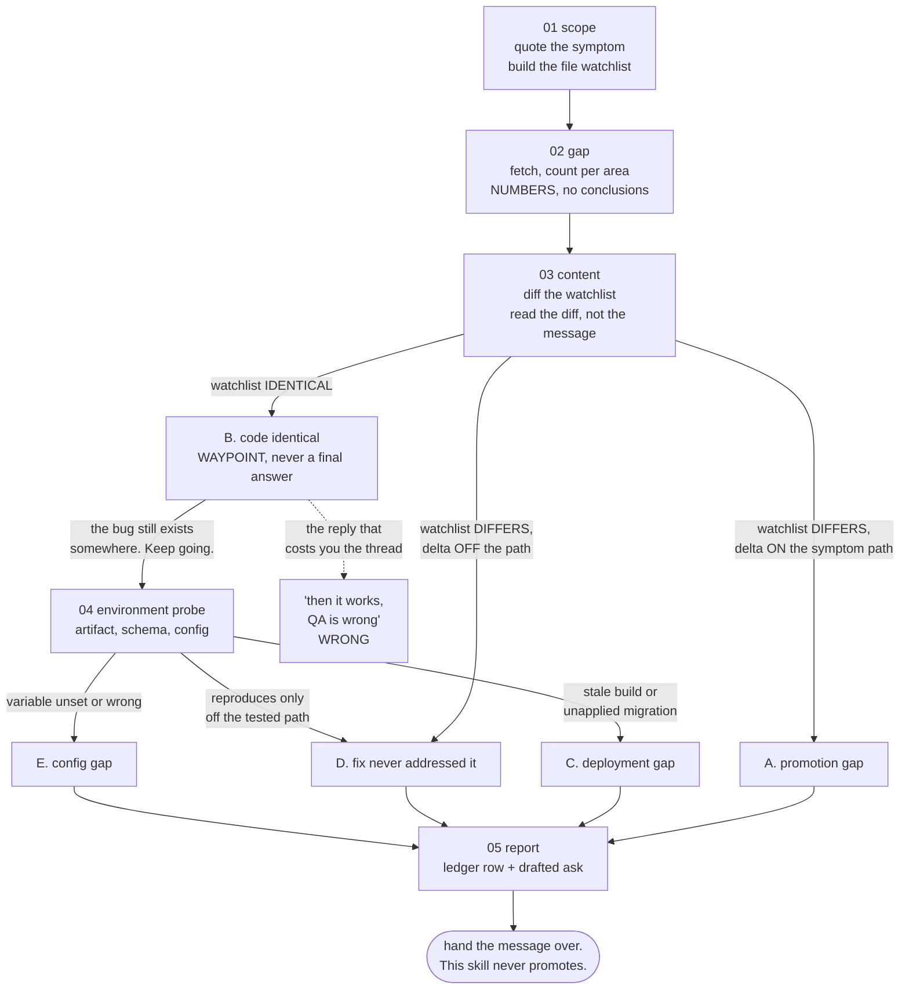

# "Your fix is still broken on staging"

**What this page shows:** the highest-friction scenario in this whole workflow. You shipped a
fix. QA says it is still broken on the staging environment. Everybody in the thread is a
little bit annoyed. This page walks the audit that ends the argument with evidence instead of
opinion.

The product is a fictional invoicing app called **Ledgerly**.

---

## The message, and the two wrong reactions

Monday, 09:40. The QA engineer posts a screenshot of the staging environment with the same
error string you fixed nine days ago:

```
"Could not load invoices. Please try again."
```

Two reactions arrive before you finish reading it.

**Argue.** You merged it. You watched the tests go green. The reflex is to reply "that was fixed
last week, please retest", and about a third of the time you will be right, which is what makes
the habit expensive. The other two thirds you spend the reporter's trust to buy nothing.

**Re-fix.** Open the file, find something adjacent that looks suspicious, change it, ship it.
Worse. You now have two changes on a symptom whose cause you never established, and the second
is unverified.

Both act before anything is proven. The third option is
[`../starter/.claude/skills/promotion-audit/`](../starter/.claude/skills/promotion-audit/). It
is **read only**. It never merges, pushes, or promotes. It produces evidence and a message
someone else acts on. That constraint is what makes it usable in a tense thread: it cannot make
the situation worse.

---

## The five verdicts

Every run ends in exactly one.

| Verdict | Meaning |
| --- | --- |
| **A** | Genuine promotion gap. The fix is on the source branch, absent from the target, and its diff touches the symptom's path. |
| **B** | Already promoted. The relevant files are identical on both branches. |
| **C** | Deployment or migration gap. The code is right on the branch, the running environment does not reflect it. |
| **D** | The fix never addressed the symptom. The change is present, and it is off the failing path. |
| **E** | Environment configuration gap. Code correct, schema current, a required variable unset or wrong. |



**Verdict B is a waypoint, never a final answer.** If the code is identical, the bug still
exists somewhere. That single rule is what this page is really about.

---

## Step 01: scope the symptom and the code path

The output of this step is two concrete things: the exact failing behaviour, and the code path
that produces it. Everything downstream compares against these.

**Quote the string exactly.** Exact strings are searchable. Paraphrases are not.

```
Symptom:      "Could not load invoices. Please try again."
Environment:  staging
Observed:     2026-08-24 09:12 local time (UTC+7) -> 2026-08-24 02:12 UTC
```

That timestamp is not decoration. "They tested before the promotion landed" is a complete, cheap
explanation, and it ends a surprising number of runs before step 02 finishes.

**Locate the code path on every side.** One side decides what it sends, the other decides
whether to accept. Do not assume from the symptom's appearance which one owns it. The string
lives in the client:

```bash
grep -rn "Could not load invoices" src/
```

```
src/features/invoices/InvoiceList.tsx:64:  setError('Could not load invoices. Please try again.');
```

Read the surrounding lines. The client renders that string when `GET /api/invoices` returns
anything other than 2xx. So the failing path spans both sides, and the watchlist has to too.

**Build the watchlist.** The candidate commit's file list is not sufficient on its own. The
real decision logic often lives in a helper the change never touched. Add files by behaviour,
not by authorship:

```
src/features/invoices/InvoiceList.tsx      client render + error branch
src/services/api/apiClient.ts              shared client, interceptors
src/api/invoices.py                        the route
src/services/invoices.py                   the query
src/security.py                            the authorization decorator
```

**Name the candidate fix, without asserting it yet.** You believe `a91f0c2` fixed this. At
this stage it is only a candidate. That claim needs the diff, which is step 03.

---

## Step 02: measure the gap, in numbers only

Fetch first. Non-negotiable. A stale reference makes every later answer confidently wrong.

```bash
git fetch origin --prune --quiet
git rev-list --left-right --count origin/stag...origin/main
```

```
31	4
```

A repository-wide count in a monorepo tells you almost nothing. Scope it to the directories
the symptom lives in:

```bash
git rev-list --left-right --count origin/stag...origin/main -- src/api src/services
```

```
2	0
```

```bash
git rev-list --left-right --count origin/stag...origin/main -- src/features/invoices
```

```
0	0
```

So `stag` is 31 commits behind overall, and **zero behind in the client area where the symptom
renders**. Say the other number out loud before anyone panics: `stag` is 4 ahead, and all four
are merge commits. Merge-only ahead counts are normal. An unexplained "4 commits ahead" invites
a wrong panic, so name which kind it is.

Then the timeline check:

```bash
git log -1 --format='%h %ci %s' origin/stag
```

```
7b21e4a 2026-08-19 11:02:33 +0700 Merge branch 'main' into 'stag'
```

The promotion landed five days before QA tested. That kills the cheapest explanation.

**No verdict yet.** A behind-count is not a verdict. A branch can be many commits behind in the
symptom's own area and still contain every line that matters. The pull to message the deployment
owner right here is strong. Step 03 is what earns the verdict.

---

## Step 03: prove it by content, and reach verdict B

Diff each watchlist file between the two branches.

```bash
for f in src/features/invoices/InvoiceList.tsx src/services/api/apiClient.ts \
         src/api/invoices.py src/services/invoices.py src/security.py; do
  echo -n "$f: "
  git diff --quiet origin/stag origin/main -- "$f" && echo IDENTICAL || echo DIFFERS
done
```

```
src/features/invoices/InvoiceList.tsx: IDENTICAL
src/services/api/apiClient.ts: IDENTICAL
src/api/invoices.py: IDENTICAL
src/services/invoices.py: IDENTICAL
src/security.py: DIFFERS
```

Four of five identical. One differs, so read that diff:

```bash
git diff origin/stag origin/main -- src/security.py
```

```diff
-def admin_required(fn):
-    """Reject non-admin callers."""
+def admin_required(fn):
+    """Reject non-admin callers.
+
+    Covered by tests/test_security.py::test_admin_required_rejects_viewer,
+    which exercises the invoice list flow end to end.
+    """
```

The commit that carried this reads:

```
b40f9e1 fix(security): correct admin gate on the invoice list flow
```

The message describes exactly the failing flow. **A commit message is not evidence.** The diff
is a docstring change. It touches no behaviour. The sentence describes the commit's test
coverage, not its behaviour change.

This is the trap the skill exists to prevent, and it is written into the skill because a
previous run had already sent the wrong commit to the deployment owner.

So: identical across the whole symptom path, with one off-path documentation delta.
**Verdict B.**

### The naive conclusion, and why it is wrong

The tempting reply writes itself:

> The code on stag is identical to main across the whole invoice list path. There is nothing
> to promote. Please retest.

That reply is wrong in a way that costs you the thread. **QA saw the error. The screenshot is an
observation.** If the code is identical, the promotion gap cannot explain the bug. That is a
strong finding and it narrows the search enormously. It does not mean the bug is imaginary.

Verdict B means keep going. The skill routes it to step 04 and does not let you close.

---

## Step 04: probe the environment

Every probe here is read only. Never send a state-changing request to a shared environment to
prove a point. Authenticating is the only common exception.

The honesty rule is blunt: **probe what the wire shows you. Never state an artifact version, a
deployed variable, or a database column as fact unless you observed it.** "I could not check X"
is a finding. A guess presented as a check is a defect.

**First, reproduce on the wire.** Judge by the body and the content type, not the status code,
because an unknown path on a host serving a client app often returns the application shell with
a 200:

```bash
curl -s -o /dev/null -w '%{http_code} %{content_type}\n' \
  https://<staging-host>/api/invoices
```

```
401 application/json
```

Not 404, and not HTML. So the route exists on the deployed build and is guarded. A structured
not-found on a route the branch has would have been direct evidence of a stale artifact. This
is not that.

**Fingerprint the built artifact.** Most build tools emit content-hashed filenames:

```bash
curl -s https://<staging-host>/ | grep -o 'assets/index-[a-z0-9]*\.js'
curl -s https://<dev-host>/     | grep -o 'assets/index-[a-z0-9]*\.js'
```

```
assets/index-9c1f4a02.js
assets/index-9c1f4a02.js
```

Identical hashes. The two environments run the same client build. Since the client files were
identical on both branches, that is consistent rather than suspicious. Identical hashes while
the branches differed would have been verdict C on its own: a promotion that never redeployed.

**Then the configuration checks.** Three columns per candidate, and be strict about the third:

| Variable | Symptom when it is wrong | How to see it from outside |
| --- | --- | --- |
| cross-origin allowed origins | the browser blocks the call, reads as "the API is down" | inspect the response headers on a real request |
| the client's API base URL | the client talks to the wrong system, no trace in version control | read the target out of the built bundle |
| the auth provider's signing key | every token is rejected, reads as "the feature is broken" | 401 on a valid token |

The base URL is the highest-value case, because it is **baked in at build time and leaves no
trace in version control at all**. No code diff will ever show it.

```bash
curl -s https://<staging-host>/assets/index-9c1f4a02.js | grep -o 'https://[a-z0-9.-]*/api' | sort -u
```

```
https://<dev-api-host>/api
```

The client bundle deployed to staging points at the **development** API host. The build was
produced with the development value of the base URL variable and promoted as an artifact.

Now the headers, which is what actually produces the error string:

```bash
curl -s -D - -o /dev/null -H 'Origin: https://<staging-host>' \
  https://<dev-api-host>/api/invoices
```

```
HTTP/2 401
access-control-allow-origin: https://<dev-host>
```

The dev API's cross-origin allowlist does not contain the staging host. The browser blocks the
response, the client sees a failed request, and it renders "Could not load invoices. Please try
again." That is the symptom, produced without a single wrong line of code.

**Verdict E.** Environment configuration gap.

Note what is honest here and what is not. The bundle target and the cross-origin header were
both **observed**. The build-time variable's value in the deployment pipeline was not, because
you cannot see the pipeline's variable store from outside. That goes into the message as a
question, never as a diagnosis.

---

## Step 05: the ledger row and the ask

One row appended to `.claude/specs/promotion-audit-ledger.md`:

| Date | Symptom | Area audited | Behind (per hop) | Verdict | Evidence | Asked of the owner | Outcome |
| --- | --- | --- | --- | --- | --- | --- | --- |
| 2026-08-24 | "Could not load invoices" on staging | invoices client + api | main→stag: 31 overall, 0 in the client area | E | staging bundle resolves to the dev API host; that host's allowlist omits the staging origin | confirm the base URL variable for the staging build | *open* |

The outcome column stays open until they reply, and that column is what makes the ledger
compound. Two verdict-E rows on the same variable is a case for a build-time assertion. Three
verdict-C rows is a case for putting a migration step in the pipeline.

### The drafted message

Register matters as much as content. Questioning, not instructing, because they own the deploy
surface and can correct your reading of it. Refer to the work, not to people: cite hashes, not
authors. Short, because long messages get skimmed and the line that matters gets skipped.

> **To whoever owns deployment**
>
> Quick one about the invoice list on staging. QA reported it failing this morning, and I do
> not think this one is a promotion.
>
> I checked the code first. Every file on that path is byte identical between `main` and
> `stag`: the list component, the shared HTTP client, the route, the query, and the auth
> decorator. `stag` is 31 commits behind `main` overall, but zero behind in the invoice area,
> and the 4 commits it is ahead are all merge commits, so nothing unusual there. Promoting
> would be fine to do, and it would not change this behaviour.
>
> What I can see from outside is that the client bundle serving staging resolves to the
> **development** API host. The bundle hash on staging and dev is the same
> (`index-9c1f4a02.js`), and grepping the deployed bundle for its API target returns the dev
> host. That host's cross-origin allowlist answers `access-control-allow-origin:
> https://<dev-host>`, which does not include the staging origin, so the browser blocks the
> response and the client shows its generic load error.
>
> Could you check what the API base URL variable is set to for the staging build job? That
> value is baked in at build time, so it does not show up in any diff, and it would need a
> rebuild rather than a re-promote to change.
>
> I have not touched anything. Happy to be wrong about this if the pipeline reads differently
> from your side.

Three properties of that draft are deliberate:

1. It names **the exact thing to verify**, not "please check staging".
2. It separates what was **observed** from what is being **asked**.
3. It says the promotion is not the fix, without claiming the promotion is worthless. Those two
   get conflated constantly, and conflating them is what sends somebody on a merge that changes
   nothing.

**The audit changes nothing itself.** Ending here, with the message drafted and unsent, is the
correct terminal state. Somebody else acts on it.

---

## When a previous message named the wrong cause

Sometimes you have already sent a message and the audit disproves it. That happened in the run
this skill was written from: a commit was named as the fix because its message described the
failing flow, and the diff turned out to be a docstring.

Lead the follow-up with the correction, briefly, without over-apologising.

> Correction on my earlier message: `b40f9e1` is not the relevant change. I read its diff
> rather than its subject, and it only edits a docstring. The gate it describes is identical
> on both branches. The real finding is below.

A correction now is cheaper than a merge that changes nothing.

---

## The other honest outcome: verdict A

Sometimes your fix really was incomplete, and the audit says so.

Verdict A is the plain one: the fix is on `main`, absent from `stag`, and its diff touches the
symptom's path. A real promotion gap, and the ask is a one-line "please promote `a91f0c2`".

Verdict D is the sharper one: the change is present on both branches and its delta sits off the
failing path. You fixed something. It was not this. The skill tells you to **say this plainly
even if a promotion ask was already sent**.

Neither is a failure of the process. The process succeeded in all five cases, because what it
produces is a true answer with evidence attached. An audit concluding "my fix was incomplete"
cost 25 minutes and saved a second round of QA finding the same thing. What the process protects
against is not being wrong. It is being wrong **loudly, to the person who owns the deploy
surface**, which is the version that costs a merge cycle plus trust.

---

## The failure modes, named

The skill lists these as explicit failure conditions for a run:

- Naming a commit from its message instead of its diff.
- Reading "behind" as "missing".
- Closing on verdict B without probing further.
- Stating an unobserved deployment fact as a check.
- Merging or promoting from this skill.

The middle one is worth repeating on its own. **"The branch is behind" is not the same as
"the fix is missing".** In this run, `stag` was 31 commits behind and contained every line
that mattered.

---

## See also

- [`02-bug-from-qa.md`](02-bug-from-qa.md) for the triage front door, whose step 02 catches
  the "already fixed, not yet promoted" case before it ever reaches an audit.
- [`../starter/.claude/commands/README.md`](../starter/.claude/commands/README.md) for why the
  merge-request driver is worth writing for your own forge, and how making each promotion hop
  explicit prevents this scenario in the first place.
- [`../docs/05-local-ci-enforcement.md`](../docs/05-local-ci-enforcement.md) for the gates that
  catch the code half of this before it ships.
