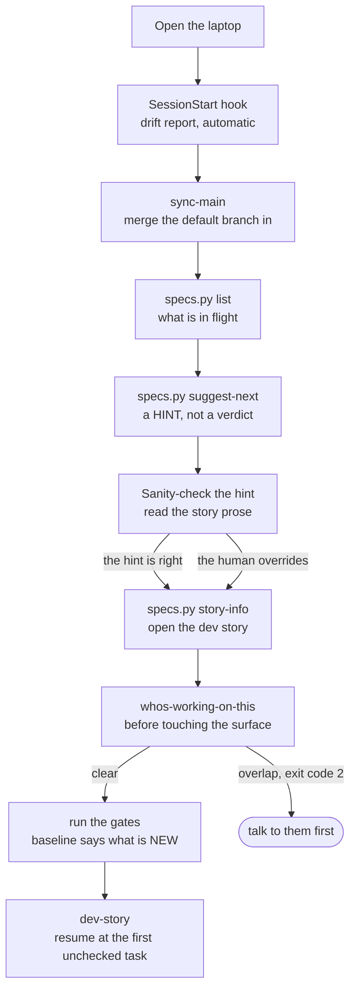

# Monday morning

**What this page shows:** the boring one. No incident, no new feature, no argument in the QA
thread. Work is already in flight and you need to pick it back up. This is the case the whole
workflow was built for, and it is the case people skip when they demo it.

The product is a fictional invoicing app called **Ledgerly**.

---

## The state you actually wake up in

Two versions of the same morning.

**After a normal weekend.** You remember roughly what you were doing. Export templates,
something about the worker queue that annoyed you on Friday. You do not remember which of the
six tasks you finished, or whether the test you were writing at 17:40 ever went green.

**After two weeks off.** You remember the project name.

The second case is the honest test. Everything below costs about ten minutes, and it costs the
same ten minutes in both cases. That is the whole argument: you cannot tell on Monday morning
which Monday morning this is.



---

## 1. The drift hook reports before you ask

[`../starter/.claude/hooks/`](../starter/.claude/hooks/) wires `check-drift.mjs` to
**SessionStart**. You do not run it. It runs, fetches, and reports:

```
[drift] feat/export-templates is 9 commits behind origin/main (3 ahead).

Incoming commits:
  a91f0c2 fix(invoices): drop soft-deleted rows from the list query
  4e77b1d chore: bump the date library
  2c0a8e9 feat(export): wire the PDF worker queue
  91b3d40 refactor(api): extract the pagination helper
  d0a7712 test(export): add worker retry coverage

Touched areas (14 files): src/api, src/services, src/workers, tests

This is a report, not a merge. Run /sync-main when you want to catch up.
```

Two things earn this hook its place. The **fetch** is the point: without it the tracking ref is
stale and the behind-count reads 0 while the default branch has moved on. And it **never
merges**. A session-start hook that changes your working tree is a hook you will disable.

`2c0a8e9` touches `src/workers`, which is where your in-flight story lives. Worth knowing before
you write a line.

The hook is silent when there is nothing to say. Up to date means no output at all, which is the
correct amount.

---

## 2. `sync-main`, and what it checks that you would not

[`../starter/.claude/commands/sync-main.md`](../starter/.claude/commands/sync-main.md) merges.
It never rebases, because the feature branch is pushed and rewriting its history breaks anyone
who pulled it.

```
/sync-main
```

It refuses to start on a dirty tree and does not stash for you, because you may have in-flight
work you have not looked at. Assume Friday-you committed. It fetches all branches, not just the
default one, since a narrow fetch leaves every teammate branch stale and silently breaks the
overlap check later in the morning.

Then it predicts conflicts with a dry-run merge before starting one, merges, and runs the checks
that matter after a merge:

```
Merged origin/main into feat/export-templates (9 commits).

  Migrations from both sides:  yes
    origin/main  2026-08-22_add_export_jobs_table.sql
    your branch  2026-08-21_add_export_template_column.sql
    Same table?  no. export_jobs vs export_templates. No manual ordering needed.

  Duplicated config still matches: yes (worker routing table, 2 copies)
  Import check: pass
  Scoped tests for merged files: 34 passed
```

The migration line is the one that would not occur to you. **Two branches each adding a
migration that touches the same table produce two files that never touch each other.** Version
control merges them without a murmur, and they collide at apply time on the environment. No
conflict marker warns you. The command asks the question on every run involving a migration.

The duplicated-config check is the same shape: if a project deliberately keeps a config table in
two places, a merge can leave the copies disagreeing with no conflict anywhere.

**A merge that succeeds textually can still break things.** Two branches can each be valid while
their union is not.

---

## 3. What is in flight

The spec helper answers this without loading a single spec file into context. Its subcommands
are documented in
[`../starter/.claude/scripts/specs/README.md`](../starter/.claude/scripts/specs/README.md).

```bash
python3 .claude/scripts/specs/specs.py list
```

```
* epic-01-invoicing  -  Invoicing core  [done]
    * story-01-create  -  Create an invoice  [done]
    * story-02-list  -  List and filter invoices  [done]
~ epic-02-export  -  Export and delivery  [in_progress]
    * story-01-pdf-render  -  Render an invoice to PDF  [done]
    ~ story-02-templates  -  Per-org export templates  [in_progress]
    o story-03-scheduling  -  Scheduled exports  [planned]
    o story-04-delivery  -  Email delivery  [planned]
o epic-03-billing  -  Billing  [planned]
```

Status marks: `o` planned, `~` in_progress, `x` blocked, `*` done. Those four values are the
whole vocabulary. Story 2.2 is where you stopped.

---

## 4. `suggest-next` gives you a hint, and you check it

```bash
python3 .claude/scripts/specs/specs.py suggest-next 2.2
```

```
Suggested next story: 2.3 - Scheduled exports [planned]
  note: this is a regex scan over freeform markdown, not a dependency graph. Verify before you act on it.
  ready: every explicit prerequisite it names is done.
  Check the story prose for an ordering rule this scan cannot see.
  plan: /proj/.claude/specs/plan_artifacts/epic-02-export/story-03-scheduling.md
  dev story: (not yet created)
```

Read the caveat line, because the tool prints it on purpose. `suggest-next`, `deps`,
`feed-forward`, `lessons`, and `stale-refs` are **regular expressions run over freeform
markdown a human wrote**. They are not a dependency graph and they are not a parser. A phrasing
outside the recognized keywords defeats them with no error at all.

**Every verdict they give is a hint to verify, never ground truth.**

So verify it. Open the prose of the story it suggested:

```bash
python3 .claude/scripts/specs/specs.py show epic-02-export story-03-scheduling
```

```
# Scheduled exports

Lets an org schedule a recurring export. Reuses the per-org template
selection introduced earlier in this epic, so the template resolver must
be settled before the scheduler can pick one.
...
```

There it is. "The template resolver must be settled" is a real prerequisite, and that is story
2.2, which is `in_progress`, not `done`. The scan missed it because the prose says "must be
settled before" rather than naming 2.2 with a keyword the matcher knows.

**The human overrides the tool, and the tool told you to.** You are not switching to 2.3. You
are finishing 2.2.

That is the correct relationship with every heuristic in the helper. The scan is fast and
sometimes wrong, so it is a prompt to look rather than an answer. A tool claiming certainty here
would be worse than one admitting it is a regex, because you would stop reading.

---

## 5. Picking up the half-finished story

```bash
python3 .claude/scripts/specs/specs.py story-info 2.2
```

```
Story 2.2: Per-org export templates  [in_progress]
  epic:        epic-02-export - Export and delivery
  plan source: /proj/.claude/specs/plan_artifacts/epic-02-export/story-02-templates.md
  dev story:   /proj/.claude/specs/implementation_artifacts/epic-02-export/story-02-templates.md  (EXISTS)
  previous:    2.1 [done] dev=/proj/.claude/specs/implementation_artifacts/epic-02-export/story-01-pdf-render.md
```

The dev story is your primary context. It was written to be self-sufficient, so
[`../starter/.claude/skills/dev-story/`](../starter/.claude/skills/dev-story/) reads it fully
and reads other things only when it tells you to.

Three sections carry Monday morning:

**The task list, with checkboxes that mean something.**

```
- [x] Add the org_template_id column and its migration
- [x] Template resolver service, with the fallback to the org default
- [x] Wire the resolver into the PDF render path
- [ ] Reject a template belonging to another org  <- resume here
- [ ] Surface the selected template name on the export detail screen
- [ ] Update the generated API contract
```

A task is checked only when its tests exist and pass. The skill is explicit: never mark a task
done unless its tests pass, never claim done falsely. That rule is what makes the checkbox
trustworthy on a Monday. Without it the list is a mood.

**The dev agent record**, where Friday-you left the parts that are not in the code:

```
## Dev agent record

- The resolver runs inside the worker, not the request. The worker caches
  its task code, so a change here is not live until the worker restarts.
  Cost me 25 minutes on Friday.
- `org_default_template_id` is nullable on purpose: orgs created before the
  migration have none, and the resolver falls back to the built-in template.
```

**The guardrails**, sourced from the PRD's locked decisions, which are requirements even when
no acceptance criterion restates them:

```
## Guardrails
- Authorization is enforced server-side on the route. A client-side check
  is user experience, not a control.
- A model change ships WITH its migration file, in the same commit.
```

You have re-entered the story without re-deriving anything. No re-reading the PRD, no
reconstructing why the column is nullable, no rediscovering the worker restart. Three minutes.

### The code context you lost, bought back in one query

The dev story names the files — `src/security.py`, `src/services/templates.py` — but not
their neighborhood: who calls the resolver, what else the authorization check guards,
which test fixtures already construct an org. That is Monday's real context bill, and
re-reading files to rebuild it is the expensive way to pay it. If the repo has a
knowledge graph, the neighborhood is one bounded traversal:

```bash
graphify query "template resolver: callers, authorization checks, existing fixtures" --budget 1500
```

Nodes with source locations, the boundary crossings named, nothing more loaded than
the question needed ([`docs/09-graphify.md`](../docs/09-graphify.md)). Two honest
caveats: the graph must be fresh — an incremental update hook or the loop's
epic-boundary re-cluster keeps it honest — and on a repo small enough to hold in your
head, skip the ceremony and open the files.

---

## 6. Check the surface before you touch it

The next task is the authorization rejection, which lives in `src/security.py` and
`src/services/templates.py`. Before editing either, run
[`../starter/.claude/commands/whos-working-on-this.md`](../starter/.claude/commands/whos-working-on-this.md).

Run it **before picking up a task, not at session start**. The remote is the only board that
reflects reality, because teammates push a branch when they **start**. A merged-only view of the
default branch reports the collision after it has cost two people the same day.

Use the file mode once you know the files. It is sharper than keywords:

```
/whos-working-on-this --files src/security.py src/services/templates.py
```

```
Clear. No pushed branch touches those files.  (exit code 0)
```

Exit codes are `0` clear, `2` overlap found, `1` **the scan itself failed**, which you must not
read as clear.

Two limits worth saying out loud: it only sees pushed branches, so a teammate working locally
for three days is invisible; and it is never a substitute for asking. The output is a reason to
start a conversation, not a replacement for one.

---

## 7. The gates catch what Friday's merge brought in

Before writing anything, run the gate runner. The manual is
[`../gates/README.md`](../gates/README.md).

```bash
node gates/run-gates.mjs
```

```
  Running gates
  config /proj/gates.config.json

  PASS  client/tsc type-check 3.1s
  FAIL  server/pytest unit tests 6.4s
        1 NEW failure(s), not in the baseline:
          + tests/test_pagination.py::test_page_size_clamps_at_100
        4 known failure(s) in the baseline, ignored

  1 PASS  1 FAIL

  1 new failure(s) across 1 gate(s). Fix them before committing.
  Do not add them to the baseline to get past this.
```

Read what that report is telling you. Four failures are **known debt**, recorded in the
baseline, counted and left alone. One is **new**, and it is named. It is not yours: you have
written no code this morning. It arrived in `91b3d40`, the pagination helper refactor a teammate
merged on Friday, which `sync-main` pulled in twenty minutes ago.

**This is what the baseline buys.** Without it, this run is five red tests in a wall of output,
you cannot tell which one you caused, and by the third morning you turn the gate off. With it,
the thing that broke does not hide inside forty lines of old debt.

The right move is a message to whoever merged `91b3d40`, or a fix if it is a one-liner and you
have the context. The wrong move is adding it to the baseline. The policy is one sentence:

> The baseline may shrink freely. It must never grow to get past a red gate without an explicit
> human decision.

The runner helps hold that line. `--update-baseline` prints how the baseline changed and says
so loudly when it grew, and baselines are sorted plain text so growth shows up as added lines
in a diff where a reviewer can see it.

Two flags worth knowing on a Monday:

```bash
node gates/run-gates.mjs --show-known          # list the debt, not just the count
node gates/run-gates.mjs --only-changed        # skip projects whose paths were not touched
```

---

## 8. Resume

```
/dev-story
```

The skill loads the dev story, confirms the status is already `in_progress`, and starts at the
first unchecked task. Tests first, then the code, then the checkbox. It runs to completion
rather than stopping at "good progress", and it pauses only on a HALT trigger: a new dependency
the story does not specify, three consecutive failures on the same task, missing configuration,
or a conflict between the story and the PRD.

Total elapsed before the first line of real work: about ten minutes.

---

## The honest friction

**On the Monday where you already remember, this is ceremony.** You knew you were on 2.2. You
knew the next task was the authorization check. Ten minutes of orientation to learn what you
already knew reads as pure overhead, and the pull to skip to the editor is strong and
reasonable.

Three responses, and only the third is really convincing.

It is not ten minutes of your attention. The hook runs itself, `sync-main` and the gates run
while you get coffee, and the helper output is three commands. The part needing you is the
sanity check on `suggest-next` and the read of the dev agent record, maybe four minutes.

Two of the seven steps found something this morning you did not know: a teammate's migration on
a nearby table, and a new test failure you did not cause. Neither was predictable from your
memory of Friday.

And the actual argument: **you cannot tell in advance which Monday this is.** The value is
concentrated in the mornings where your memory is gone, and those do not announce themselves.
The two-weeks-off Monday feels identical to a normal one for the first thirty seconds. A routine
you run only when you feel you need it is missing exactly when it would have paid.

**The part that genuinely decays is the dev agent record.** If Friday-you wrote nothing in it,
Monday-you gets a task list and no context, and the routine returns much less. That is not a
flaw in the tooling. It is a habit the tooling depends on, and it is the real price.

---

## See also

- [`../docs/04-compound-engineering.md`](../docs/04-compound-engineering.md) for the two loops
  that make the dev agent record worth writing.
- [`../docs/05-local-ci-enforcement.md`](../docs/05-local-ci-enforcement.md) for the baseline
  pattern and the gate ladder.
- [`../starter/.claude/scripts/specs/README.md`](../starter/.claude/scripts/specs/README.md)
  for every helper subcommand and which of them are heuristics.
- [`06-a-real-week.md`](06-a-real-week.md) for what happens when Monday's plan does not
  survive Wednesday.
