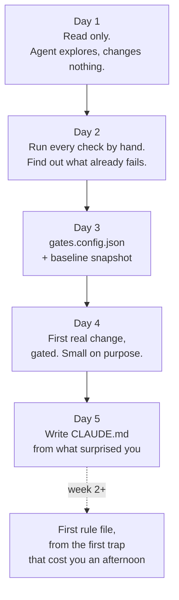

# Scenario 05: Joining an unfamiliar repo

**What this page answers:** you started on Monday. The repo is six years old, nobody has time to
onboard you, and the last person who understood the payments module left in March. What do you
do with an agent in week one?

The short version: **read first, then gates, then write down what surprised you.** Do not install
a workflow into a codebase you cannot yet describe.

---

## The week



---

## Day one: do not install the workflow

The temptation on day one is to copy `starter/.claude/` in and start being productive. Resist it
for a week. Two reasons, and the second is the one that matters.

**You cannot fill the placeholders yet.** The `CLAUDE.md` template has a fill-in table with
around forty entries: the test command, the composition root, when CI actually runs, how
migrations get applied and by whom. Guessing them is worse than leaving them blank, because a
filled-in wrong value reads as verified fact to both you and the agent.

**A new person reorganizing a codebase in week one is a social problem, not a technical one.**
More on that below.

So day one, the agent is a reading tool. It changes nothing.

### What good exploration prompts look like

"Explain this codebase to me" produces a plausible essay you cannot check. Better prompts ask
about structure and return answers that point at a file you can open yourself:

> Find the composition root. Which file assembles the application and registers its route
> modules? Show me the registration list and how many entries it has.

> List every place this repo talks to the database. Do they all go through one layer, or do
> route handlers query directly? Three examples of each if both exist.

> What runs in CI, and on what trigger? Read the CI configuration and tell me whether a plain
> push to a branch runs anything at all.

> Find every configuration value read from the environment. Which ones have no default and will
> crash on startup if unset?

Week one you have no way to catch the agent being confidently wrong, so every question has to be
one you can verify in under a minute.

**One prompt to run on day one and never skip:**

> Find every test that is skipped, marked expected-to-fail, or commented out. Show me the file,
> the test name, and any comment explaining why.

That list is the repo's confession. It tells you what people gave up on, and it is usually the
fastest map of where the pain lives.

---

## Day two and three: gates, and what your baseline tells you

The first useful thing you add is not a spec pipeline. It is
[`gates`](../gates/README.md), and it earns its place on day three because it changes no
application code and immediately tells you what "broken" already means here.

### Run everything by hand first

Before writing a config, run each check yourself: `npm run lint`, `npm run type-check`,
`npm test`. You are not looking for green. You are looking for what each command does when it is
unhappy, because that is what the parser has to read. Note the exit codes too. A test runner
exiting 1 on failures ran normally, and the config has to say so with `allowedExitCodes`.

### Write the config, snapshot, commit

```bash
cp -r path/to/gates your-repo/gates
cd your-repo
cp gates/gates.config.example.json gates.config.json
$EDITOR gates.config.json          # delete the stacks you do not have

node gates/run-gates.mjs --help

# The tree must be clean. Commit or stash first.
node gates/run-gates.mjs --update-baseline

git add .gates/baselines && git commit -m "chore: record gate baselines"

# From now on, before every commit.
node gates/run-gates.mjs
```

Each gate names a `run` command and a `parser` that turns its output into stable failure keys.
The parsers that ship cover pytest, vitest, tsc, eslint, go test, and JUnit XML, with
`exit-code` as the fallback for anything with no machine-readable output. Full key reference:
[`gates/README.md`](../gates/README.md).

The snapshot refuses to run on a dirty working tree, and that refusal is doing you a favour. A
baseline taken over uncommitted work records failures no commit explains, and the next person
cannot tell your work in progress from real debt.

### The baseline is a map of the debt

This is the part nobody tells new joiners. The number that comes out of that first snapshot is
the most honest document in the repository.

**A small baseline, under twenty entries.** The team keeps things green. Your gate is a genuine
safety net from day one, and a red run means you broke something.

**A large baseline, hundreds of entries.** Nobody has run the full suite in a long time. Do not
treat this as a crisis and do not announce it as one in your first week. Treat it as the map it
is: the failures cluster, and the clusters name the modules the team stopped maintaining. Read
the baseline file, group the keys by directory, and you have a ranked list of where the risk
lives, derived from evidence rather than from gossip.

**A test suite red for a year** means something specific and worth naming to yourself early: the
suite is not part of anyone's feedback loop. Nobody has been told "you broke this" in twelve
months. So every convention you were told about in your onboarding chat is unenforced, and some
of them are no longer true. Trust the baseline over the chat.

**A gate that reports SKIP.** A missing toolchain reports `SKIP` and does not change the exit
code. The summary says a skip is not a pass, which is the line to read carefully. Three SKIPs
means three stacks you have not actually checked, and on day three that is fine as long as you
know it.

### The one policy to say out loud, once

The baseline may shrink freely. **The baseline must never grow to get past a red gate** without a
human deciding, in writing, that the failure is acceptable debt. Baselines are sorted plain text,
one key per line, precisely so a grown baseline shows up as added lines in a diff where a
reviewer can see it.

As the new person, you will be the first one tempted to grow it. Do not.

---

## Day four: the first real change

Pick something small and boring on purpose. A one-field validation, a wrong error message, a
missing null check. You are not proving you can ship. You are testing the loop:

1. Make the change.
2. `node gates/run-gates.mjs`
3. Read what it says.

The first run is where you find out whether your parsers are right. A key that shifts when
somebody adds a line at the top of a file will invent new failures out of unrelated edits, and a
gate that does that gets turned off within a week. If you see a failure you did not cause, fix
the parser before you go any further, because everything after this depends on the gate being
believable.

---

## Day five: write the first `CLAUDE.md`

Now, not before. And write it from what surprised you this week, not from the template's
placeholder list read top to bottom.

The template at [`starter/.claude/CLAUDE.md`](../starter/.claude/CLAUDE.md) is worth using for
its structure and its fill-in table. The content that makes it earn its context budget is the
part only you know now:

```markdown
npm test                    # full suite. About 4 minutes.
npm test -- <path>          # ONE file. The default while working.
npm run type-check          # tsc --noEmit. Excludes test files. See the trap below.
npm run lint                # eslint, max-warnings 0

# There is NO formatter configured. Do not add one. Match the file you are in.
```

That last line is the kind of fact that only appears in a real `CLAUDE.md`. The template says to
state honestly which commands do not exist, because an agent that invents a gate reports a green
run of a command nobody configured.

More week-one facts worth recording, drawn from what actually bit you:

- **When CI actually runs.** If it runs only on pull requests, a plain push runs nothing, and
  your local gate is the first signal anyone gets. This is load-bearing and it is frequently
  wrong in people's heads.
- **How migrations are applied, and by whom.** Hand-applied SQL and an automated migration step
  are different worlds, and the difference decides whether "merged" implies "the schema moved".
- **Where the composition root is**, and the warning that a module nothing registers does not
  exist while every other gate still passes.
- **Any configuration duplicated in two files.** If a routing table or a queue map lives in two
  places, name both, and say they must stay identical. This is the single highest-value line in
  most `CLAUDE.md` files, because nothing else will ever tell you.
- **The gitignore trap, if the repo has one.** If the repository ignores a file type by default
  and re-includes a documentation subtree, write the exact rule and its line number. This costs
  someone an hour the first time, every time, because the file simply does not appear in
  `git status` and nothing explains why.

Keep it under about 200 lines. It loads every turn, and a longer file consumes context and
reduces adherence to everything in it, including itself. When a topic outgrows a few lines,
extract it into a scoped rule file that loads on demand.

---

## Week two: the first rule file

Do not write rule files in advance. Write the first one when a trap has actually cost you an
afternoon, and write it about that trap.

A real shape, from the kind of thing that happens in an old repo:

> **Trap.** The report service and the export worker each hold their own copy of the
> queue-routing table. They are not imported from one place. A queue added to one and not the
> other produces a task that is accepted, never routed, and never runs. Nothing fails. The row
> just never appears.

That is a rule file worth having, because nothing in the codebase says it and no test catches it.

Then apply the preference from
[`docs/04-compound-engineering.md`](../docs/04-compound-engineering.md): **prefer rule to
guard.** A written rule is a static claim about a moving codebase. Six months from now it will
describe a structure that no longer exists and nothing about the stale paragraph will look
stale. This particular trap is mechanically checkable, so the better version is four lines:

```python
def test_queue_routing_tables_match():
    from app.extensions import TASK_ROUTES as a
    from app.worker import TASK_ROUTES as b
    assert a == b
```

Then break one on purpose, watch it go red, restore. A guard you have never seen fail is not
evidence of anything.

---

## What not to do as the new person

These are social rules, and getting one wrong costs more than any technical mistake you will
make this month.

**Do not reorganize other people's code.** Every old repo has a module that is obviously wrong
and obviously fixable. It is also load-bearing in a way you cannot see yet, and it is somebody's
work. Reorganizing it in week two is how you spend your only stock of goodwill on a refactor
nobody asked for. Fix bugs in scope. Leave the shape alone until you have earned an opinion.

**Do not commit a `.claude/` directory to a shared repo without asking the team.** This is the
two-homes rule from
[`starter/.claude/rules/docs-sync.md`](../starter/.claude/rules/docs-sync.md), and the reason is
the conversation you start, not the files. Commit a conventions page and the team argues about
the content: is this layering rule right? That is a good argument and it improves the document.
Commit your agent configuration, your prompt files, your story numbering, and your baselines,
and the team argues about whether everyone is now required to use your process.

You are the new person. You do not want to be the reason that argument happens in your third
week. Keep your workflow local, git-excluded, and quiet. The split is clean:

| Stays local, git-excluded | Goes in committed team docs |
| --- | --- |
| Your spec tree, story numbers, status file | The layering rule, the endpoint convention |
| Your gate baselines and how you run them | The 20-line trap that bit you, stated as a repo fact |
| Your prompts, skills, and rule files | Local dev setup, how to run the thing |
| Anything naming a `.claude/` path | Zero references to your tree. A reader without it loses nothing |

**Do not present the workflow as a mandate.** Nobody argues about whether they are allowed to
read a document. They argue about whether they have to adopt a process. Adoption stays voluntary,
which is the only way it works anyway. The
[repo README](../README.md) says it plainly and it applies hardest to a new joiner: take one
page, take one script, take the whole thing, or take nothing.

**The exception, and it is a real one.** Gates are the piece worth proposing out loud, because
they benefit everyone and they cost nobody their process. "I wrote a config that runs our
existing lint, type check, and tests in one command, and it only fails on things you just broke"
is a proposal about the repo, not about you. Offer it once, in week three, after your baseline
has caught something real. Let it be judged on that.

---

## What week one gets you

- A checkable picture of the codebase, built from answers you verified rather than an essay you
  read.
- A committed baseline that names, precisely, what was already broken before you arrived. This
  is also your alibi.
- A gate you run before every commit that fails only on breakage you introduced.
- A `CLAUDE.md` written from real surprises, which means every line in it earned its place.
- No argument with anyone about process.

The spec pipeline can wait. It is the largest commitment in the kit and it needs a `CLAUDE.md`
that is true before it produces anything worth reading. The adoption order in
[`starter/README.md`](../starter/README.md) puts gates first and the pipeline fifth for exactly
this reason.

Next: [`06-a-real-week.md`](06-a-real-week.md), which is what week six looks like once all of
this is running.
