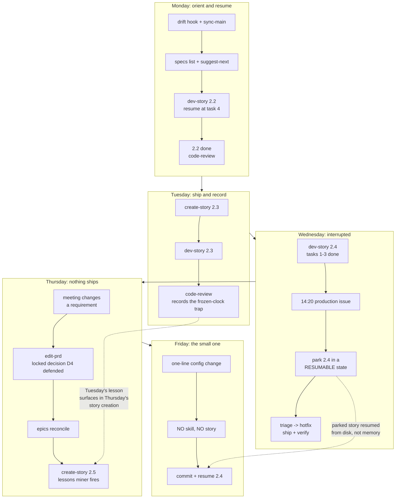

# A real week

**What this page shows:** one week, Monday to Friday, with everything interleaved the way it
actually is. Planned work interrupted by a production issue. A meeting that changes a
requirement. A day where the process is skipped entirely and that is the right call. A day
where nothing ships.

The other pages in this directory each show one scenario cleanly. Nothing in a real week is
clean, and a workflow that only survives the clean version is not worth adopting.

The product is a fictional invoicing app called **Ledgerly**.

---

## The week at a glance



---

## Monday: orient, then resume

Covered in full in [`04-monday-morning.md`](04-monday-morning.md), so briefly.

The drift hook reports nine commits behind. `/sync-main` merges them and flags that migrations
arrived from both sides on different tables, so no manual ordering is needed. `suggest-next`
proposes story 2.3, and reading 2.3's prose shows it depends on 2.2 in words the regex could not
see, so you override it and finish 2.2.

`/dev-story` resumes at the first unchecked task. Two tasks left, both already specified in the
dev story file. Story 2.2 goes to `done` by 15:00.

Then `/code-review`, where a story stops being just code. Seven steps in sequence, each allowed
to be a no-op as long as you say why:

```
01 verify reality      real request against the running system, human signs off
02 end-user docs       no user-facing change, no-op, stated
03 extract learnings   two facts into the local rules
03b mirror to team     one repo fact into the committed team docs
04 feed forward        ground truth into 2.3 and 2.4
05 demo seed           no seedable data, no-op, stated
06 improve pipeline    max ONE thing, "nothing this time" is valid
07 commit + next
```

**Skills used:** `sync-main`, `dev-story`, `code-review`.
**Skills not used:** everything else. No investigation, no PRD touch.

---

## Tuesday: the day the process looks like the brochure

Story 2.3, scheduled exports. `/create-story` expands the planning story into a dev-ready one,
and its step 02 mines the lessons corpus, which is the part that matters later this week:

```bash
python3 .claude/scripts/specs/specs.py lessons 2.3 --hazards --limit=3
```

```
Lessons from epic 2, stories before 3
  scanned 2 done stories, 2 had a record, 6 lessons, 2 flagged as hazards

[!] [2.2] The resolver runs inside the worker. The worker caches its task code,
    so a fix is not live until the worker restarts. A "the fix does not work"
    report from this surface is usually a stale worker.

[!] [2.1] The PDF renderer writes to a temp path derived from the org id. Two
    orgs exporting at the same second collided. Assert the premise, not just
    the output.
```

The command always prints its denominator on purpose. A thin result has to read as "those
stories logged little", never as "there is nothing to learn".

`/dev-story` implements it. Tests first. Nothing dramatic. Story 2.3 is `done` by 16:30.

Then `/code-review` step 03 records what actually bit you. The scheduler needed a timezone, and
the first implementation stored the org's local time, which broke on the daylight saving
boundary in a way the tests missed because every fixture used a fixed UTC clock:

```
## Dev agent record

- Scheduled times are stored as UTC plus an IANA zone id, never as a local
  wall-clock time. A wall-clock schedule silently shifts by an hour twice a
  year, and every test fixture used a fixed UTC clock, so the suite stayed
  green through the bug.
- The fixture clock is the hazard, not the timezone code. Any test that
  freezes time hides a class of scheduling bug.
```

Step 06 asks the compounding question: what did you do **by hand** that should be a script or a
guard? Maximum one. Today it is a guard test rather than a rule, because a rule decays as the
code moves and a failing test cannot:

```python
def test_no_naive_datetimes_in_schedule_models():
    """Every datetime column on a schedule model is timezone-aware."""
```

And it is mutation-verified before it is trusted. Break the model on purpose, watch the guard
go red, restore. A guard you have never seen go red is not evidence of anything.

**Skills used:** `create-story`, `dev-story`, `code-review`.

---

## Wednesday: the plan breaks at 14:20

The morning is story 2.4, email delivery. Three of six tasks done by lunch.

At 14:20 support reports that invoices emailed since roughly 11:00 arrive with the wrong org
logo. Two customers have noticed. Production.

### Parking the story properly

The instinct is to leave 2.4 in your head and deal with it. That is how a story comes back on
Thursday as forty minutes of "what was I doing". Parking it costs about four minutes:

1. Finish the current test to green, or revert the half-written one. **Never leave a task
   checked whose tests do not pass.** A false checkbox is worse than no checkbox, because
   Thursday-you trusts it.
2. Write the state into the dev agent record while it is still in your head:

```
## Dev agent record (in progress)

- Tasks 1-3 done and green. Task 4 (retry on a soft bounce) is NOT started.
- Blocker I hit at 13:50: the mail provider returns 202 for both accepted
  and queued-for-retry. The status is only in the webhook, not the response.
  So the retry decision cannot live in the request path.
- Next move: move the retry decision into the webhook handler and give the
  send path a single "handed off" state.
```

3. Leave the status alone. It is `in_progress`, which is true.

The story is now resumable from disk rather than from memory. That is the point of the parking
discipline: the interruption costs the afternoon, not the afternoon plus Thursday's first hour.

### The incident

One report, one symptom, already specific. Straight to
[`../starter/.claude/skills/triage/`](../starter/.claude/skills/triage/) anyway, because it is
cheap and its step 02 is nearly free.

Step 02 finds nothing already-solved: no relevant commit on the default branch, no teammate
branch on the mail templates, no prior report. Step 03 settles it fast. The logo URL resolves
from a cached org record, and the cache key omits the org id on one of two call sites:

```
src/mail/render.py:52   cache_key = f"logo:{template_id}"          <- the bug
src/mail/preview.py:31  cache_key = f"logo:{org_id}:{template_id}"
```

Proven cause, exact file and line, one surface, contained, expected behaviour stated. All four
certainty gates pass, so **STRAIGHTFORWARD**, and it goes to
[`../starter/.claude/skills/hotfix/`](../starter/.claude/skills/hotfix/) rather than a full
investigation.

Four steps. Prove the mechanism by running the two real functions on the two real shapes rather
than reading them. Failing test first. Mutation-verify: put the call site back to the old key,
watch the targeted test go red, restore, watch it go green. Verify on the wire both directions,
the reported case now renders the right logo **and** the cache still returns a hit on a repeat
render, because a fix that only proves the first half cannot tell "fixed it" from "disabled the
cache".

One row appended to `.claude/specs/hotfix-ledger.md`, the mechanism column written carefully,
because three rows on one file is a design problem rather than three bugs.

Shipped at 17:10. Story 2.4 stays untouched, parked, and honest.

**Skills used:** `triage`, `hotfix`.
**Skills not used:** `rca`, because the cause was proven at triage depth. `promotion-audit`,
because nothing about promotion was in question.

---

## Thursday: nothing ships, and the day still pays

10:00 meeting. The stakeholder wants scheduled exports to run **as another user**, so a finance
manager can schedule an export under a colleague's permissions while that colleague is on leave.

### `edit-prd` defends a locked decision

Reasonable on its face. It also collides with something the PRD locked in month one:

```
D4 | Authorization is always evaluated against the acting session's own
   | identity. No surface impersonates another user, and no background job
   | inherits a permission set from a user who is not the requester.
```

[`../starter/.claude/skills/edit-prd/`](../starter/.claude/skills/edit-prd/) runs review before
edit: read the affected sections, produce a change plan, wait for approval. The rule that matters
here is **never weaken, delete, or contradict a key decision without the user explicitly deciding
to**, and if they do, flag the downstream impact first.

So the change plan does not quietly implement the ask. It says what the ask costs:

> **Requested:** a scheduled export runs under a delegate's permission set.
>
> **Conflicts with:** decision D4, which forbids a background job inheriting a permission set
> from a non-requester.
>
> **Why the rule exists:** a scheduled job outlives the session that created it. A permission
> set captured at schedule time is a permission set that keeps working after the colleague
> changes role or leaves. That is the failure D4 prevents, and it is not a policy preference.
>
> **A shape that works:** the colleague grants an explicit, revocable delegation with an expiry.
> The job still evaluates authorization at run time, against the delegation, and the delegation
> is checked on every run rather than captured once.
>
> **What the requester must change:** the colleague has to grant it, so it cannot be configured
> unilaterally by the finance manager.

That is the difference between a document that records decisions and one that defends them.
Without the locked-decisions table, an agent asked to "add delegated scheduling" ships the
captured permission set, because it satisfies the request and passes every test you would think
to write.

The stakeholder accepts the delegation shape in the same meeting. Ten minutes.

**Never let a decision be made by accident** is the rule doing the work. The alternative is not
that someone argues for the weaker design. It is that nobody notices a constraint was traded
away.

### `epics` reconcile, then `create-story`

The PRD edit changes the shape of the epic. `/epics` runs in edit mode, adds story 2.5 for
delegated scheduling, and syncs the status mirror:

```bash
python3 .claude/scripts/specs/specs.py sync-status
```

```
status.yaml synced -> /proj/.claude/specs/implementation_artifacts/status.yaml
  3 epic(s), 11 story(ies).
  + added (status=planned): epic-02-export/story-05-delegated-scheduling
```

`sync-status` preserves values you set by hand. A new story arrives as `planned`, nothing else
moves.

### The compounding effect, concretely

`/create-story` expands 2.5, and step 02 runs the lessons miner. Tuesday's record comes back:

```bash
python3 .claude/scripts/specs/specs.py lessons 2.5 --hazards --all-epics --limit=3
```

```
Lessons from epic 2, stories before 5
  scanned 4 done stories, 4 had a record, 11 lessons, 3 flagged as hazards

[!] [2.3] Scheduled times are stored as UTC plus an IANA zone id, never as a
    local wall-clock time. Every test fixture used a fixed UTC clock, so the
    suite stayed green through the bug.
[!] [2.2] The resolver runs inside the worker, which caches its task code.
    A fix is not live until the worker restarts.
[!] [2.1] The PDF renderer's temp path is derived from the org id. Two orgs
    exporting in the same second collided.
```

Story 2.5 is a scheduling story running in the worker. The first two hazards land directly on
it, **before a line is written** rather than after a QA round.

Name the trap precisely, because vague compounding claims are worthless. The trap is: **a test
suite that freezes the clock cannot detect a wall-clock scheduling bug, and freezing the clock
is the obvious way to test a scheduler.** Tuesday spent about ninety minutes finding that, most
of it staring at a green suite. Thursday's story file carries it into the acceptance criteria as
a required case:

```
AC: a delegated schedule set for 02:30 local time fires exactly once on the
    day the local clock repeats 02:00-03:00, and once on the day it skips it.
    This case must use a real zone transition, not a frozen clock.
```

One specific hazard, mined from a record written two days earlier by the same person, surfacing
automatically at the moment it is useful. Not a large saving. Roughly the ninety minutes, once,
and it will save them again for stories 2.6 and 3.x without anybody remembering to look.

**Nothing shipped today.** No code, no commit. The PRD moved, one epic reconciled, one story
became dev-ready. Whether the day was worth it depends on whether D4 would have survived that
meeting without a written decisions table, and the honest answer is probably not.

**Skills used:** `edit-prd`, `epics`, `create-story`.

---

## Friday morning: skip the whole thing

The log level in the staging worker config is `DEBUG`, which is why the worker logs are
unreadable. One line:

```diff
-WORKER_LOG_LEVEL=DEBUG
+WORKER_LOG_LEVEL=INFO
```

**No skill. No story. No triage. No lessons.**

Say plainly what this is: a one-line configuration change with no behaviour to specify, no cause
to prove, and no requirement to check. `/triage` would produce a report whose conclusion is the
line you already wrote. `/create-story` would produce a dev story longer than the change.

Do not put a spec pipeline in front of a 20-line utility, and do not put one in front of a
one-line config change either. Same for a dependency bump with no API change, a typo in a
comment, or a rename inside one function.

The gate runner still runs, because it costs eight seconds:

```bash
node gates/run-gates.mjs --only-changed
```

Then `/commit`, which runs the gates for the areas actually touched, sweeps the staged diff for
private spec ids, and commits. Even the skip has one checkpoint, and it is the cheap one.

Total: four minutes.

**This is the part that makes the rest credible.** A workflow claiming every change needs a
story is one people route around for small changes, and once they route around it for small ones
they route around it for medium ones. The boundary has to be stated, not discovered.

### Friday afternoon: back to 2.4

Story 2.4 has been parked since Wednesday 14:20. Resuming takes one command and one read:

```bash
python3 .claude/scripts/specs/specs.py story-info 2.4
```

Open the dev story, read the in-progress record, and Wednesday's blocker is right there: the
mail provider returns 202 for both accepted and queued-for-retry, so the retry decision belongs
in the webhook handler. That note took Wednesday-you four minutes and it is worth roughly the
forty Friday-you would otherwise spend rediscovering it.

Task 4 goes green by 16:00. Tasks 5 and 6 do not. Story 2.4 stays `in_progress` over the
weekend, honestly, with an updated record.

**Skills used:** `commit`, `dev-story`.

---

## The weekly tally, without inflation

**What the process cost:**

| Item | Time |
| --- | --- |
| Monday orientation (hook, sync, helper, gates) | ~10 min |
| Tuesday lessons mining and story expansion | ~35 min |
| Tuesday code-review, steps 01 to 07 | ~40 min |
| Wednesday parking the story properly | ~4 min |
| Wednesday triage before the hotfix | ~12 min |
| Wednesday mutation verification and wire checks | ~25 min |
| Thursday edit-prd review-before-edit cycle | ~50 min |
| Thursday epics reconcile and story 2.5 expansion | ~45 min |
| Friday resume from the parked record | ~3 min |
| **Total overhead** | **about 3.7 hours** |

**What it returned, only counting what actually happened this week:**

| Item | Value |
| --- | --- |
| Thursday's locked decision D4 defended in the meeting | the delegation redesign, caught before any code |
| Tuesday's timezone hazard surfacing in Thursday's story | ~90 min, and it will recur |
| Wednesday's parking note read on Friday | ~40 min |
| Wednesday's mutation verification | one guard that is now evidence rather than decoration |
| Monday's gate run attributing a failure to a teammate's merge | ~20 min of misdirected debugging |
| Triage catching nothing already-solved on Wednesday | zero this week |
| **Total measurable return** | **roughly 2.5 hours plus one design outcome** |

So **the measurable hours are down on the week.** Three point seven spent, about two and a half
returned. Counting only the clock, this week lost.

Two things sit outside the clock, and only one is honest to count.

The one that counts is D4. Without a written decisions table and a skill that refuses to edit it
silently, the delegated scheduling ask ships as a captured permission set, and the bug surfaces
months later as "a former employee's export is still running": an incident, a customer
conversation, and a migration. That is not a time saving. It is a different outcome, and it does
not show up in a weekly tally at all.

The one that does not count, and gets claimed too often, is "code quality". Nothing this week
demonstrated that.

**The honest summary: roughly break-even this week, and clearly positive across a quarter.**
Break-even because Thursday was expensive and shipped nothing. Positive across a quarter because
three of the five costs are **one-time per lesson** while the returns are **per future story**.
Tuesday's timezone hazard surfaces in every scheduling story from now on. Wednesday's guard
fails whenever someone reintroduces the class. The parking habit pays on every interruption.

The week where this clearly loses is a week of five small independent changes, and the correct
response to that week is Friday morning: skip it.

---

## What each day used

| Day | Used | Deliberately not used |
| --- | --- | --- |
| Monday | `sync-main`, `dev-story`, `code-review` | everything else |
| Tuesday | `create-story`, `dev-story`, `code-review` | `triage`, `rca` |
| Wednesday | `triage`, `hotfix` | `rca` (cause was proven), `promotion-audit` |
| Thursday | `edit-prd`, `epics`, `create-story` | `dev-story`, nothing was built |
| Friday | `commit`, `dev-story` | all of it, for the config change |

`promotion-audit` and `rca` did not run at all this week. That is normal. They are the
expensive tools and they earn their place by being rare.

---

## See also

- [`02-bug-from-qa.md`](02-bug-from-qa.md) for Wednesday's triage and hotfix in full detail.
- [`03-fix-not-on-stag.md`](03-fix-not-on-stag.md) for the week where the QA report is about
  an environment rather than the code.
- [`04-monday-morning.md`](04-monday-morning.md) for Monday, step by step.
- [`../docs/04-compound-engineering.md`](../docs/04-compound-engineering.md) for the two loops
  behind Tuesday's record and Thursday's mining.
- [`../docs/01-why.md`](../docs/01-why.md) for the argument this week is evidence for or
  against.
