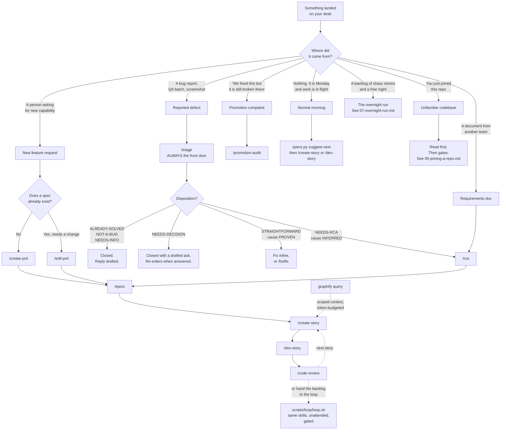
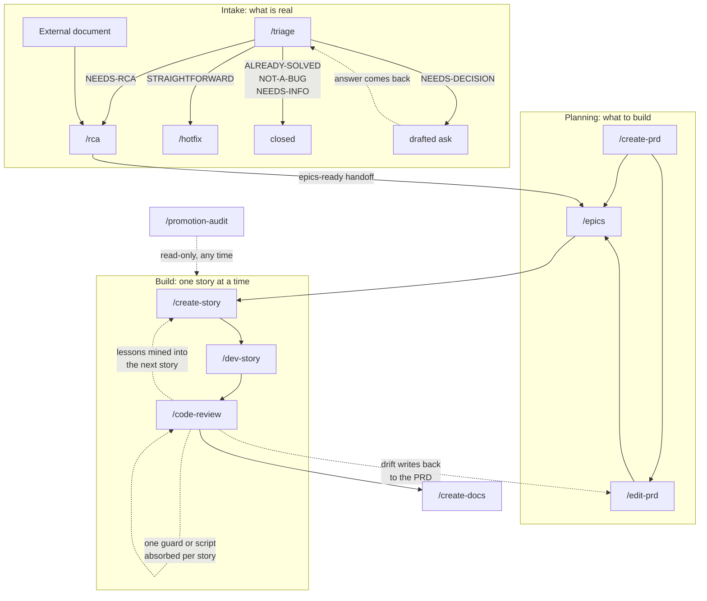

# Workflows: a day in the life

**What this page answers:** something landed on your desk. Which skill do you reach for?

The [`docs/`](../docs/) pages explain the method. The
[`starter/.claude/skills/`](../starter/.claude/skills/) directories explain what each skill
does. This directory answers a different question: on a normal working day, what actually
happens, in what order, and where does it hurt.

Thirteen skills exist. You will use two or three in a typical week. This page is the router.

---

## The decision tree



---

## The routing table

| What landed | Reach for | Why that one | What you get out |
| --- | --- | --- | --- |
| A feature nobody has specified | [`/create-prd`](../starter/.claude/skills/create-prd/) | It interviews you and produces the locked-decisions table every later story protects | `prd.md` with `F-*` features, flows, and a `D`-numbered invariant table |
| A change to a spec that exists | [`/edit-prd`](../starter/.claude/skills/edit-prd/) | It reviews the affected sections and their dependents before it edits anything | A surgical edit plus a revision-history row |
| A PRD that needs breaking down | [`/epics`](../starter/.claude/skills/epics/) | It decomposes by user value, not by technical layer, and keeps the status mirror honest | One folder per epic, one file per story, `status.yaml` synced |
| The next story to build | [`/create-story`](../starter/.claude/skills/create-story/) | It mines every shipped story's traps and writes a file the developer can build from alone | A self-sufficient dev story at the mirrored implementation path |
| A dev story ready to build | [`/dev-story`](../starter/.claude/skills/dev-story/) | Red-green-refactor, four steps, no task marked done without passing tests | Code, tests, an updated file list, and a dev agent record |
| A story just marked done | [`/code-review`](../starter/.claude/skills/code-review/) | Eight steps that make the codebase and the workflow both cheaper next time | Verified surface, synced docs, one recorded lesson, at most one new guard |
| Any bug report, QA batch, or screenshot | [`/triage`](../starter/.claude/skills/triage/) | It kills already-solved and not-a-bug work before it costs anything | A disposition per issue plus the evidence |
| A real bug whose cause you cannot prove | [`/rca`](../starter/.claude/skills/rca/) | Seven steps that establish what is true, not what was claimed | Root-caused findings and an epics-ready handoff |
| A requirements doc from another team | [`/rca`](../starter/.claude/skills/rca/) in external-doc mode | Its "this already exists" table was written by someone without commit access | Verified baselines, already-exists checks, routed decisions |
| One already-diagnosed defect in shipped code | [`/hotfix`](../starter/.claude/skills/hotfix/) | A smaller process, not a weaker one. It keeps the two checks that catch defects | The fix, a mutation-verified test, one ledger row |
| "The fix is not on staging" | [`/promotion-audit`](../starter/.claude/skills/promotion-audit/) | It proves the answer from file content, not from commit messages | One of five verdicts plus a message you can send |
| Docs a teammate or user will read | [`/create-docs`](../starter/.claude/skills/create-docs/) | Reference tables get generated from the contract, never typed by hand | A doc tree, guard tests, and the decision record that keeps it alive |
| A question about a codebase too big to re-read | [`graphify query`](../docs/09-graphify.md) | One indexed graph, then budgeted traversals with source locations — not a repo tour per question | The neighborhood of the answer, inside a token budget |
| A backlog of sharp stories you would rather not click through | [`scripts/loop/loop.sh`](../starter/scripts/loop/README.md) | The same skills you run by hand, unattended, with gates between phases that check artifacts | One conventional commit per story, gate-green, lessons banked — see [`07-overnight-run.md`](07-overnight-run.md) |

---

## The one rule people get backwards

> **Certainty routes, not size.**

The question that decides where an issue goes is **"can I point at the line and prove it?"**
It is not "does the fix look small?"

Both directions of this are common, and both are expensive.

**A one-line fix whose cause you have not proven goes to `/rca`, not `/hotfix`.**

A reporter says a filter dropdown shows no options. You look, you see a field name that looks
misspelled, and the fix is one character. It is tempting. But you have not proven that field
is on the path that populates the dropdown. It may be dead code. The real cause may be an
environment variable that is set and wrong, which leaves no trace in version control at all.
You ship the one-character fix, the reporter tests again, it is still broken, and you have
spent their next round of testing plus some of their trust. Route it to `/rca`.

**A thirty-line change whose shape you fully understand can go straight to a story.**

You already read the schema, you already quoted the contract, and you can name every file the
change touches and what each one must preserve. Size is not uncertainty. Send it through
`/epics` and `/create-story` because it is real work with acceptance criteria, not because it
is big.

The `/triage` skill states this as its first non-negotiable rule, and the boundary section of
`/hotfix` restates it as a boundary of **count and certainty, not size**. One already-diagnosed
defect is a hotfix. Several unverified claims are triage, even when each individual claim
looks tiny.

### The other half of the same rule

`/triage` splits uncertainty into two kinds, and they route differently.

- **You do not know the CAUSE.** The mechanism is inferred, the ownership is unclear, or the
  environment is suspect. That is `NEEDS-RCA`.
- **You do not know the REQUIREMENT.** You can name the exact file and line, you just do not
  know what the behaviour is supposed to be, because nobody ever decided. That is
  `NEEDS-DECISION`. Sending it to a full investigation burns an investigation to rediscover a
  question you could already state in one sentence.

---

## When not to use any of this

A six-step pipeline over a one-word change is the caricature that makes people dismiss the
whole method. So name it first.

**Do not run the spec pipeline for:**

- A typo in a string, a comment, or a README.
- A dependency version bump with no behaviour change.
- A one-line log message.
- A throwaway script you will delete this afternoon.
- Anything where being wrong costs you a `git checkout` and nothing else.

Fix it, run the gates, commit. That is the whole procedure.

**The honest boundary.** The pipeline earns its cost when the work has acceptance criteria
someone could disagree about, or when more than one person will touch the code. Below that
line it is overhead you will resent, and resented process gets abandoned, which costs you the
parts that were working.

The one piece that is worth running on almost everything is [`gates`](../gates/README.md). It
takes seconds and it does not care how small your change was.

---

## How the skills chain



Three things to notice in that diagram.

**Intake is separate from planning.** Exactly three things may become an epic: a PRD, a
verified bug report, and a verified external document. An unverified paste is not an entry
point. See [`docs/02-spec-driven-development.md`](../docs/02-spec-driven-development.md).

**The build loop is a loop.** `/code-review` ends by suggesting the next story, and
`/create-story` starts by mining what every finished story recorded. That is Loop A from
[`docs/04-compound-engineering.md`](../docs/04-compound-engineering.md).

**`/code-review` points at itself.** Step 06 asks what you did by hand this run and turns one
of those things into a script or a guard. That is Loop B, and it is why the workflow gets
cheaper rather than just the codebase.

---

## The scenarios

| File | What it covers |
| --- | --- |
| [`01-new-feature.md`](01-new-feature.md) | The full pipeline on one ordinary feature, PRD to review, with the friction shown |
| [`02-bug-from-qa.md`](02-bug-from-qa.md) | A QA batch through `/triage`, and what each disposition costs you |
| [`03-fix-not-on-stag.md`](03-fix-not-on-stag.md) | "We fixed this" versus "it is still broken there", and the five verdicts |
| [`04-monday-morning.md`](04-monday-morning.md) | Picking up work already in flight, with `suggest-next` and the status mirror |
| [`05-joining-a-repo.md`](05-joining-a-repo.md) | Week one in an unfamiliar six-year-old codebase, gates first, `CLAUDE.md` last |
| [`06-a-real-week.md`](06-a-real-week.md) | Five days end to end, including the days where nothing goes to plan |
| [`07-overnight-run.md`](07-overnight-run.md) | The overnight run: preflight dry-run, one supervised story, and the morning review in order |

---

## The helper you will type most

Every pipeline skill talks to one CLI instead of loading the whole spec tree into context.

```bash
python .claude/scripts/specs/specs.py help          # every subcommand
python .claude/scripts/specs/specs.py list          # the tree with status
python .claude/scripts/specs/specs.py next-story    # next planned story to expand
python .claude/scripts/specs/specs.py next-dev      # next dev story to implement
python .claude/scripts/specs/specs.py suggest-next  # dependency-aware, not strictly numeric
python .claude/scripts/specs/specs.py lessons 2.3 --hazards --all-epics
```

The last five subcommands in `help` are labeled heuristic for a reason. `deps`,
`feed-forward`, `suggest-next`, `lessons`, and `stale-refs` are regex scans over prose a human
wrote. They print a caveat line saying so. Treat every verdict as a hint to verify. Full
manual: [`starter/.claude/scripts/specs/README.md`](../starter/.claude/scripts/specs/README.md).

Two more you will type often, once they exist in your repo:

```bash
graphify query "who calls the template resolver and through what layer" --budget 1500
graphify path "AuthModule" "ReportService"      # the hops between two concepts, with sources

scripts/loop/loop.sh --dry-run                   # every story, phase, model, and command
scripts/loop/loop.sh --story 2.3                 # one story, supervised
```

The first pair pays only when the repo is bigger than your head
([`docs/09-graphify.md`](../docs/09-graphify.md)). The second pair is the unattended loop —
dry-run first, always ([`docs/08-loop-engineering.md`](../docs/08-loop-engineering.md)).

---

## Further reading

- [`docs/02-spec-driven-development.md`](../docs/02-spec-driven-development.md), the chain and
  why story files must be self-sufficient.
- [`docs/03-tdd-with-agents.md`](../docs/03-tdd-with-agents.md), why a test that has never been
  seen to fail is not evidence.
- [`docs/04-compound-engineering.md`](../docs/04-compound-engineering.md), the two loops.
- [`docs/05-local-ci-enforcement.md`](../docs/05-local-ci-enforcement.md), gates and baselines.
- [`docs/08-loop-engineering.md`](../docs/08-loop-engineering.md), the laws an unattended
  loop keeps, and the failure taxonomy for the morning after.
- [`docs/09-graphify.md`](../docs/09-graphify.md), token optimization via navigation.
- [`starter/.claude/rules/edge-cases.md`](../starter/.claude/rules/edge-cases.md), the
  acceptance-criteria budget these scenarios keep bumping into.
